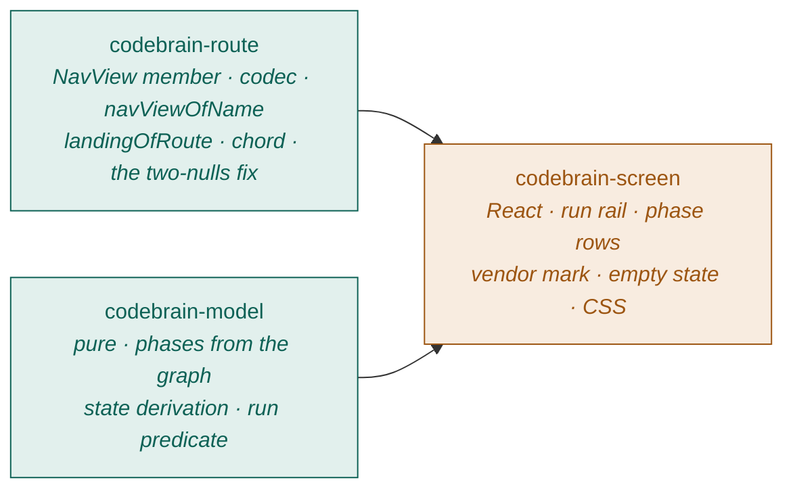

# Spec: CodeBrain — a top-level view in `tm8_ui_2.0`

Task: `01a056f3-f6e2-7cf4-bc3c-9825dcbbd7eb`
Phase: DEFINE (`/spec`) · CodeBrain 1 · `01a0566e-ff5e-76a1-91cc-4dec3f0499af`
Branch: `tm8/01a0572b` · Worktree `01a0572b-57b1-7de7-b833-7ff2faa5fe20`
Written: 2026-08-31

---

## 0. What this spec is grounded on

Everything below was read in this worktree at `41c824b4`, not recalled. Every
structural claim carries `file:line`.

| Claim | Evidence |
|---|---|
| Two navigation vocabularies; `MenuViewRef` ↔ `NavView` join lives in one file | `packages/tm8_ui_2.0/src/domain/nav-targets.ts:1-40` |
| A `null` rail target means "a real screen that simply is not a rail destination" | `src/domain/nav-targets.ts:170-181` (`Landing.target` docblock) |
| `newSession` and `boardV2` are the two existing route-only screens | `src/domain/nav-targets.ts:236-256` |
| Route-only screens are mounted off `navView`, not off `activeTarget` | `src/views/GateApp.tsx:1924`, `:1939` |
| Flat-segment routes parse and build in one codec | `src/routes/codec.ts:353-372`, `:466-476` |
| `navViewOfName` omits `craft` and `help` today | `src/domain/nav-targets.ts:140-159` |
| Nine `g` chords, all `nav.view`/`nav.kind` | `src/keyboard/contract.ts:212-222` |
| `team_member` state carries `model`, `agentTool`, `owner`, `liveWork` | `packages/contract/src/contract.ts:253-254` |
| `EntitySummary` carries `parentId` and `position` | `packages/contract/src/contract.ts:133-134` |
| `badges.workingActors: LiveWork[]`, `badges.attention` | `packages/contract/src/contract.ts:431-435`; `LiveWork` at `:582` |
| `WorkSessionStatus = 'spawning'\|'running'\|'idle'\|'exited'\|'failed'` | `packages/contract/src/contract.ts:2948` |
| `working_on` edges are already projected into `data.graph` and read this way | `src/views/WorkspaceView.tsx:540-566` |
| No `codebrain` identifier exists anywhere in the package yet | `grep -rni codebrain packages/tm8_ui_2.0/src` → no hits |

The ten CodeBrain team members were read from the graph, not assumed —
`tm8 entity query --kind team_member --limit 100`, filtered on
`parentId === 01a05662-e721-78a4-a68d-673d1ba964eb`:

| pos | id | title | model | agentTool |
|---|---|---|---|---|
| 1 | `01a0566e-ff5e-76a1-91cc-4dec3f0499af` | CodeBrain 1 · DEFINE — Idea → Refine | `claude-opus-5` | `claude-code` |
| 2 | `01a0566f-3f4e-77a6-a31f-f443e5750a42` | CodeBrain 2 · PLAN — Spec → PRD | `claude-opus-5[1m]` | `claude-code` |
| 3 | `01a0566f-648e-75e3-aa17-029d0eac2019` | CodeBrain 3 · BUILD — Code → Impl | `claude-sonnet-5` | `claude-code` |
| 4 | `01a0566f-9e30-75b1-8ea7-01d37f196059` | CodeBrain 4 · VERIFY — Test → Debug | `claude-fable-5` | `claude-code` |
| 5 | `01a0566f-e1b3-7c05-95a7-a74fc0643a4f` | CodeBrain 5 · REVIEW — QA → Gate | `gpt-5.6-sol` | **`codex`** |
| 6 | `01a05670-1ed2-7d36-af40-9283a1bb092b` | CodeBrain 6 · SHIP — Go → Live | `claude-opus-5` | `claude-code` |
| 7 | `01a05670-4c3f-7cdf-876c-2d5c3e2cf3ff` | CodeBrain ⚙ Code Reviewer | `gpt-5.6-sol` | `codex` |
| 8 | `01a05670-6576-7cf1-a406-1291a28ed978` | CodeBrain ⚙ Security Auditor | `claude-opus-5` | `claude-code` |
| 9 | `01a05670-8196-74a3-a847-652ad6eb55a5` | CodeBrain ⚙ Test Engineer | `claude-fable-5` | `claude-code` |
| 10 | `01a05670-b46e-729e-9442-49766c1300bb` | CodeBrain ⚙ Web Performance Auditor | `claude-sonnet-5` | `claude-code` |

**Positions 1–6 are the phases. 7–10 are specialists and this slice does not
render them.** That split is a graph fact (`position`), not a name parse.

---

## 1. Reference inventory

**No images were supplied with this task.** `attachments count="0"` on the
assignment envelope. The reference is a static HTML prototype, read at:

`/tmp/claude-110/-home-tm8-prod-workspace/68c7fe47-526e-419e-a92b-2654c3b91085/scratchpad/playground.html`
(87,856 bytes, mtime 2026-08-31 07:46) — plus its sibling
`codebrain-runbook.html`, which is prose and not a screen reference.

Drawn against the prototype, **only the parts this slice implements**:

| Element | Prototype anchor | What it carries |
|---|---|---|
| Run header | `playground.html:571-575` | run title, project, meta line |
| Phase rail | `:1070-1084` (`renderRail`), CSS `:119-135` | one row per phase |
| Phase row | `:1076-1082` | bead + connector line, `N NAME`, state chip, `box` subtitle, model chip, elapsed/meta |
| Bead states | CSS `:127-130` | `--done` ok, `--run` machine/teal, `--you` human/ochre, plain = queued |
| State chip | CSS `:70-77` | `st--done` / `st--run` (pulsing) / `st--queue` / `st--you` / `st--fail` |
| Vendor mark | `:1079`, `.vendor--x` | applied when `tool === 'codex'` — the cross-vendor split |
| Phase detail head | `:1088-1097` | `command`, `model · tool`, `teammate` id, `skills`, `output` as a `kv` list |
| Reduced motion | CSS `:77` | the running pulse is disabled under `prefers-reduced-motion` |

The prototype's colour thesis — **teal = a machine acts, ochre = a person
acts** (`codebrain-runbook.html:6-11`) — is information design and is adopted.
Its literal hex values, `<style>` block and DOM are **not** copied; this package
has its own token system and a hex ban (`src/hex-ban.test.ts`).

Deliberately **not** inventoried, because they are out of scope: the setup
wizard (`:404-528`), the model matrix (`:529-568`), the chat column
(`:577-592`), the live stage viewports (`STAGE`, `:718+`), the browser matrix
(`:verify.browsers`).

---

## 2. Ambiguity ledger — what the reference cannot tell us

Every row is a thing the prototype shows but the graph does not yet answer.
`ASSUMED` items are decided below and flagged in place. `ASK` items block
nothing in this slice but must be answered before the phase after it.

| # | Ambiguity | Resolution |
|---|---|---|
| A1 | How is a run selected, and is it addressable? | **DECIDED** — optional run segment (§5). Approved at the DEFINE gate by Tarkesh (admin), 2026-08-31, msg `01a0573a-6a1b-7556-8248-b061c4ac2597` in reply to the fork `01a05738-e9f5-73e5-b59c-a4b0777825e3`. **Shareable and reloadable runs are a requirement, not a preference** — a change that trades them away is out of scope, not a simplification. |
| A2 | What makes a task a "CodeBrain run"? The prototype has one, hardcoded. | **ASSUMED** — §6.2's predicate. Flagged: it will misclassify a task that a CodeBrain teammate touched incidentally. |
| A3 | `waiting on you` is per-viewer in the prototype. `badges.attention` (`contract.ts:528-534`) carries `pendingCount`/`points`/`reason` and **no actor** — the summary cannot say *you*. | **ASSUMED** — §6.3 renders it from `pendingCount > 0`, and the label stays "waiting on you" because `tm8 attention` is by definition a request for *human* attention. Not per-viewer-targeted, and §11 says so. |
| A4 | The prototype shows elapsed time per phase (`took: '6m 12s'`). | **ASSUMED** — derived from the phase's session `startedAt`/`exitedAt`. Absent ⇒ render nothing, never a zero. |
| A5 | The prototype shows a `/spec`-style command and a skills list per phase. Neither is on `team_member` summary state. | **ASK.** Not rendered in v1. Absence is the finding; no placeholder. |
| A6 | Ordering of phases when two members share a `position`. | Cannot happen in the read data; if it does, tie-break on `id` so the order is total. Stated so it is a decision, not an accident. |
| A7 | A phase whose team member has been deleted or moved out from under the root. | The rail renders the phases the graph actually has. Fewer than six is a **measured** fact and the screen says how many it found; it does not pad to six. |

---

## 3. Capability map

Three modules. Two have no dependency on each other and can be built in
parallel; the screen depends on both.



| Module id | Responsibility | Depends on |
|---|---|---|
| `codebrain-route` | The `codebrain` member of `NavView`; its codec segment both ways; `navViewOfName`; `landingOfRoute`; the `g r` chord; and teaching the chord dispatcher the difference between the two nulls (§5.3). | — |
| `codebrain-model` | Pure and React-free: resolve the six phases under the CodeBrain root in `position` order; derive each phase's state; decide which tasks are runs. | — |
| `codebrain-screen` | The screen component, its mount in `GateApp`'s render switch, and its CSS. | `codebrain-route`, `codebrain-model` |

**Build order:** `codebrain-route` ∥ `codebrain-model` → `codebrain-screen`.

No cycles. `codebrain-model` names no route type and imports nothing from
`routes/`; `codebrain-route` reads no graph. That is what makes them parallel.

---

## 4. Tech stack

React 18 + TypeScript, Vite, Vitest, in `packages/tm8_ui_2.0`. Zustand stores
(`navStore`). No new dependencies. **No contract change, no new entity kind, no
migration** — confirmed against `packages/contract/src/contract.ts:2487`
(`MenuViewRef` enum) which this slice does not touch.

---

## 5. Module: `codebrain-route`

### 5.1 The route member

**APPROVED AT THE DEFINE GATE, 2026-08-31** (Tarkesh, admin —
msg `01a0573a-6a1b-7556-8248-b061c4ac2597`). This shape is a decision, not a
proposal, and the reason given with the approval is part of it: *shareable and
reloadable runs are a requirement.* A later change that moves the selection into
component state is a scope reversal and needs its own approval.

```ts
/* packages/tm8_ui_2.0/src/routes/types.ts — added to the NavView union */
| { view: 'codebrain'; runId: EntityId | null }
```

`runId` is an optional trailing segment in the `settings/{section}` and
`help/{plate}` shape (`types.ts:167-186`). The reason is the one this codebase
has already ruled twice: a run is the unit people **send each other**. Held in
`useState` it could not be linked to, could not be reloaded into, and Back would
leave CodeBrain entirely.

**Lossy-tolerant, exactly like `help.plate`:** an id naming nothing decodes to a
route that resolves; the screen renders its empty state with a line saying the
run in the link was not found. A stale link opens the screen, never a crash and
never a silent redirect elsewhere.

### 5.2 The codec

Parse (`src/routes/codec.ts`, beside `case 'board-v2'` at `:368`):

```ts
case 'codebrain': {
  const runId = rest[1];
  return { view: 'codebrain', runId: runId && runId.length > 0 ? runId : null };
}
```

Build (`codec.ts`, beside `case 'boardV2'` at `:472`):

```ts
case 'codebrain':
  return t.runId ? `${base}/codebrain/${enc(t.runId)}` : `${base}/codebrain`;
```

Both directions, or it is a dead link — AC1.

### 5.3 The two vocabularies, and the fix the chord needs

`navViewOfName` gains `codebrain` (AC2). Note it must construct the member with
its field, like `settings` does:

```ts
case 'codebrain':
  /* No run: a chord names the screen, not a run within it — the same posture
     `settings` takes with its section. */
  return { view: 'codebrain', runId: null };
```

`landingOfRoute` gains, beside `newSession` and `boardV2`:

```ts
case 'codebrain':
  /* A real screen with no rail seat. `target: null` — see `Landing.target`. */
  return { target: null, openEntity: null };
```

`routeViewOf` needs **no** case: there is no `MenuTarget` to come back from.

**THE DEFECT THIS EXPOSES, AND IT IS NOT OPTIONAL.**
`GateApp.tsx:544-551` collapses the two nulls that `nav-targets.ts:170-181`
exists to keep apart:

```ts
const target = view ? landingOfRoute(view)?.target : null;
if (!target) { console.error('[nav] no destination for keyboard ref', ref); return; }
```

`landingOfRoute` returning `null` means *unresolvable* — refuse.
`landing.target` being `null` means *a real screen with no rail seat* — navigate.
As written, a `g` chord to CodeBrain logs an error and does nothing, which is
precisely the "the chord would report an error instead of going Home" failure
`navViewOfName`'s own docblock warns about.

Required change — split the two:

```ts
const landing = view ? landingOfRoute(view) : null;
if (!landing) { console.error('[nav] no destination for keyboard ref', ref); return; }
if (!landing.target) { navStore.getState().navigate(view!); return; }  // route-only screen
navigateTo(landing.target);
```

The store write **is** the navigation for a route-only destination; this is the
same move `openTab` already makes for Board v2 (`GateApp.tsx:1630-1640`), stated
once here instead of a second time at the call site.

### 5.4 The chord

```ts
{ id: 'g.codebrain', layer: 'global', keys: 'g r', label: 'CodeBrain',
  command: 'nav.view', ref: 'codebrain', guaranteed: true, match: chord('r') },
```

`g r` for *run*. `g b` reads as Board and `g c` is taken by Channels.

**This breaks `src/keyboard/guaranteed-destinations.test.ts` in two places and
both must be amended deliberately, not patched around:**

1. `expect(NAV_BINDINGS.length).toBe(9)` → `10`. It is a vacuity guard
   (`:47-52`); bumping it is the intended maintenance.
2. Its local `destinationOf` (`:30-39`) has the **same** two-nulls collapse as
   `GateApp`. It must mirror the §5.3 dispatch, returning a discriminated
   result — `unresolvable` vs `route-only` vs a `MenuTarget` — and assert that
   `g.codebrain` resolves as `route-only`. Leaving it collapsed would make the
   test pass for the wrong reason or fail for a chord that works.

The file's own header states its purpose: a chord must name a real destination.
CodeBrain's destination is real; the resolver simply could not say so yet.

### 5.5 Tests for this module

- `src/routes/codec.test.ts` — `#/s/{s}/codebrain` and
  `#/s/{s}/codebrain/{id}` round-trip; an unknown trailing segment survives
  as an opaque `runId`; a bare `codebrain/` decodes to `runId: null`. (AC1)
- `src/domain/nav-targets.test.ts` — **CORRECTED 2026-08-31, after PLAN read
  the file this spec had only cited.** An earlier draft of this line said the
  existing "both-direction exhaustiveness assertions must keep passing", which
  overstates what passing proves. `ALL_ROUTE_VIEWS` (`:31-54`) is a
  **hand-written literal, deliberately not derived from the type** — its own
  docblock at `:25-30` says a derived list "would grow automatically and prove
  nothing". It already omits `craft`, `help` and `boardV2`. So adding
  `codebrain` to `NavView` breaks nothing here, the suite stays green, and
  CodeBrain falls silently outside the guard. The file names this exact failure
  at `:41-44`: an omission "silently stops guarding it, which is the one
  failure mode this list has."

  Therefore, as a **required edit and not a consequence**:
  - add `{ view: 'codebrain', runId: null }` **and**
    `{ view: 'codebrain', runId: ENTITY }` to `ALL_ROUTE_VIEWS`. Both, because
    the two forms take different codec paths and only the pair covers §5.2.
  - the list's assertion is `expect(landingOfRoute(view)).not.toBeNull()`
    (`:64-68`) — the **Landing**, not its target — which is why `newSession`
    passes with `target: null` and why CodeBrain will too. That is the assertion
    we want; nothing about it needs changing.
  - add that `navViewOfName('codebrain')` returns the member with
    `runId: null`, and that `landingOfRoute` returns a `Landing` whose `target`
    is `null` — not a `null` Landing. (AC2)

  `routeViewOf` needs no row: the "emits a route for every view-ref target"
  assertion (`:70-75`) iterates `MenuViewRef`, and CodeBrain is not one.
- `src/keyboard/guaranteed-destinations.test.ts` — as amended in §5.4.

---

## 6. Module: `codebrain-model`

Pure functions over `EntitySummary` rows. No React, no store reads, no fetch —
the `nav-targets.ts` posture. Home: `src/codebrain/codebrain-model.ts`.

### 6.1 The phases, from the graph

```ts
export const CODEBRAIN_ROOT_ID = '01a05662-e721-78a4-a68d-673d1ba964eb';
```

One named constant, sanctioned by AC3 which names this root explicitly. It is
the **only** hardcoded CodeBrain fact; the six phases, their names, models,
tools and ids are all read.

```ts
phases(rows) =
  rows.filter(r => r.kind === 'team_member'
                && r.parentId === CODEBRAIN_ROOT_ID
                && r.deletedAt === null)
      .sort(byPosition, thenById)          // A6 — total, never a tie
      .filter(r => r.position <= 6)        // 7..10 are the specialists
```

Each phase carries `{ id, position, title, model, agentTool }` straight off
`row.state` (`contract.ts:253-254`). `model`/`agentTool` may be `null`; a null
renders **nothing**, never a default string.

The `N NAME — box` display splits `title` on `·` and `—` for presentation only.
If a title does not split, the whole title renders. **Presentation never becomes
identity**: the phase is identified by `id` and ordered by `position`.

**Source of rows.** `data.rowsFor('team_member')(…)`, with
`data.ensureKind('team_member')` on mount. **Not** `data.launch.teammates` —
that projection drops any teammate whose model is not a launchable one or whose
`agentTool` disagrees (`useGateData.ts:2322-2324`), so it is the *launchable*
roster, not the roster. A phase silently missing from the rail because its model
fell out of a launch catalogue is exactly the lie this note prevents.

### 6.2 What is a run (A2)

```ts
isRun(task, phaseIds) =
     task.state.assignees.some(a => phaseIds.has(a.id))
  || task.badges.workingActors?.some(w => phaseIds.has(w.actor.id))
  || hasWorkingOnFromPhaseSession(task.id)
```

The third disjunct walks `data.graph` edges of type `working_on` whose source is
a `work_session` with `state.teammate.id ∈ phaseIds` — read exactly the way
`WorkspaceView.tsx:540-566` already reads them.

Two disjuncts are on the summary and cost nothing; the third catches a run whose
sessions have all exited. Flagged in §2 A2: a task a CodeBrain teammate merely
touched will be listed as a run. That over-inclusion is visible and correctable;
under-inclusion would hide a real run, which is worse.

### 6.3 Phase state derivation

Closed vocabulary, in precedence order. The **first** matching rule wins.

| State | Rule | Source |
|---|---|---|
| `waiting` | run task has `badges.attention.pendingCount > 0` **and** this is the frontier phase (the lowest-position phase not `done`) | `contract.ts:431-432` |
| `failed` | a session for this phase on this run has `state.status === 'failed'` | `contract.ts:2948` |
| `running` | `badges.workingActors` on the run names this phase's member, **or** a session for it has `status ∈ {spawning, running}` | `contract.ts:435`, `:582` |
| `done` | no live session, and ≥1 session for this phase on this run with `exitedAt !== null` and `status === 'exited'` | `contract.ts:279-280` |
| `queued` | everything else — the honest default | — |

`idle` is deliberately **not** folded into `running`: an idle session is not
work in progress, and saying it is would be the same class of lie as a dead
verb drawn as live.

Liveness, when a session id is in hand, goes through `data.livenessOf(id)` —
"THE verdict. Never computed in the UI" (`useGateData.ts:597`).

### 6.4 Tests for this module

`src/codebrain/codebrain-model.test.ts`, fixture rows only, no DOM:

- six phases resolve in `position` order from unordered input; specialists 7–10
  are excluded; a tie on `position` falls through to `id` (A6)
- fewer than six members ⇒ fewer than six phases, and the count is reported,
  not padded (A7)
- each state rule fires, and **precedence**: attention beats running; failed
  beats done; idle is `queued`, not `running`
- `null` model / `null` agentTool produce no rendered claim
- `isRun` fires on each disjunct independently, and is false for an ordinary
  task with no CodeBrain involvement

---

## 7. Module: `codebrain-screen`

`src/codebrain/CodeBrainScreen.tsx`, `codebrain.css`, `index.ts`.

### 7.1 Mount

In `GateApp`'s render switch, **route-matched** beside `boardV2`
(`GateApp.tsx:1939`) — not target-matched, because there is no target:

```tsx
) : data.ready && navView.view === 'codebrain' ? (
  <CodeBrainScreen data={data} runId={navView.runId}
                   onSelectRun={(id) => navStore.getState().navigate({ view:'codebrain', runId:id })} />
```

`MobileShell`: CodeBrain is **not** added to the phone's drawer in this slice.
The desktop refusal card's honesty rule (`src/views/view-ref-screens.ts:1-27`)
concerns `MenuViewRef`s; CodeBrain is not one, so no row is added to
`VIEW_REF_SCREENS` and nothing there needs to change.

### 7.2 Layout

Two columns, following the prototype's `.console` (`playground.html:115-118`)
minus the chat column, which is out of scope:

```
┌────────────────────┬───────────────────────────────────┐
│ run header         │  phase detail                     │
│ ────────────────── │  ───────────────────────────────  │
│ ● 1 DEFINE   done  │  3 · BUILD — Code → Impl  running │
│ │   Idea → Refine  │                                   │
│ │   claude-opus-5  │  model     claude-sonnet-5 ·      │
│ ● 2 PLAN     done  │            claude-code            │
│ │   Spec → PRD     │  teammate  01a0566f-648e-75e3-…   │
│ ● 3 BUILD    running│ state     running                │
│ │   Code → Impl    │                                   │
│ ○ 4 VERIFY   queued│                                   │
│ ○ 5 REVIEW ⟂ queued│   ⟂ = a different vendor          │
│ ○ 6 SHIP     queued│                                   │
└────────────────────┴───────────────────────────────────┘
```

Single column below the prototype's `52rem` breakpoint.

### 7.3 The four states, drawn

Bead + state chip, per §6.3's vocabulary. Teal = a machine acts, ochre = a
person acts, ok = done, muted = queued, danger = failed. The running chip
pulses, and the pulse is off under `prefers-reduced-motion` — the prototype
already does this (`playground.html:77`) and it is not optional here.

### 7.4 Cross-vendor (AC5)

The mark is derived from **`agentTool !== 'claude-code'`**, never from a list of
model names. That is what makes it survive a new model landing in the catalogue.
It is a persistent glyph plus a distinct chip treatment on the phase row *and*
in the detail — not colour alone (contrast + non-colour channel), because the
cross-vendor split is the thesis of the design and a reader who cannot see the
hue must still get it. It carries a `title`/`aria-label` naming the tool.

Today that marks exactly one phase: `5 REVIEW`, `gpt-5.6-sol` on `codex`.

### 7.5 Empty state (AC4)

Rendered when `runId` is null, **and** when `runId` names nothing.

It must be a real screen, not a blank and not a spinner that never resolves:

1. One paragraph saying what CodeBrain is — six phases, each a different model,
   one cross-vendor review.
2. **The six phases, read from the graph and rendered in the same rail**, with
   every state `queued`. This is not decoration: it makes AC3 observable with
   no run in existence, and it is the honest picture of a run that has not
   started.
3. The runs this space has — tasks matching §6.2 — as a pick list. Empty is
   rendered as a measured zero ("no runs in this space yet"), never as a
   loading state.
4. How to start one: the `tm8 session spawn` line naming the DEFINE teammate.

Three absences are **three different sentences** and the screen must not
conflate them: rows not hydrated yet; hydrated and the root has no children;
hydrated, phases found, no runs. The first is a wait, the other two are facts.

### 7.6 Tests for this module

`src/codebrain/codebrain-screen.test.tsx`:

- six phase rows render from fixture graph rows, in order, each showing its
  state, model and agent tool (AC3)
- with `runId: null` the empty state renders its explainer, the six queued
  phases and the how-to-start line — asserted by **text**, never by CSS (AC4)
- `runId` naming nothing renders the empty state plus the not-found line
- the `codex` phase carries the vendor mark and the five `claude-code` phases
  do not (AC5)
- a `team_member` under a different parent never appears

---

## 8. Project structure

```
packages/tm8_ui_2.0/src/
  codebrain/
    CodeBrainScreen.tsx        the screen
    codebrain-model.ts         pure: phases, states, run predicate
    codebrain-model.test.ts
    codebrain-screen.test.tsx
    codebrain.css
    index.ts                   the only public surface
  routes/types.ts              + the NavView member
  routes/codec.ts              + parse and build
  routes/codec.test.ts         + round-trip
  domain/nav-targets.ts        + navViewOfName, landingOfRoute
  domain/nav-targets.test.ts   + both directions
  keyboard/contract.ts         + the g r chord
  keyboard/guaranteed-destinations.test.ts   amended, §5.4
  views/GateApp.tsx            + the mount, + the two-nulls fix
```

---

## 9. Commands

```
Typecheck (AC6): bun run typecheck:tm8-ui-2.0
                 # == tsc -p packages/tm8_ui_2.0/tsconfig.json --noEmit
Test (AC7):      cd packages/tm8_ui_2.0 && bunx vitest run src/codebrain src/routes src/domain/nav-targets.test.ts src/keyboard
Dev server:      cd packages/tm8_ui_2.0 && bun run dev
```

**Two preconditions, both measured in this worktree on 2026-08-31, both real:**

1. **There is no `node_modules` in this worktree at all.**
   `ls node_modules` → no such file or directory;
   `readlink -f packages/tm8_ui_2.0/node_modules/@tm8/contract` → empty, exit 1.
   AC6's own warning is the check to run, and it currently fails outright.
   Dependencies must be installed in **this** worktree before any green is
   worth anything — a typecheck run from a sibling tree is a typecheck of
   another tree. This is a BUILD-phase blocker recorded here, not a spec gap.

2. **The Vitest runner never processes CSS.** `packages/tm8_ui_2.0/vite.config.ts`
   sets no `css` key at all (`grep -n css vite.config.ts` → no hits), so
   Vitest's default `css: false` applies. A green run therefore **cannot** have
   seen a CSS change. Assert CSS as source text, and never claim the suite
   covered it (AC7).

---

## 10. Code style

Match the neighbours, which in this package means: a docblock stating **why the
file exists and what failure it prevents**, not what it does; comments at the
line where a decision could be misread; total functions over closed unions with
no `default` arm, so a new member is a compile error.

```ts
/**
 * WHY THIS SPLITS THE TWO NULLS. `landingOfRoute` returning `null` means the
 * route is UNRESOLVABLE. A `Landing` whose `target` is `null` means a real
 * screen with no rail seat — CodeBrain, New Session, Board v2. Collapsing them
 * turns a working screen into a silent no-op, which is what the `g` chords did
 * to CodeBrain before this.
 */
export type PhaseState = 'done' | 'running' | 'queued' | 'waiting' | 'failed';
```

Package bans that apply and are enforced by tests already in the tree:
`src/hex-ban.test.ts` (no raw hex — use tokens), `src/type-scale-ban.test.ts`,
`src/no-op-handler-ban.test.ts` (**a stub handler is banned outright — passing
no handler is how a host says it has nothing to do**).

`panels/no-branching.test.ts` bans quoted kind literals outside `domain/` and
`fixtures/`. `src/codebrain/` is outside `panels/` so it is not fenced — the
Board precedent (`board/BoardScreen.tsx:31-33` says so in as many words) — but
kind literals stay in `codebrain-model.ts` and out of the component.

---

## 11. Boundaries

**Always**
- Read the six phases from the graph under `CODEBRAIN_ROOT_ID`, in `position`
  order. That constant is the only hardcoded CodeBrain fact in the slice.
- Distinguish "not read yet" from "read, and the answer is zero". They get
  different sentences.
- Derive the vendor mark from `agentTool`, never from a model-name list.
- Render `null` model / `null` tool / unknown elapsed as **nothing**.
- Keep `codebrain-model.ts` pure — no React, no store, no fetch.
- Keep the selected run in the URL. A run must be reloadable into, shareable and
  reachable with Back — a gate-approved requirement (§5.1), not a preference.

**Ask first**
- Any change to `MenuViewRef`, the kind registry, or a DB migration. This slice
  needs none and a diff containing one has left its scope.
- Adding CodeBrain to the mobile drawer or the menu config.
- Changing `navigateTo` / `attachRouter` / `navStore` beyond the §5.3 split.
- Rewording `Landing.target`'s docblock. It is the ruling this slice depends on.

**Never**
- Hardcode the six phase names, models, tools or ids (AC3).
- Treat a green `nav-targets.test.ts` as evidence that CodeBrain is guarded.
  `ALL_ROUTE_VIEWS` is hand-written and does not fail on an omission — that is
  its one documented failure mode (`:41-44`). The row is a required edit
  (§5.5), not something the suite will ask for.
- Invent a `run` entity kind, or a `run` route that is not a `task`.
- Read the roster from `data.launch.teammates` (§6.1).
- Stub a handler to satisfy a prop — `no-op-handler-ban.test.ts` is the law.
- Copy the prototype's markup or its hex values.
- Claim a green Vitest run covered CSS (§9.2), or a typecheck run against a
  tree whose `@tm8/contract` resolves elsewhere (§9.1).
- Say "waiting on you" is targeted at the viewer. It is not — `badges.attention`
  carries no actor (A3).

---

## 12. Out of scope — stated, not quietly added

Named in the task and confirmed here. A diff containing any of these has
widened past this spec:

- the setup wizard (what to build, references, project defaults, MCP)
- the approval gate and its Approve/Reject writes
- chat — the run conversation column
- the live stage viewports (the per-phase "what it is doing right now" pane)
- the cross-browser matrix
- the specialists (positions 7–10) and the BUILD parallel-lane table
- CodeBrain on the phone
- any rail seat, menu group, or `MenuViewRef`

---

## 13. Success criteria

Traced to the task's acceptance criteria.

| AC | Condition | Verified by |
|---|---|---|
| 1 | `{ view:'codebrain'; runId }` in the union; both forms round-trip through the codec | `routes/codec.test.ts` |
| 2 | `navViewOfName('codebrain')` returns the member; `landingOfRoute` returns a `Landing` (`target: null`), not `null` | `domain/nav-targets.test.ts` |
| 3 | Six phases rendered from graph rows under the root, in `position` order, each with state + model + agent tool; no hardcoded names | `codebrain-model.test.ts` + `codebrain-screen.test.tsx` |
| 4 | Empty state explains CodeBrain and how to start a run; no blank panel, no unresolving spinner | `codebrain-screen.test.tsx`, asserted by text |
| 5 | The `codex` phase is distinguishable from the five `claude-code` phases by a non-colour channel | `codebrain-screen.test.tsx` |
| 6 | `bun run typecheck:tm8-ui-2.0` green, **after** `readlink -f packages/tm8_ui_2.0/node_modules/@tm8/contract` resolves inside this worktree | command output + the readlink, echoed with `git rev-parse HEAD` in the same command |
| 7 | Vitest green for the touched files; CSS asserted as source, not claimed as covered | command output, same echo |
| 8 | Screenshot of the rendered screen attached to the task, Chrome, `--js-flags=--jitless` | the attachment |
| 9 | PR linked with `tm8 task link-pr` when it exists; closing message names branch, PR, exact command and output | the task anchor |

Additionally, and not in the AC list because it was found during DEFINE:

| — | A `g` chord to a route-only screen navigates instead of logging "no destination" | `keyboard/guaranteed-destinations.test.ts`, amended per §5.4 |

---

## 14. Open questions

- **A5** — the per-phase command (`/spec`, `/plan`, …) and skills list the
  prototype shows are on neither `team_member` state nor any read this slice
  makes. Not rendered in v1. Where should they live — a `team_member` content
  field, an `equips` edge projection, or a UI-side table? Answer before the
  phase detail grows.
- **A2** — is the run predicate right, or should a run be marked explicitly
  (an axis value, a `codebrain` label, a parent collection)? An explicit mark
  would end the over-inclusion in §6.2.
- **A3** — "waiting on you" cannot be viewer-targeted from the summary. If the
  approval gate needs per-viewer truth, it needs a read the summary does not
  carry. Flagged now so the gate phase does not discover it late.
- ~~**A1** — route shape.~~ **CLOSED at the DEFINE gate, 2026-08-31.** Option A:
  `{ view:'codebrain'; runId: EntityId | null }`, `#/s/{s}/codebrain` and
  `#/s/{s}/codebrain/{taskId}`, bare form round-tripping. See §2 A1 and §5.1.
- **§9.1** — the worktree has no `node_modules`. Who installs, and does the
  BUILD phase get a tree where `@tm8/contract` resolves locally?

---

*Written by CodeBrain 1 · DEFINE. No spec, no build — PLAN, BUILD and VERIFY are
entitled to refuse work that this document does not cover.*
