# Seamless chat harness continuity LLD

Status: coordinator reviewed and approved design; no implementation in this change.
Baseline: `bad53675b`, including migration 314 and chat credential selection.
Owner task: `01a1259f-edda-7eb3-b432-499756c142ff`.
Related lanes: runtime `01a1259f-ecef-7c13-8883-892ba4a68877`, credentials
`01a1259f-ee8f-7fa6-b551-eb48bf76f6ba`.

## 1. Decision and user-visible guarantee

A chat keeps one tm8 entity and conversation while its model, harness, credential
binding, process, node or transcript directory changes. tm8 owns the portable
conversation. Provider-native history accelerates delivery when its coverage can
be verified. A missing transcript never authorizes an empty-context restart.

The next claimed turn uses the selected configuration and receives earlier
requests, answers, decisions, attachment references and tool evidence through
either verified native context or a bounded tm8 projection. A current answer
keeps its execution snapshot when a selection changes. A selection response says
the requested configuration is saved and applies at the next claim; it cannot
claim the currently running process already changed.

Seamlessness means preserving conversation identity and making relevant history
available without a new chat. It does not promise unlimited verbatim model memory
or an identical answer across models. Compaction, omitted payloads, missing
legacy provenance and interrupted effects are identified to the model and in a
durable continuity receipt. Full authorized source records remain retrievable.

Historical tool calls are evidence. They are never submitted as executable calls
to a new harness. An uncertain delivery is never automatically resent.

## 2. Existing behavior and boundaries to replace

Repository observations, rather than assumptions about external CLI versions:

| Current surface | Consequence for this design |
| --- | --- |
| [migration 176](../../db/migrations/176_chat_entity.sql) makes chats independent anchors, pairs inputs/outputs in `chat_turns`, and retains one UUID `native_session_id` | Use `chat_id` as permanent identity; move native IDs into generation records with opaque text IDs |
| [migration 276](../../db/migrations/276_chat_model_switchable.sql) stamps model/provider at claim and refuses a different `agent_tool` | Preserve claim-time selection; replace the harness prohibition with capability validation and a continuity transition |
| [migration 314](../../db/migrations/314_chat_credential_selection.sql) stamps credential selection at claim | Preserve the requested selection; add resolved binding revision and authority to the actual attempt snapshot |
| [orchestrator](../../packages/server/src/chat/orchestrator.ts) compares process-local model, authority and credential-environment fingerprints, and marks `live` before `startThread` resolves | Add durable fenced ownership; publish starting separately from ready; compare typed non-secret credential binding metadata |
| `claim_next_chat_turn` can reclaim an expired running lease | Expiry after possible provider delivery is an interrupted outcome, not permission to repeat an external effect |
| [Claude adapter](../../packages/execution/src/runtime/ClaudeHeadlessAdapter.ts) falls back from missing resume transcript to fresh `--session-id` with the same ID | Return a typed resume-unavailable result; orchestrator creates a generation with portable history |
| The adapter's compaction boundary clears the context meter; it does not create portable conversation memory | tm8 maintains its own evidence-backed summaries and projection receipts |
| `message_parts` retains text and tool results before WebSocket deltas; completion also writes a capped assistant `messages.body` | Preserve append-before-publish; use structured text parts once, never duplicate them with the finalized body |
| [server runtime port](../../packages/server/src/chat/runtime.ts) and [execution runtime port](../../packages/execution/src/runtime/types.ts) have different resume shapes | Converge on the runtime lane's one typed `HarnessAdapter` contract |

These facts do not establish a Codex chat transport implementation. That adapter
must demonstrate its own open/resume/interrupt and context-injection semantics in
the runtime lane. Provider protocol details belong there, not in SQL.

## 3. Authority and identities

| Identifier | Owner and meaning |
| --- | --- |
| `chatId` | tm8 chat entity; never changes for a switch |
| `configRevision` | monotonic desired configuration revision; a claim pins one |
| `turnOrdinal` | monotonic queue order, assigned in the message/queue transaction |
| `attemptNo`, `snapshotId` | execution attempt and immutable sealed launch/input snapshot |
| `runtimeEpoch` | durable ownership fence; changes when runtime ownership is acquired/replaced |
| `nativeGeneration` | monotonically allocated native history generation within the chat |
| `nativeConversationRef` | harness-specific opaque ID plus node/workdir/storage scope |
| `captureHighWater` | upper bound of the chat's append-only history capture sequence |
| `throughTurnOrdinal` | last earlier turn eligible for a particular context projection |
| `logicalHistoryDigest` | hash of the authorized, eligible logical history at that cursor |
| `contentHash` | hash of exact rendered bootstrap bytes; distinct from source history hash |

Execution-facing contracts are imported from the runtime lane once implemented,
not duplicated in server/execution ports. SQL `runtime_epoch` maps to
`GenerationFence.leaseEpoch`; SQL native generation maps to
`GenerationFence.generation`; `snapshot_id` maps to `AttemptRef.attemptId`.
The examples below describe that shared contract, with server-only metadata
stored separately. `projectionPolicyVersion` is a string in every layer.

`provider`, `agentTool` and model identity are separate. For example, a harness
may serve a third-party model backend. Credential/storage compatibility is never
inferred from the model name. IDs and revisions are references, not secret keys;
the continuity store contains neither credential values nor raw environments.

Ordinary configuration edits do not increment a running turn's ownership fence.
Otherwise saving a next-turn preference would revoke the current answer. A hard
credential/policy revocation can fence and interrupt the process immediately;
that interruption records an honest partial outcome.

The credentials lane supplies secret-free `ResolvedCredentialPlan` metadata;
material acquisition yields a node-local `ModelCredentialLease` with
`nativeStorageScopeId` and `nativeStorageGeneration`. Preserve those two fields
in binding compatibility alongside logical credential reference, credential and
resolver/policy revision, authority identity/auth kind and node. The
`storageScopeRef` below represents that namespace tuple. Account auth home and
native history namespace are distinct. `PreparedLaunch` is a node-local opaque
handle, never a serialized environment. Current authority and policy are checked
before every actual dispatch. Same-account key rotation can preserve eligible
native history after material reacquisition when the storage namespace and
adapter proof remain compatible; it does not automatically require bootstrap.

## 4. Portable history and model-visible attribution

### 4.1 Capture once, read bounded ranges

Use existing `chat_turns`, `messages` and append-only `message_parts` as the
portable history source. The message/queue transaction adds an immutable input
snapshot to its turn: body, attachments and server-resolved speaker/source
metadata. Part append retains assistant text and tool evidence in its existing
row; settlement retains terminal facts on the turn. Source keys are derived from
turn/message/part IDs. No second conversation log or generic event framework is
required, and duplicate append RPCs cannot duplicate context.

Retain full authorized evidence or a durable content-addressed payload
reference before publishing the matching delta. A filesystem path alone is not
a durable reference: an externalized result uses the server blob store and
retention rules at least as long as its chat. Hashes and references let a bounded
read avoid transferring megabyte tool dumps. Do not use the UI's joined entity
page query to build history; query turns and parts by their indexed IDs directly.

Stamp portable inputs, parts and settlement with a per-chat capture sequence,
allocated under a short chat-row lock. These are additional columns on existing
rows, not copied payloads. Render order as `(turn_ordinal, slot, part_seq)`:
input slot 0, assistant slot 1, settlement/correction evidence slot 2. Inputs
that are queued while an earlier answer streams can arrive before that answer's
last parts. Arrival timestamps or one capture watermark alone cannot represent
model-visible conversation order.

For current turn N, include only rows with `turn_ordinal < N`, up to the captured
high-water. Its input is supplied separately exactly once. Exclude all later
queued inputs even if they already exist below the high-water. Eligible rows
include interrupted and failed earlier turns, with their partial status. A
lower unfinished ordinal prevents claiming N until recovery settles it.

Every external message that queues work gets an ordinal. A self-authored agent
placeholder is bound to its existing turn and never becomes a fresh input.
Assistant text parts are authoritative when present. Use legacy assistant body
only when there are no text parts; omit the in-progress placeholder. Never
concatenate the final body and the same text parts.

### 4.2 Projection contents

Portable items are versioned data records, not vendor protocol messages:

```ts
interface CoverageCursor {
  throughTurnOrdinal: number;
  captureHighWater: number;
  projectionPolicyVersion: string;
  authorityScopeDigest: string;
  logicalHistoryDigest: string;
}
interface PortableItem {
  sourceKey: string;
  turnOrdinal: number;
  role: 'user' | 'assistant' | 'tool_evidence' | 'continuity_notice';
  author: {
    actorId: string | null;
    actorKind: string | null;
    sourceSessionId: string | null;
    sourceChatId: string | null;
    recordedModel: string | null;
    attribution: 'recorded' | 'legacy_unknown';
  };
  content: unknown; // validated content DTO, or an authorized payload handle
  status?: 'completed' | 'error' | 'interrupted' | 'effect_unknown';
}
interface BootstrapContext {
  schemaVersion: 1;
  snapshotId: string;
  coverage: CoverageCursor;
  contentHash: string;
  renderedContext: string; // escaped readonly history-data envelope
  manifest: readonly {
    sourceId: string;
    treatment: 'included' | 'summarized' | 'reference';
    reason: string;
  }[];
}
interface SeedReceipt {
  snapshotId: string;
  coverage: CoverageCursor;
  contentHash: string;
  transport: 'instructions' | 'current_turn_prefix';
  acknowledgement: 'launch_materialized' | 'protocol_echo' | 'turn_accepted';
}
```

Render bodies, titles, filenames and tool content as escaped JSON strings inside
an explicitly untrusted history-data envelope. Server-owned metadata names the
role and author; user text cannot manufacture a trusted speaker line. A wrapper
instruction says this is historical evidence, original requests are not fresh
commands, tool records are not pending calls, and only the separately identified
current request authorizes new work. Do not import prior system/developer
instructions as current instructions. The current policy/prompt always wins.

Keep user preferences and unresolved goals with source citations. Label prior
assistant assertions as assertions, summaries as tm8 summaries, and tool
observations as observations from their original tool and turn. An unrecorded
historical model stays `null`; the current chat model cannot fill that fact.
Private reasoning/thinking blocks, runtime secrets, credentials, provider hidden
state and usage meters do not become portable conversation memory. Tool results
retain visible content and provenance; nontext/binary results become authorized
attachment/blob references with MIME/type and availability metadata.

Recheck access while building a projection and when retrieving a payload. A
redaction/deletion/access-policy change increments the visibility revision in
`authorityScopeDigest`, invalidates derived checkpoints/projections, and forces
a fresh native generation if the cached native context contains disallowed
content. Historical snapshots remain audit records subject to server access
controls; they cannot be reused to bypass current readability.

### 4.3 Logical coverage is not the injected byte stream

Compute `logicalHistoryDigest` over canonically serialized, eligible records
and their content hashes in logical order, including their status and visibility
revision. Excluded private reasoning and future turns do not enter that digest.
The projection-policy version makes a changed role/filter policy explicit.

A checkpoint plus exact tail can cover a logical cursor while rendering fewer
bytes. `contentHash` proves which bytes were injected; the manifest explains
their relationship to the source. It is false to claim that every source token
was injected merely because the source coverage digest matches.

Coverage comparisons include the eligible ordinal and digest. A raw
`nativeThroughCanonicalSeq >= requestedSeq` comparison is insufficient: a
future queued input may have a lower capture sequence than an earlier turn's
final tool result.

Capture high-waters can differ while eligible history is identical because only
excluded future inputs arrived. Resume compares eligible ordinal, policy,
authority scope and logical digest exactly; it does not require equality of
unrelated raw high-waters. Each high-water still bounds its source read.

## 5. Bounded context and compaction

The capability catalog supplies a verified effective context limit and tokenizer
estimator for each supported model/harness pair. Do not infer limits from a name.
For unknown limits, use the adapter's measured conservative minimum; if none is
known, fail the unsupported capability check before starting a process.

At plan time reserve current prompt/tool-schema overhead, current input,
attachment overhead, output tokens and an estimation margin. Bootstrap budget:

```text
historyBudget = contextLimit - systemAndTools - currentInputAndAttachments
                - outputReserve - estimationMargin
```

Use exact recent settled turns up to the budget, preserving a tool call/result
pair as one evidence unit. Large results become a bounded excerpt plus full
payload handle, content hash and explicit truncation notice. Do not split a
JSON/tool evidence unit into an invalid provider call. Retain the latest request,
constraints, decisions, unresolved work and all uncertainty notices; earlier
material is represented by a checkpoint with citations. References are usable
through existing authorized tm8 message/entity/file read tools with bounded
pages and continuation cursors. The server's internal ordinal/part reader does
not require a new public endpoint. Add a dedicated bounded payload/history read
surface only if existing tools cannot express the necessary authorized read.

Checkpoints contain goals/preferences, decisions with source keys, completed
effects with their receipts, uncertain effects, unresolved questions and artifact
references. Generate them without tools in a separately accounted internal
summary request, or use a deterministic extractive reducer. The summary is
untrusted derived data. It cannot mint authority, invent successful effects or
rewrite original attribution. Validate that all citations exist within the
covered cursor and all uncertainty notices survive. Record summarizer model,
prompt/reducer version and source digest. If generation or validation fails,
use the deterministic reducer and disclose omitted detail; never start empty.

Use deterministic extractive compaction in phase one, so a switch never depends
on a fresh summary request through a revoked credential. Cached checkpoints
after settlement are optional latency optimizations. Reuse checkpoints only
with matching source/visibility digests. A smaller-model switch re-renders to
that model's budget. If the current input and required uncertainty/constraint
envelope alone exceed capacity, return `continuity_context_overflow` with the
measured budget; no process receives a silently truncated active request.

Native provider compaction remains an adapter optimization. Record its event
and context reading as native facts; do not label an unknown provider summary as
a tm8 verified checkpoint. Portable summaries come from tm8 sources. Context
meters clear during a cold start and are populated from new observations; a
previous model's capacity/usage cannot describe the replacement process.

## 6. Native generations and adapter contract

Align with the runtime lane's `HarnessAdapter.open(OpenHarnessInput)`:

```ts
type ContinuityOpen =
  | { mode: 'create'; /* empty earlier history only */ }
  | { mode: 'resume'; ref: NativeConversationRef; expected: CoverageCursor }
  | { mode: 'bootstrap'; context: BootstrapContext };

interface NativeConversationRef {
  agentTool: string;
  nativeId: string; // opaque text; Claude can use a pre-minted UUID
  generation: number;
  nodeId: string;
  workdirBinding: string;
  storageScopeRef: string;
}
interface NativeCoverageEvidence {
  ref: NativeConversationRef;
  coverage: CoverageCursor;
  seedEnvelopeDigest: string | null;
  nativeCheckpoint: unknown; // adapter-specific durable tail identity/digest
  noUnsettledTail: boolean;
  verification: 'exact' | 'unavailable' | 'mismatch' | 'unknown';
}
```

`open` accepts immutable snapshot/fence references and returns the native ref,
effective configuration evidence and seed transport/acknowledgement. Provider
events carry `(chatId, runtimeEpoch, nativeGeneration, turnId, attemptNo)` and a
stable event/part identity. The execution adapter owns protocol normalization;
the server owns snapshot selection, persistence, authorization and projection.

Bootstrap context is a read-only data overlay in thread base/developer
instructions or an append-system-prompt context, subject to the adapter proving
those semantics. Historical content is explicitly data even if its transport
field is an instruction field. If that transport cannot prove inclusion, the
adapter uses a context prefix on the first actual current-user input and records
that transport. Never send a seed-only synthetic turn. Only the current user
request is a live turn; no history records enter a provider tool dispatcher.

Record the seed envelope before opening. `launch_materialized` proves local
configuration bytes only; protocol echo or accepted current-turn input proves
injection under the adapter's conformance contract. If an adapter cannot
acknowledge that injection at open, the generation is prepared, not context-ready, until its first
actual send acknowledges the exact seed digest. The first send carries the
current input once. An ambiguous first-send outcome uses the same interrupted
recovery rule as every other send; do not retry merely to obtain a seed ack.

### 6.1 Resume eligibility

Live reuse requires the same effective configuration/authority and verified
in-process settled coverage. Cold resume additionally requires:

1. Same harness/protocol-compatible adapter and current native reference.
2. Same node, workdir binding and credential storage scope, and access to them.
3. Compatible prompt/tool policy, authority scope and credential binding. A
   different model is allowed only when the adapter advertises and tests that
   exact model transition with the target context budget.
4. Seed acknowledgement and exact logical coverage for all earlier eligible
   turns, with no unresolved or extra native tail.
5. A probe of the native store that verifies native ID and the recorded
   checkpoint/tail identity. File existence is not coverage proof.

`unknown`, stale/partial coverage, corrupted data, missing store or a provider
resume refusal falls back to portable bootstrap before current-input dispatch.
Fallback allocates a new generation and native ID; it does not reuse an ID that
may already identify a partially populated native conversation. It records a
reason such as `harness_changed`, `storage_scope_changed`,
`native_history_unavailable`, `native_history_ahead` or `coverage_unknown`.

Do not copy or search another member's credential directories to find a usable
native transcript. The selected scoped store is the only candidate. Returning
Claude -> Codex -> Claude normally needs a fresh Claude generation: the old
Claude thread does not contain the intervening Codex conversation. A stale
native thread is not repaired by silently sending all missing requests to it.

## 7. Turn and switching state machine

Two state machines are necessary: runtime readiness and delivery certainty.
Use the runtime lane's final lifecycle vocabulary; the following states define
the required semantics and must map one-to-one to durable runtime phases.

```mermaid
stateDiagram-v2
  [*] --> idle
  idle --> preparing: claim + pin config
  ready --> preparing: next turn needs transition
  ready --> dispatching: same-config live reuse + sealed snapshot
  preparing --> opening: old process quiesced + reserve generation/epoch
  opening --> ready: open proved effective config and context
  opening --> prepared: seed acknowledged only by first actual send
  prepared --> dispatching: first actual user turn with seed
  ready --> dispatching: persist delivery barrier
  dispatching --> running: provider acceptance
  running --> ready: terminal + durable parts + settlement
  dispatching --> recovering: timeout/crash/unknown acceptance
  running --> recovering: crash/interrupt/revocation
  opening --> idle: proved no current-input delivery
  recovering --> idle: partial/unknown outcome settled; next turn may proceed
```



### 7.1 Selection and claim

`chat.setConfiguration` accepts a validated model/harness/credential selection
and expected configuration revision, applies existing human/space/ownership
checks, and increments the desired revision atomically. Immutable attempt
snapshots retain the settings actually used; a separate revision-history table
is unnecessary in phase one.
Convenience `setModel`/`setCredentials` commands delegate to it. The capability
resolver rejects unsupported pairs before saving/spawning. Changes in quick
succession use CAS; the latest saved revision wins for the next claim.

Expose atomic `setModel({model, reasoningEffort?, credentialSelection?,
expectedConfigRevision})`: resolve provider/harness from the server catalog,
validate target effort and optional credential intent together, and commit one
revision. Preserve provider-specific selection intent/defaults from the
credentials lane; the existing `credential_selection` is the active-provider
projection. An absent optional selection preserves that intent rather than
silently resetting it to Auto. Do not migrate a named credential to a different
provider by copying its ID, and do not overwrite inactive-provider intent.

Persist the coordinator's small credential intent JSON:
`{defaultChoice:{source}, byProvider:{[inferenceProvider]:selection}}`. Choosing
a generic source updates the default and removes the current provider override;
a named pin writes that provider override. A target model uses its saved override
or default. Keep `credential_selection` as the backwards-compatible active
projection. A failed same-provider pin never silently falls back. An incompatible
legacy pin requires explicit correction. Target model, effort, intent and active
projection change atomically.

Claim locks chat, then the lowest unsettled ordinal and copies desired settings
into `chat_turns.claimed_configuration` once. It refuses a new turn while
an earlier turn owns an unexpired execution lease or needs recovery. The first
claim pins its configuration revision. The process-local drain map is only an
optimization. Two nodes cannot independently claim different turns and both
start processes for one chat. PostgreSQL locks are short and never held across
provider/network awaits. The fenced lease owns later operations instead.

Resolve current credentials/policy from that pinned selection and build the
prior-history cursor. Seal an immutable attempt snapshot before opening or
dispatching. It contains the pinned revision, resolved non-secret credential
binding/revisions, authority and speaker provenance, actual workdir/node,
prompt/tool-policy versions and hashes, target model/harness, budget, prior
history cursor, native generation, epoch and exact current-input digest/content.
Preserve current mode and about/attachment manifest in that snapshot too.

A provably pre-send failed attempt may retry with the original pinned selection
and a new attempt snapshot, re-resolving its references under current policy.
It cannot silently adopt a newer desired configuration. Old attempt snapshots
remain immutable. If the selected reference is revoked, refuse it; no implicit
credential fallback. The next distinct queued turn can use the new selection.

### 7.2 Transition algorithm

1. Settle the prior turn, capturing terminal or interrupted evidence. Saving a
   normal preference waits for this boundary; it does not stop the answer.
2. Compare the sealed target with the live binding. Reuse only if compatibility
   and coverage hold. Otherwise enter preparing and close the old process,
   waiting for exit; release its tool token. A close failure prevents a second
   process until node runtime ownership can prove it is gone or fenced.
3. Reserve a runtime epoch and either an eligible native binding or a fresh
   generation. Commit the transition intent with snapshot ID and lease token.
4. Produce and persist the bounded bootstrap projection when native resume is
   ineligible. Opening with empty prior history is legal only for turn one with
   no earlier eligible source records.
5. Open the adapter in create/resume/bootstrap mode. A pre-send resume mismatch
   can switch the intent to a new generation under CAS, with a recorded reason.
   It cannot become a retry after current input may have been delivered.
6. Persist returned native ID, seed evidence and effective configuration under
   the exact epoch/generation/attempt fence. If Codex allocates the native ID at
   open, the reserved row starts with a null ID; it is never represented by the
   legacy Claude UUID. A failed CAS closes the returned process immediately.
7. Recheck binding/policy and durable lease ownership. An ordinary newer desired
   config does not invalidate this pinned turn. A revocation does. Persist the
   delivery barrier immediately before invoking send.
8. Send only the current input (plus the recorded bootstrap prefix if needed),
   persist normalized items before publishing, and reject stale fence tuples.
9. On terminal, atomically settle the attempt/turn and record the eligible new
   logical coverage. Promote native resumability only with the adapter's durable
   checkpoint proof; absent proof retains the process as usable live state but
   the next cold start bootstraps. Publish done and effective configuration from
   committed evidence. Release the turn lease and drain the next ordinal.

New selections/queued inputs received during these steps are durable and do not
mutate this snapshot. A wake during drain teardown is handled by durable queued
work plus a scheduler scan; the existing pending-wake optimization can remain.

## 8. Concrete persistence design

This is proposed forward-migration DDL, not a migration to execute in this draft.
Use existing database roles, entity checks and security-definer command patterns.
The runtime and credentials lanes can share the revision/snapshot tables; there
must be one authoritative copy of each field, not parallel lane-owned stores.

```sql
alter table public.chats
  add column config_revision bigint not null default 1,
  add column credential_intent jsonb,
  add column reasoning_effort text,
  add column history_seq bigint not null default 0,
  add column next_turn_ordinal bigint not null default 1,
  add column runtime_epoch bigint not null default 0,
  add column next_native_generation bigint not null default 1,
  add column history_visibility_revision bigint not null default 1;

-- Runtime lane shares these ownership columns on the existing chat row.
alter table public.chats
  add column runtime_owner_boot_id text,
  add column runtime_lease_token_hash text,
  add column runtime_lease_expires_at timestamptz,
  add column runtime_phase text not null default 'idle',
  add column active_execution_snapshot_id uuid;

alter table public.chat_turns
  add column turn_ordinal bigint,
  add column input_snapshot jsonb, -- immutable original body/attachments/source
  add column input_history_seq bigint,
  add column settlement_history_seq bigint,
  add column claimed_config_revision bigint,
  add column claimed_configuration jsonb, -- first-claim settings; refs only
  add column execution_snapshot_id uuid;
create unique index chat_turns_ordinal_uq
  on public.chat_turns(chat_id, turn_ordinal);
alter table public.chat_turns add constraint chat_turn_chat_uq
  unique (chat_id, turn_id);

alter table public.message_parts
  add column chat_capture_seq bigint,
  add column execution_snapshot_id uuid,
  add column normalized_event_id text;
create unique index chat_part_normalized_event_uq on public.message_parts
  (message_id, execution_snapshot_id, normalized_event_id)
  where normalized_event_id is not null;

create table public.chat_context_checkpoints (
  chat_id uuid not null references public.chats(entity_id) on delete cascade,
  checkpoint_id uuid not null default internal.new_id(),
  cursor jsonb not null,
  summary_text text not null,
  source_citations jsonb not null,
  uncertainty_manifest jsonb not null,
  reducer_revision text not null,
  summarizer_model text,
  created_at timestamptz not null default now(),
  primary key (chat_id, checkpoint_id)
);

create table public.chat_native_bindings (
  chat_id uuid not null references public.chats(entity_id) on delete cascade,
  generation bigint not null check (generation > 0),
  agent_tool text not null,
  adapter_protocol_revision text not null,
  native_id text, -- null only while reserved; provider may allocate at open
  node_id text not null,
  workdir_binding text not null,
  storage_scope_ref text not null,
  compatibility_digest text not null,
  status text not null check (status in
    ('reserved','prepared','ready','retired','failed','legacy_unverified')),
  seed_snapshot_id uuid,
  seed_transport text,
  seed_ack_digest text,
  covered_cursor jsonb,
  native_checkpoint jsonb,
  runtime_epoch bigint not null,
  created_at timestamptz not null default now(),
  primary key (chat_id, generation),
  check (status <> 'ready' or native_id is not null)
);
create unique index chat_native_current_uq on public.chat_native_bindings(chat_id)
  where status in ('reserved','prepared','ready');
create unique index chat_native_scoped_id_uq on public.chat_native_bindings
  (agent_tool, node_id, storage_scope_ref, native_id) where native_id is not null;

create table public.chat_turn_attempts (
  chat_id uuid not null,
  turn_id uuid not null,
  attempt_no integer not null check (attempt_no > 0),
  snapshot_id uuid not null unique default internal.new_id(),
  config_revision bigint not null,
  runtime_epoch bigint not null,
  native_generation bigint not null,
  -- Immutable, validated DTO: target, authority, credential refs/revisions,
  -- prompt/tool hashes, current input, budget, prior cursor, continuity mode.
  configuration_snapshot jsonb not null,
  -- Immutable BootstrapContext including exact rendered bytes/hash/manifest;
  -- null for live reuse/resume/create. snapshotId identifies this attempt.
  bootstrap_context jsonb,
  input_digest text not null,
  -- Only lifecycle/receipt fields below may change, under epoch/attempt CAS.
  phase text not null check (phase in
    ('prepared','dispatching','accepted','settled','delivery_unknown')),
  provider_turn_id text,
  open_receipt jsonb,
  provider_terminal jsonb,
  dispatch_started_at timestamptz,
  accepted_at timestamptz,
  settled_at timestamptz,
  created_at timestamptz not null default now(),
  primary key (chat_id, turn_id, attempt_no),
  unique (chat_id, snapshot_id),
  foreign key (chat_id, turn_id)
    references public.chat_turns(chat_id, turn_id) on delete cascade,
  foreign key (chat_id, native_generation)
    references public.chat_native_bindings(chat_id, generation)
);
alter table public.chat_turns add constraint chat_turn_snapshot_fk
  foreign key (chat_id, execution_snapshot_id)
  references public.chat_turn_attempts(chat_id, snapshot_id);
alter table public.message_parts add constraint chat_part_snapshot_fk
  foreign key (execution_snapshot_id)
  references public.chat_turn_attempts(snapshot_id);
alter table public.chat_native_bindings add constraint chat_native_seed_fk
  foreign key (chat_id, seed_snapshot_id)
  references public.chat_turn_attempts(chat_id, snapshot_id);
alter table public.chats add constraint chat_active_snapshot_fk
  foreign key (entity_id, active_execution_snapshot_id)
  references public.chat_turn_attempts(chat_id, snapshot_id);

alter table public.auth_sessions
  add column runtime_epoch bigint,
  add column runtime_native_generation bigint;
```

This uses three new tables. Attempt configuration/bootstrap fields are immutable;
a trigger rejects their modification while allowing fenced lifecycle receipts in
the same row. Server-generated normalized event IDs avoid duplicate parts when
callback delivery repeats. The definer also verifies the part's bound turn/chat,
because a UUID FK alone does not prove that association.

The runtime lane adds lease owner node/boot ID, token hash, expiry and phase to
the chat runtime row; do not create a separate generic ownership subsystem.
`runtime_epoch` is shared with that lane. A token bound to epoch/turn/attempt
fences server-managed tools and append/settle calls. Existing `chat_turns.state`
can retain queued/running/completed/error: interrupted/unknown is an error with
an explicit terminal reason in `failure` and the attempt receipt. New UI DTOs
must distinguish those outcomes from an ordinary provider error.

JSON fields require contract DTO validation and object-type/range checks in the
actual migration. Hashes use versioned canonical serialization, not arbitrary
property order. Query history using ordinal-limited turn IDs, then indexed
`message_parts(message_id, seq)`; filter each input/part/settlement by its capture
sequence. Compute the cursor in one repeatable-read transaction. No heavy joined
entity reads, generic event stream or duplicate transcript payload table.

Enable RLS on all three new tables. Read policies require current readable chat
and same-space authority; private binding metadata uses a server/audit projection.
No client/agent role gets arbitrary writes. Grant only definer commands that
check identity, human/space pin where appropriate, ownership, expected revision
and fence. Checkpoints reject updates. Source edits/redactions bump visibility
revision and invalidate cached projections; launch never uses a deleted or
unreadable source simply because its snapshot exists.

Required transactional procedures:

| Procedure | Atomic invariant |
| --- | --- |
| `set_chat_configuration` | Validate authority/pair; CAS revision; increment desired revision; no current-turn mutation |
| message queue/capture | Assign unique ordinal and capture input in the same transaction as durable message/queue insertion |
| `claim_next_chat_turn` | One lease owner; lowest unsettled ordinal; first-claim configuration revision; no resend of unknown delivery |
| `reserve_chat_continuity` | Current fence, target intent and generation reservation; retire old candidate before activating replacement |
| `seal_chat_turn_snapshot` | Verify pinned target and history cursor; insert immutable snapshot/delivery plan once |
| `record_chat_open` | Native ID/config/seed evidence belongs to current fence; stale open cannot become ready |
| `begin_chat_dispatch` | Recheck ownership/policy; prepared -> dispatching committed before calling provider |
| `append_chat_part` | Deduplicate by fenced normalized event identity; append part with capture metadata before delta |
| `settle_chat_turn` | Terminal/partial outcome, complete text/usage, settlement sequence and eligible coverage updated together |
| `recover_chat_attempt` | Finalize proved terminal, safe pre-send retry, or settle interrupted/unknown; never blindly reclaim |

Native completion and PostgreSQL cannot be one atomic commit. Coverage promotion
therefore stores a checkpoint reference that a later cold resume must verify.
A reused live turn stores a cursor, not another full history envelope. Bootstrap
bytes exist only in attempts that need them. Current input is bounded by the
existing message contract, with payload/attachment references.

### 8.1 Fence the runtime token and actual MCP effects

Current `createChatLaunchConfigResolver` calls `issueAgentRuntimeSession` and
installs its bearer in the strict MCP config. Migration 176's
`issue_agent_runtime_session` atomically revokes previous chat tokens, but the
token currently identifies only the chat/member, not runtime ownership.
Output fencing alone would leave a losing process able to mutate the graph.

Extend `auth_sessions` with immutable `runtime_epoch` and
`runtime_native_generation` for `agent_runtime` tokens. Mint receives expected
epoch/generation and verifies the reserved runtime ownership under the chat lock
before revoking/replacing any token. A stale open cannot revoke the winner's
token. Return those references from `resolve_auth_session`, through
`ResolvedAuthSession`/`RequestIdentity`, as server-verified metadata. Bind a
verified auth-session reference into database claims; do not trust epoch or chat
IDs supplied by the model or client headers.

Every authenticated MCP invocation checks token row, chat epoch/generation,
current ownership lease and active delivery phase. Model-effect operations are
allowed only for a current dispatching/accepted attempt; opening may list tools
without effect authority. Add a shared SQL guard for agent-runtime callers in
mutating definer entry points, so direct graph/CLI RPC calls cannot bypass the
HTTP/MCP check. The local MCP dispatcher also checks the fence immediately before
repo/filesystem/connector effects that do not traverse a graph RPC. Its metadata
comes from the launch/token, not the model's tool arguments. Runtime lane owns
dispatcher/transport changes; coordinator owns shared identity/claim plumbing;
this lane owns issuance/current-owner SQL checks in migration 315.

For live reuse, the token keeps the epoch/generation while the server changes
the active attempt pointer at the settled boundary. Where transport can carry a
server-stamped attempt ID, validate it too. Otherwise the adapter must prove
there are no outstanding prior tool invocations before starting another turn;
an uncertain tail closes/fences that generation. Generation-aware revoke targets
only the closing epoch/token, so a late old close cannot revoke its successor.
Tests must race stale token/tool invocation against generation replacement and
prove refusal before mutation, in addition to rejecting stale output. An effect
already authorized and in flight can still finish; record that uncertainty and
do not claim that revocation rolls back external side effects.

### 8.2 Exact RPC shapes for handler/orchestrator convergence

All functions below return JSONB and use the existing server-owned definer/RLS
boundary. The JSON DTOs are closed schemas: reject unknown fields. The facade
resolves catalog model/provider/harness and credential intent before the writer;
browser input cannot assert a provider, native ID, node or authority. Internal
execution procedures are not public chat actions.

Public API input and SQL configuration writer:

```ts
interface SetChatModelInput {
  model: string;
  reasoningEffort?: string | null; // omitted preserves compatible value
  credentialSelection?: ChatCredentialSelection; // omitted preserves intent
  expectedConfigRevision: number;
  clientMutationId: string;
}
interface ResolvedDesiredConfiguration {
  model: string;
  provider: string;
  agentTool: string;
  reasoningEffort: string | null; // incompatible old effort needs correction
  credentialIntent: {
    defaultChoice: { source: 'auto' | 'member' | 'space' | 'node' };
    byProvider: Record<string, ChatCredentialSelection>;
  };
  credentialSelection: ChatCredentialSelection; // target-provider projection
}
// SQL: set_chat_configuration(p_chat_id uuid, p_expected_revision bigint,
//                            p_resolved_target jsonb, p_mutation_id text)
interface SetChatConfigurationResult extends ResolvedDesiredConfiguration {
  chatId: string;
  configRevision: number;
  appliesAt: 'next_claim';
}
```

Replay matches the mutation ID plus request hash; mismatched replay is refused.
Revision conflict returns current revision without saving a partial field set.
`setModel` and `setCredentials` handlers use this same writer and return the
resolved desired configuration/revision, not an invented effective process
status. Removing old SQL overloads or making them call the new writer requires
the same worker-protocol rollout gate as claim.

Internal fence DTO contains `runtimeEpoch`, `nativeGeneration`, `turnId`,
`attemptNo` and a server-only lease token. Store only the token hash. Neither the
token nor node-local launch/material handles appears in UI DTOs or snapshots.

| Exact SQL signature | Return DTO |
| --- | --- |
| `claim_next_chat_turn(p_chat_id uuid, p_worker_protocol integer, p_owner jsonb)` | null, or existing claimed-turn fields plus `{turnOrdinal, configRevision, claimedConfiguration, attemptNo, runtimeEpoch, leaseExpiresAt}`; owner DTO is `{nodeId, bootId, leaseTokenHash}` derived by server |
| `reserve_chat_continuity(p_chat_id uuid, p_fence jsonb, p_plan jsonb)` | `{runtimeEpoch, nativeGeneration, continuityMode, nativeRef, leaseExpiresAt}`; plan is `{replaceRuntime, targetBinding, priorCursor, candidateGeneration}`; nativeRef may be null when reserved |
| `seal_chat_turn_snapshot(p_chat_id uuid, p_fence jsonb, p_snapshot_id uuid, p_configuration jsonb, p_bootstrap jsonb)` | `{snapshotId, phase:'prepared', runtimeEpoch, nativeGeneration, inputDigest}`; configuration is the complete immutable attempt DTO from section 7.1 |
| `record_chat_open(p_chat_id uuid, p_fence jsonb, p_snapshot_id uuid, p_open_receipt jsonb)` | `{snapshotId, nativeRef, contextReady, effectiveConfiguration}`; receipt validates target model/harness, seed digest/transport and returned native identity |
| `begin_chat_dispatch(p_chat_id uuid, p_fence jsonb, p_snapshot_id uuid, p_input_digest text)` | `{snapshotId, phase:'dispatching', dispatchStartedAt}` |
| `record_chat_acceptance(p_chat_id uuid, p_fence jsonb, p_snapshot_id uuid, p_acceptance jsonb)` | `{snapshotId, phase:'accepted'}`; acceptance contains provider turn ID and optional seed acknowledgement |
| `append_chat_message_part(p_message_id uuid, p_seq integer, p_kind text, p_payload jsonb, p_fence jsonb, p_snapshot_id uuid, p_event_id text)` | existing `MessagePart` DTO; source sequence metadata stays server-internal |
| `complete_chat_turn(p_turn_id uuid, p_state text, p_body text, p_usage jsonb, p_total_cost_usd numeric, p_failure jsonb, p_fence jsonb, p_snapshot_id uuid, p_terminal jsonb, p_native_checkpoint jsonb)` | `{turnId, state, terminalReason, continuityReceipt}`; checkpoint may be null, terminal completeness is validated rather than guessed |
| `recover_chat_attempt(p_chat_id uuid, p_turn_id uuid, p_expected_attempt integer, p_recovery_owner jsonb)` | `{disposition:'retry_prepared'|'finalized_terminal'|'settled_unknown'|'wait_owner', turnId, nextEligibleTurnOrdinal}` |

Procedure names in section 8 are semantic labels: `append_chat_part` maps to the
extended existing `append_chat_message_part`; `settle_chat_turn` maps to extended
`complete_chat_turn`. All effect/append/settle procedures validate the same fence.
Recovery uses a node-authorized expired-owner path, not a forged live token.
`continuityReceipt` is `{snapshotId, configRevision, runtimeEpoch,
nativeGeneration, mode, priorCursor, settledCursor, seedEnvelopeDigest,
nativeResumable, reason, omissions}`. A resume/open receipt cannot claim a seed
digest it did not observe. Native eligibility failure before send may require a
fresh reserved generation and sealed attempt; keep the failed attempt receipt.

The exact mint signature is `issue_agent_runtime_session(p_chat_id uuid,
p_team_member_id uuid, p_token_hash text, p_expires_at timestamptz, p_label text,
p_fence jsonb)`. It returns existing non-secret session metadata plus
`runtime_epoch` and `runtime_native_generation`. Generation-aware revoke is
`revoke_agent_runtime_session(p_chat_id uuid, p_expected_epoch bigint,
p_native_generation bigint)`; it cannot revoke a successor token. Its mint/revoke/resolve changes and shared gate in section 8.1 are
required acceptance tests, not optional comments. Stable runtime tokens validate
current active attempt from the runtime row; they never create new human mint
authority. Generic `closed`/process exit remains an interruption unless a
validated successful terminal proves otherwise.

## 9. Tool evidence and effects

Fold repeated `running -> completed|error` updates into one historical tool
evidence unit keyed by `(turnId, attemptNo, nativeGeneration, providerCallId)`.
Preserve arguments, result/error, original tool name, terminal state, source
keys and content references. A late result for an old generation cannot attach
to a new call with the same provider ID. A result without its recorded call is
labelled orphaned evidence; a call without a result is `effect_unknown`, not a
fabricated error or successful execution.

For tm8-managed mutations, preserve existing command-ledger mutation IDs and
durable receipts. A recovery read can query the ledger to establish whether the
operation committed. Never issue the mutation just to recover its receipt.
Server-controlled tool entry points check the current fence before authorizing
an effect. Provider-native tools can act before their observation reaches tm8;
their streamed `running` item is not proof of a pre-execution database barrier.

This architecture guarantees that bootstrap/lease recovery does not execute or
automatically resend historical effects. It cannot promise exactly-once shell,
filesystem or external-service effects that the provider executed before a
crash. In that case preserve `effect_unknown`, prohibit automatic retry of the
old turn, and let a later explicit request reconcile with reads or authorize new
work. Prompting a replacement model to continue must not silently reinterpret
an interrupted old request as fresh authorization to repeat a mutation.

## 10. Restart, crash and race recovery

| Failure boundary | Recovery behavior |
| --- | --- |
| After queue commit, before wake | Scheduler sees durable queued ordinal and claims it |
| After claim, before snapshot/open | Lease recovery proves no dispatch barrier; retry pinned selection safely |
| After new generation reservation, before open | Fence expired owner, retire reservation; retry with a fresh native ID if creation may have occurred |
| Native process created, DB never received its ID | Treat as orphaned; close/reap by node boot/epoch handle; never infer that legacy UUID identifies it |
| Open acknowledged, before dispatch barrier | Recover/close process under its epoch; safe retry because current input was never eligible to send |
| Dispatch barrier committed, before actual send | Conservative `delivery_unknown`; no automatic resend, even though the input may not have reached the provider |
| Input accepted, acknowledgement lost | `delivery_unknown`; preserve native/DB evidence and partial output; next explicit turn uses a fresh projection |
| Tool executed, result not durable | Preserve uncertain effect; ledger lookup can establish a managed mutation; native effect remains unknown without evidence |
| Parts durable, terminal not durable | Settle partial interrupted outcome; stale generation callbacks rejected |
| Terminal and all normalized parts durable, completion transaction absent | Recovery validates terminal completeness and settles without send; no duplicate user input or tools |
| Completion durable, WebSocket done lost | UI reload/events read committed outcome; never run the turn again |
| Native transcript ahead of DB or with an unresolved tail | Reject native reuse; bootstrap from authoritative durable sources with uncertainty notice |
| Native transcript missing/corrupt/changed directory | New generation + portable history; reason recorded; no empty fallback |
| Desired switch changes while snapshot/open awaits | Pinned turn still uses its selected revision; newer preference applies to next claim |
| Credential revocation during open/send | Policy/fence check rejects or interrupts; settle partial/unknown if send may have occurred |
| Two nodes race claim/start | Row lock + lease + epoch CAS gives one owner; losing open closes immediately |
| Queued B/C while A runs | Projection for B includes settled A, excludes C and B's own input; B carries its input once |
| Returning to old harness | Old coverage differs after intervening turns; new generation, preserving the full logical chat |

On node boot, reconcile only runtime rows owned by that node/previous boot,
unless their leases expired under the shared ownership rules. Do not globally
mark every chat `live` row stopped on a different healthy node. Recover lower
running ordinals before draining queued work. No live process is inferred solely
from a database label or a provider-native ID.

## 11. Migration and rollout

1. Reserve forward migration 315 for this continuity lane; coordinator will
   carry baseline identity-allowlist corrections separately. Add the three tables
   and metadata columns behind a server capability flag. Keep the existing chat entity, messages, tool audit and WebSocket shapes.
   Introduce effective runtime/continuity receipts as additive DTOs.
2. Under a per-chat migration lock, assign legacy turn ordinals in existing
   `(queued_at, user_message_id)` order. Stamp existing input/part/settlement
   rows with reconstructed capture sequence and retain original timestamps; no
   payload copy is needed beyond original-input snapshots. Finalized assistant
   body is only a fallback when no text parts exist. Set sequence counters before
   releasing the lock. Large chats backfill metadata in bounded batches with a
   progress marker; queueing/append allocate above the reserved legacy range.
   Portable launch waits for complete metadata through its requested boundary.
   Resume interrupted backfill idempotently; do not renumber already assigned
   capture sequences.
3. Set desired configuration revision 1 from current settings. Preserve
   legacy recorded turn model/provider/selection where available. Legacy nulls
   remain unknown; do not fill historical execution facts from current settings.
   Mark currently running pre-migration attempts as legacy/unsnapshotted, settle
   them through the old process path, then transition at the next turn boundary.
4. Import the old UUID as a text native ID in a `legacy_unverified` binding only
   when node/storage scope can be identified under current credentials. Do not
   invent missing scope, coverage or seed receipt. The first cold turn normally
   creates a portable generation; an adapter can prove an exact legacy tail
   before reuse. Retain the old ID as historical metadata.
5. Replace expired-lease reclaim with delivery-aware recovery before enabling
   cross-harness switching. Version/gate SQL procedures so an older server
   cannot claim the new queue or blindly replay unknown attempts. Drain existing
   workers, then require the new worker-protocol version at claim.
6. Enable capability-validated switching after runtime/credential/projection
   conformance tests pass. `chats.model/provider/agent_tool` remain desired
   configuration compatibility fields during rollout; generation bindings become
   the only runtime-native authority. Deprecate `chats.native_session_id` reads
   and retire it in a later migration, rather than setting it to a fake Codex ID.

After a new-generation turn exists, reverting to an older binary that assumes
one Claude UUID is unsafe. Rollback disables new switches and drains/stops
workers while preserving new data; it does not route new chats to the old claim
implementation. Existing messages remain readable during the pause.

## 12. Exact first implementation integration points

- `db/migrations/315_*`: add the minimal metadata/tables above; replace
  `set_chat_model` cross-harness refusal with catalog-resolved target validation;
  make `set_chat_credentials` increment the same revision; queue assigns ordinal
  and original input; claim pins all target fields including `agent_tool`; add
  prepared/sent recovery and fenced append/settle procedures. Preserve existing
  human ownership, auth kind, space pin and C5 authorization checks.
- `ChatOrchestrator.drain`: retain the loop but consume the claimed immutable
  target/ordinal/fence; recovery settles any lower expired running ordinal first.
- `ChatOrchestrator.runTurn`: keep placeholder binding and append-before-publish;
  prepare a snapshot, persist dispatch barrier immediately before `sendTurn`,
  pass attempt fences to append/settle, and update coverage after terminal parts
  are durable. Do not mark generic `closed` as successful without a successful
  terminal receipt. A persistence/fence failure closes/fences the producer;
  recovery later records the honest partial outcome.
- `ChatOrchestrator.ensureRuntime`: replace env-string hashing/native UUID
  assumptions with credentials lane's typed binding and runtime lane's adapter
  registry. Call a small `planChatContinuity` helper to read eligible turns/parts,
  render bounded context or select a verified native ref. Reserve/open/record
  the generation through DB CAS. Return actual effective configuration evidence.
- New server `chat/continuity.ts`: deterministic eligible-history reader,
  source digest, projection/manifest renderer, checkpoint validation, and native
  compatibility selector. New `chat/recovery.ts` is optional extraction of the
  existing boot recovery path; no generic event-processing framework.
- `ChatOrchestrator.reconcileOnBoot`: replace the current global `live` ->
  `stopped` sweep and blanket running-lease requeue. Reconcile owning node/boot
  and expired leases, inspect attempt send phase, finalize durable terminals or
  settle unknown sends, then wake only eligible queued/prepared turns. The
  decisive regression test kills one prepared attempt and one sent attempt:
  only the prepared attempt is sent after restart.
- Runtime lane changes `ClaudeHeadlessAdapter` missing-history fallback to a
  typed result and supplies opaque refs/checkpoint proof/Codex transport;
  credentials lane changes resolver/composition to non-secret binding metadata.
  Coordinator mounts configuration/effective runtime DTOs in API/UI. This lane
  changes only SQL/orchestrator/continuity helpers when implementation is assigned.

## 13. Required verification scenarios

New identity-reading definer functions need justified audited allowlist entries
and pinned-space enforcement in migration315. Database tests explicitly set
`TM8_W1_ADMIN_DATABASE_URL`/`TM8_MIGRATION_DATABASE_URL` to the dedicated PG5443
cluster; the coordinator's baseline green checks are context, not validation of
this document's proposed code.

Implement deterministic adapter fixtures and PostgreSQL transaction tests first;
live provider canaries supplement them. A test that only observes a process
restart is insufficient: assert what history the target model actually received,
which current input was delivered, and how many effects occurred.

| Scenario | Required assertion |
| --- | --- |
| Claude -> Codex -> Claude with a unique early fact, latest decision and attachment | All target envelopes/verified native cursors contain the facts or cited checkpoint representations; chat ID remains unchanged; two transitions get distinct generations |
| Same-harness compatible model switch | Resume preserves exact native coverage; actual model evidence changes; recorded earlier model facts do not |
| Smaller-context model with long/heavy tool history | Budget fits; exact tail/pairs survive; older facts have cited checkpoint and authorized retrieval handles; omission notice present |
| Different credential home / transcript root / cwd / node | Scoped probe cannot use old directory; bootstrap uses tm8 history and a new ID; no transcript copying or ambient credential search |
| Missing transcript after retention cleanup | Typed unavailable result triggers history bootstrap; empty-context start is never called |
| Corrupt transcript or native tail ahead of DB | Resume rejected; reason/unknown effects preserved in projection |
| Two members plus session/chat-authored input | Speaker/source and authority are independently truthful; previous credentials never transferred; historical model null remains null |
| In-progress preference change and three rapid changes | Active snapshot is immutable; next claim chooses last committed revision; CAS conflicts are explicit |
| A streaming while B/C queue | Logical order is A input/output, then B input; C excluded from B; no duplicate B input in bootstrap |
| Concurrent nodes claim and stale open/event callbacks | Exactly one eligible owner; losers cannot append/settle/authorize tools; old call IDs cannot collide with new generation |
| Kill at every boundary in section 10 | Only proved pre-send attempts retry; every uncertain send settles without redispatch; durable terminal recovery finalizes once |
| Stop/revoke during a non-idempotent tool | Effect count never increases due to bootstrap/recovery; incomplete receipt stays unknown; current UI status matches outcome |
| Bootstrap source contains fake role delimiters, tool JSON or instruction text | Renderer keeps it in escaped data; provider dispatcher observes zero historical tool invocations and only one current user turn |
| Large binary/error/orphan tool result | Durable payload digest/reference survives; attribution and unknown/orphan status explicit; bounded reader does not load entire blob |
| Summary failure, missing citation, deleted attachment, changed readability | Invalid checkpoint rejected/reduced; redaction invalidates native reuse; no inaccessible payload or silent empty context |
| Restart after seed, before/after first send | Seed receipt/manifest matches exact injected bytes; unknown send is not repeated; abandoned generation never reused as clean |
| Legacy null provenance and interrupted backfill | No invented model/authority; source keys idempotent; portable launch waits for complete capture; existing messages stay readable |
| Lost wake and lost WebSocket completion | Scheduler drains committed queue and reload shows settled result without executing again |

Suggested test homes: server `test/chat/orchestrator.test.ts`, new projection and
recovery unit tests, `test/db/chat-continuity.pg.test.ts`, execution adapter
conformance tests next to `test/claude-headless-adapter.test.ts`, and a Codex
headless conformance fixture from the runtime lane. A provider canary should use
a unique nonce in prior dialogue and a counted filesystem mutation, then switch
both directions, restart and change scoped transcript directories. It must prove
nonce recall or readback and a mutation count of one; final prose alone is not
evidence. No such implementation tests are claimed by this design-only draft.

## 14. Cross-lane decisions for review

Minimum first implementation: bounded portable history from existing turns and
parts; deterministic extractive compaction with honest references/omissions;
atomic desired model/effort/credential configuration; immutable attempt input
and provenance; durable prepared/sent distinction and boot recovery; scoped
native generations; generation-aware MCP authorization; stale append/settle
fences; and exact canonical runtime contracts. The sent-versus-prepared crash
test and stale-token mutation test are release requirements.

Later optimizations: model-generated summaries, eager checkpoint creation,
deduplicated projections/externalized large blobs, new history endpoints and
richer native-store coverage probes. An initial probe can return `unknown` and
always bootstrap on cold start. It cannot claim exact coverage from file
existence. This trades acceleration for an honest portable transition and does
not weaken the first implementation's continuity guarantees.

The runtime lane owns adapter protocols, effective configuration evidence,
process fencing/close semantics and provider-native checkpoint probes. The
credentials lane owns typed binding/revision metadata, scoped home materializing
and policy revocation. This lane owns portable history, eligibility/digests,
projection/compaction and continuity recovery rules. The server orchestrator
joins the three; it does not ask an adapter to choose the human or silently choose
a credential fallback.

Convergence requires accepting the composite history cursor rather than a raw
sequence watermark, a delivery barrier rather than blind running-lease replay,
opaque native IDs with generation records, and truthful seed/coverage receipts.
An adapter unable to prove native coverage is still usable through portable
bootstrap. Its limitation affects acceleration, not conversation continuity.
