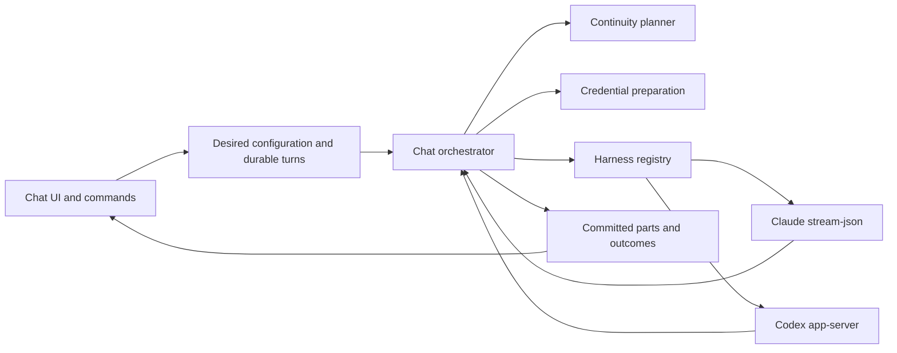

# Chat harness foundation: reviewed integration decisions

Reviewed on 2026-10-10 against main `bad53675b`. This records the implementation
boundary agreed by the runtime, continuity and credentials design lanes. It is
an implementation contract, not evidence that the behavior has already shipped.

The user authorized implementation with GPT-6.1 Sol xhigh tm8 workers and asked
for the adapter foundation before mounting chat. Codex uses its structured
app-server agent runtime, as in T3 Code; Claude keeps its stream-json runtime.

## Ownership

| Component | Owns | Does not own |
| --- | --- | --- |
| tm8 chat | Conversation identity, ordered history, desired settings, immutable claimed turns, authorization, persistence and publication | Provider hidden state |
| Continuity planner | Bounded historical projection, coverage, native eligibility and crash recovery | Tool execution or credential fallback |
| Credential preparation | Model-derived route, selected source, guarded authorization, private launch leases and cleanup | Conversation history |
| Harness adapter | Vendor transport, native session IDs, observations, submission, cancellation and confirmed process exit | Canonical storage, human identity or automatic replay |
| UI/API | Supported selections and truthful desired/current state | Client-selected provider, paths, secret material or proof of native readiness |

## Canonical private interfaces

The execution-owned runtime LLD defines `HarnessAdapter`, `HarnessSession`,
`GenerationFence`, `AttemptRef`, `CoverageCursor`, `BootstrapContext`,
`SeedReceipt` and `PreparedLaunch`. The server imports the same types rather
than maintaining a second runtime port.

SQL `runtime_epoch` maps to `GenerationFence.leaseEpoch`; native generation
maps to `GenerationFence.generation`; the immutable attempt snapshot ID maps
to `AttemptRef.attemptId`. Provider IDs are opaque, server-private references.
The portable projection policy version is a string. Server-only projection
receipts may contain richer omission and source metadata without creating a
competing execution contract.

`PreparedLaunch` is a node-local handle. Its materialization supplies only the
chosen generation's vendor environment, instructions, provider settings and MCP
descriptors. Those resources are never serialized into public chat state.
Cleanup waits for confirmed exit, checks the exact owner, and never removes a
shared login mount or a successor's files.

## Configuration and credentials

Model, inference provider, harness, reasoning effort and credential intent are
separate fields. The server resolves the provider and harness from its admitted
catalog and validates effort against the supported route. Unknown or
unimplemented combinations refuse before launch.

Existing `chat.setModel` accepts optional reasoning effort and credential
selection in the same atomic update; `chat.setCredentials` remains available
for source-only changes. Setters return saved desired state and revision. A
setting changed during an answer applies at the next claim. It never rewrites
the claimed turn or represents the old process as already reconfigured.

Keep `credentialSelection` as the backwards-compatible active-provider
projection. Persist a small credential intent with an unpinned default source
and provider-specific remembered choices. A named pin is scoped to its
inference credential provider. Switching away preserves that choice for a
switch back; the target provider uses its remembered choice or the unpinned
default. Failure of an explicit choice never permits fallback. A target choice
can be replaced atomically alongside model and effort.

Use the existing shared credential resolver and precedence policy. Native auth
provider, backend inference provider and policy namespace remain distinct for
Kimi through Claude and Groq through Codex. Options are filtered by the target
catalog route rather than an Anthropic-only UI filter.

Reuse existing credential/entity/policy revisions when they provide evidence.
Unknown account/material revisions disable hot reuse: acquire an authorized
generation-owned snapshot and replace through portable continuity. Do not make
this release depend on a new global account or membership epoch subsystem, and
do not pretend filesystem mtimes or a public secret hash prove account identity.

## Continuity and delivery

Existing turns, messages and message parts are canonical history. Add logical
turn ordering and generation/attempt records; do not create a duplicate
transcript log. A projection for turn N includes only earlier turns, including
partial and uncertain outcomes, in logical input/output order. It excludes N's
input and all future queued inputs. Streamed text and final message bodies are
never counted twice.

Native resume requires the exact native ID, compatible scope and verified
coverage without an unresolved tail. Unknown coverage, a missing transcript,
another harness or a changed credential storage scope creates a new generation
with a bounded portable history envelope. Historical tool calls/results remain
escaped, attributed data and are never dispatched. Only the current request is
sent as a live turn.

Use deterministic extractive compaction initially, with source references and
explicit omissions. Preserve constraints, unresolved work and uncertain effects;
keep complete source records readable through authorized bounded reads. Record
what was injected separately from the logical history coverage. Never silently
drop all previous context or truncate the active request.

Commit a dispatch marker before vendor submission. A crash after possible send
settles as interrupted or delivery unknown and is never automatically resent.
Only proved pre-send work may retry under its pinned configuration. Durable
terminal evidence can finalize without dispatch. Node recovery is scoped to
the owning node/lease and leaves healthy remote owners alone.

Generation/attempt fences protect canonical appends, settlement, lifecycle
updates and tm8-managed tool authorization. Late output, close or cleanup from
an old generation cannot affect its successor. Only provider success proves a
completed turn; accepted cancellation or process exit does not prove success.

## Required integration evidence

The final change must pass typecheck, build, focused adapter/server/UI tests and
fresh database migration checks. Fault-injection tests cover send uncertainty,
stale owners, boot revocation, queued future inputs, missing native history and
provider text snapshots. Adapter fixtures assert model/effort, exact returned
native IDs, MCP settings, terminal outcomes, tool pairing and interruption.

A composed chat test switches Claude to Codex and back, changes credentials,
and preserves an earlier unique fact and tool result without executing the
historical tool again. A bounded live provider smoke supplements deterministic
tests and reports precisely which providers and credentials were available.

See the three lane LLDs for implementation details and test matrices:

- [Runtime](chat-harness-runtime-lld.md)
- [Continuity](chat-harness-continuity-lld.md)
- [Credentials](chat-harness-credentials-lld.md)
