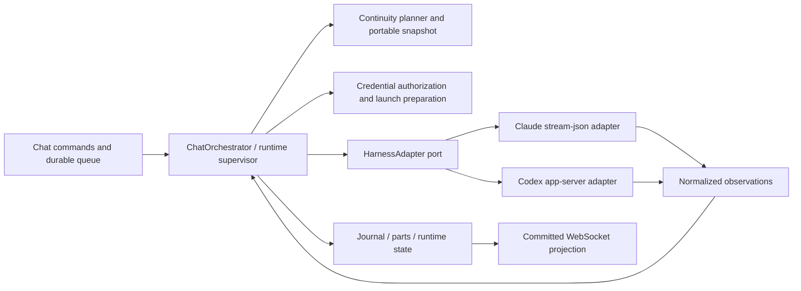
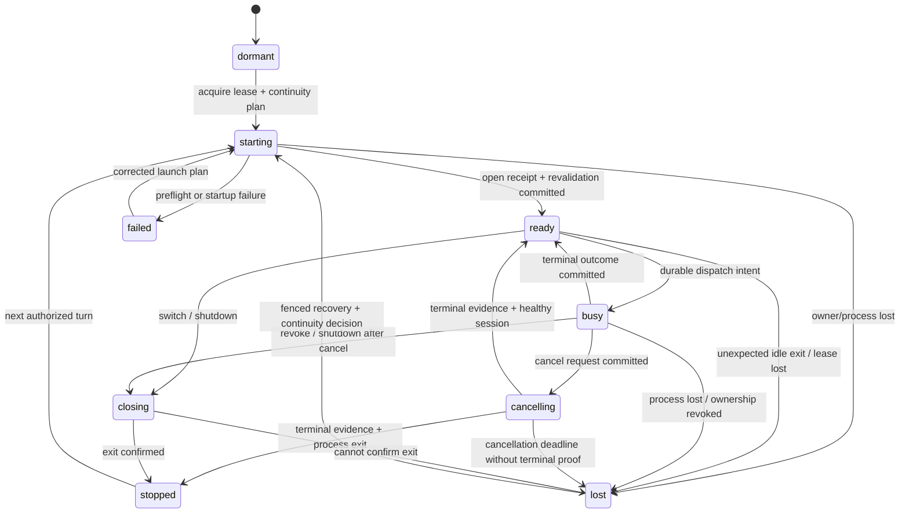
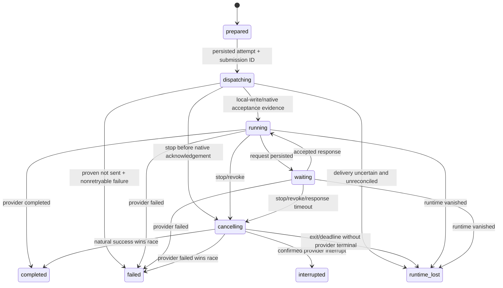
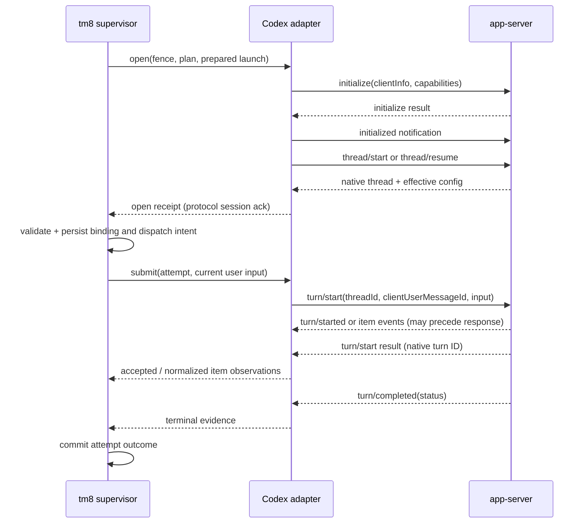

# Chat harness adapters and lifecycle foundation

Status: reviewed by the coordinator for the foundation contract; design only. Base: `bad53675bcd608445ab45e66cd5f40af81fd7067` (merged credential-selection PR #1158). Date: 2026-10-10. Task: `01a1259f-ecef-7c13-8883-892ba4a68877`. Companion lanes own portable continuity and credential policy. Implementation proceeds through separate assignments; this document authorizes no independent merge.

## 1. Decision and boundary

tm8 owns the conversation, turn queue, authorization, desired configuration, runtime leases, and durable outcomes. A harness owns one disposable execution of that conversation. Claude Code and Codex app-server implement a common execution port without pretending their native histories, tool protocols, or readiness signals are interchangeable.

Keep the current separation between structured chat subprocesses and work-session PTYs. Extend the chat foundation around four boundaries:



Execution adapters never access DB claims, choose another credential, append canonical messages, complete tm8 turns, retry submitted work, or decide whether history may be discarded. They execute an immutable launch plan and report evidence. Provider-native tools and MCP tools continue to execute inside the harness and existing MCP services; observing a tool event never dispatches the tool again.

One chat has at most one owned live generation and one active turn attempt. Initial implementation uses one subprocess per chat generation, including Codex, to isolate credentials, settings, cancellation and failures. Multiplexing several chats into a shared app-server is deferred; it would require independent account and thread isolation proofs.

## 2. Current code and concrete changes

| Current interface or behavior | Proposed change and owner |
| --- | --- |
| [`AgentRuntime`, `StartAgentThreadInput`, `TurnItem`](../../packages/execution/src/runtime/types.ts) require a Claude native UUID and `post_interrupt` resume | Replace with `HarnessAdapter`, `OpenHarnessInput`, discriminated native references and fenced observations. Execution owns the private port. |
| [`runtime.ts`](../../packages/server/src/chat/runtime.ts) duplicates execution's types with a different resume shape | Import/re-export the shared execution port; remove the translation in [`wrapExecutionAgentRuntime`](../../packages/server/src/chat/compose.ts). The server already depends on execution. |
| [`ClaudeHeadlessAdapter.startThread`](../../packages/execution/src/runtime/ClaudeHeadlessAdapter.ts) silently creates fresh when a resume transcript is gone | Return `continuity_required` before current-user dispatch. The supervisor requests an explicit portable bootstrap plan with a new native ID. |
| [`ChatOrchestrator.ensureRuntime`](../../packages/server/src/chat/orchestrator.ts) persists `live` before awaiting startup | Persist `starting`, launch, validate current authorization/configuration, then persist readiness evidence. Admission of startup MCP traffic needs a narrow starting-generation grant, not a false live status. |
| `runTurn` treats `closed` as completed; interruption becomes generic turn error | Only a provider success proves success. Persist `interrupted` and `runtime_lost` distinctly, including when closing interrupts active work. |
| `liveChats`, `drains`, adapter tombstones and counters are process maps | Retain maps as accelerators; durable generation/lease/attempt state is authoritative. Boot recovery reconciles only leases owned by the dead node. |
| [`createChatLaunchConfigResolver`](../../packages/server/src/chat/compose.ts) refuses every non-Claude model | Resolve harness via the catalog; compose a registry of Claude and Codex adapters, with harness-specific launch material. |
| [`createChatCredentialEnvResolver`](../../packages/server/src/chat/credentials.ts) returns only environment and materializes chat-scoped credential homes | Consume the credential lane's validated binding/prepared-launch lease. Separate credential compatibility from native-history compatibility. |
| [`MessagePart`, `ChatTurnUsage`](../../packages/contract/src/contract.ts) and [`MessagePartSchema`](../../packages/contract/src/schemas.ts) have eight presentation kinds | Preserve the existing part projection while adding runtime/attempt/phase metadata outside it. Introduce a versioned runtime DTO; do not expose vendor wire messages to UI. |

The existing model switch is sticky and freezes the chosen model when a turn is first claimed. Preserve that behavior. Changing desired configuration while an attempt runs affects the next attempt; the current attempt retains its accepted config revision. Revocation may cancel immediately, because permission loss is not an ordinary model switch.

## 3. Identity, configuration and capabilities

Harness, inference provider, model and credential are separate axes. `codex` can use an inference provider other than OpenAI; `claude` can use a non-Anthropic transport. Derive the supported combination from the server catalog and policy. Never select an adapter by guessing a model-name prefix, and never pass a Codex native ID to Claude.

The sketches in §§3–7 form one strict-TypeScript unit. They describe proposed interfaces, not code already shipped. IDs use strings here; implementation should reuse repository ID aliases.

```ts
export type HarnessKind = 'claude' | 'codex';
export type Json = null | boolean | number | string | readonly Json[]
  | { readonly [key: string]: Json };
export type Support = 'supported' | 'unsupported' | 'unknown';

export interface HarnessTarget {
  readonly harness: HarnessKind;
  readonly provider: string;
  readonly model: string;
  readonly reasoningEffort: string | null;
  readonly serviceTier: string | null;
}

export interface HarnessCapabilities {
  readonly schemaVersion: 1;
  readonly harness: HarnessKind;
  readonly binaryVersion: string;
  readonly protocolRevision: string;
  readonly nativeResume: Support;
  readonly portableBootstrap: Support;
  readonly cancelActiveTurn: Support;
  readonly nativeTurnIds: Support;
  readonly usage: Support;
  readonly contextReading: Support;
  readonly interactiveRequests: Support;
  readonly textInputs: Support;
  readonly imageInputs: Support;
  readonly fileInputs: Support;
  readonly builtInToolRestriction: Support;
  readonly configuration: Readonly<Record<
    'model' | 'reasoningEffort' | 'serviceTier' | 'instructions' | 'tools' | 'credential',
    'per_turn' | 'restart' | 'unsupported' | 'unknown'
  >>;
}

export interface NativeConversationRef {
  readonly schemaVersion: 1;
  readonly harness: HarnessKind;
  readonly nativeId: string;
  readonly nodeId: string;
  readonly storageScopeId: string; // opaque node-local history namespace
  readonly nativeStorageGeneration: number;
  readonly cwdIdentity: string;   // canonical, immutable directory identity
  readonly historyFormat: string;
}

export interface GenerationFence {
  readonly chatId: string;
  readonly bindingId: string;
  readonly generation: number;
  readonly leaseEpoch: number;
  readonly configRevision: number;
}

export interface AttemptRef {
  readonly turnId: string;       // stable tm8 user-request identity
  readonly attemptId: string;   // distinct dispatch/recovery attempt
  readonly configRevision: number; // frozen attempt config, may differ from launch
}

export interface RuntimeConfig {
  readonly schemaVersion: 1;
  readonly revision: number;
  readonly target: HarnessTarget;
  readonly instructionHash: string;
  readonly toolPolicyHash: string;
  readonly mcpBindingRevision: string;
  readonly cwdIdentity: string;
  readonly credentialBindingId: string;
  readonly credentialRevision: string | null;
  readonly launchFingerprint: string | null; // nonsecret comparison token
}
```

A configuration is an immutable snapshot, including instructions, chat mode/tool policy, connectors, requester authority, cwd, model/effort/tier, credential binding and material revision. The public desired config may move while a generation is active. Store desired revision, attempt revision, and observed effective facts separately. A launch fingerprint covers immutable spawn settings, excluding only measured supported per-turn overrides. It should come from known secret-store material revisions and policy facts, not a published hash of raw low-entropy secrets. Unknown/unversioned account material sets revision/fingerprint to null and is incompatible for hot reuse; neither mtime nor a secret hash proves account identity. Phase one reuses existing entity/policy revisions and fresh authorization checks, without requiring new global membership/session/node-account epoch stores.

`NativeConversationRef` is durable but server-only; public clients do not receive filesystem paths. Claude's native ID can be tm8-minted for creation and must be confirmed by the stream. Codex's ID comes from `thread/start`/`thread/resume`; never synthesize it or equate it with `chatId`, `sessionId`, or a tm8 turn ID. Namespace and cwd are eligibility constraints even when the ID looks like a UUID.

Capabilities come from an installed-version support matrix plus bounded local protocol/config preflight, not a successful inference probe. A known schema does not prove model entitlement or authentication. Unsupported and unknown features produce explicit preflight errors when required. Optional usage/context can remain unknown. Claude's current CLI path advertises no native-turn correlation or interactive-request bridge; Codex can advertise these only when implemented and tested.

## 4. Launch and continuity ports

```ts
export interface CoverageCursor {
  readonly throughTurnOrdinal: number;
  readonly captureHighWater: number;
  readonly projectionPolicyVersion: string;
  readonly authorityScopeDigest: string;
  readonly logicalHistoryDigest: string;
}

export interface BootstrapContext {
  readonly schemaVersion: 1;
  readonly snapshotId: string;
  readonly coverage: CoverageCursor;
  readonly contentHash: string;
  readonly renderedContext: string;
  readonly manifest: readonly {
    readonly sourceId: string;
    readonly treatment: 'included' | 'summarized' | 'reference';
    readonly reason: string | null;
  }[];
}

export type OpenMode =
  | { readonly kind: 'create' }
  | {
      readonly kind: 'resume';
      readonly native: NativeConversationRef;
      readonly expectedCoverage: CoverageCursor;
    }
  | { readonly kind: 'bootstrap'; readonly context: BootstrapContext };

export interface McpDescriptor {
  readonly name: string;
  readonly command: string;
  readonly args: readonly string[];
  readonly env: Readonly<Record<string, string>>;
  readonly cwd: string | null;
}

export interface LaunchMaterial {
  readonly harness: HarnessKind;
  readonly command: string;
  readonly argvPrefix: readonly string[];
  readonly cwd: string;
  readonly modelConfigDir: string;
  readonly env: Readonly<Record<string, string>>;
  readonly instructionText: string;
  readonly providerConfig: Json;
  readonly mcpConfigPath: string;
  readonly mcpServers: readonly McpDescriptor[];
  readonly nativeTools: readonly string[];
  readonly allowedTools: readonly string[];
}

export interface PreparedLaunch {
  readonly kind: 'ephemeral-launch';
  readonly launchId: string;
  readonly storageScopeId: string;
  readonly nativeStorageGeneration: number;
  readonly owner: {
    readonly chatId: string;
    readonly generation: number;
    readonly ownerLeaseId: string;
    readonly claimFence: string;
  };
  readonly modelCredentialLeaseId: string;
  readonly runtimeGrantId: string;
  readonly capabilityPlanId: string;
  // Node-local materialization. Never serialize this object, env, or auth files.
  materialize(): Promise<LaunchMaterial>;
  // Release only this generation's files and credential lease after exit.
  release(): Promise<void>;
}

export interface OpenHarnessInput {
  readonly fence: GenerationFence;
  readonly config: RuntimeConfig;
  readonly mode: OpenMode;
  readonly launch: PreparedLaunch;
}

export interface ExecutionFacts {
  readonly requested: HarnessTarget;
  readonly configuredModel: string | null;
  readonly observedModel: string | null;
  readonly observedEffort: string | null;
  readonly observedServiceTier: string | null;
  readonly evidence: 'requested_only' | 'protocol_echo' | 'provider_observed';
}

export interface OpenReceipt {
  readonly native: NativeConversationRef;
  readonly nativeConfirmed: boolean;
  readonly readiness: 'stdin_writable' | 'protocol_session_ack';
  readonly capabilities: HarnessCapabilities;
  readonly execution: ExecutionFacts;
  readonly seed: SeedReceipt | null;
}

export interface SeedReceipt {
  readonly snapshotId: string;
  readonly coverage: CoverageCursor;
  readonly contentHash: string;
  readonly transport: 'instructions' | 'current_turn_prefix';
  readonly acknowledgement: 'launch_materialized' | 'protocol_echo' | 'turn_accepted';
}
```

The continuity planner chooses `create` only for a genuinely new conversation, `resume` only for a verified compatible native checkpoint, and `bootstrap` for a new native binding with tm8 context. Execution consumes the planner's result; it does not derive the snapshot from vendor files. The continuity lane owns snapshot persistence, coverage semantics, budget policy and renderer. `BootstrapContext` is the minimal execution-facing view, not a second canonical transcript format.

A bootstrap must include durable partial output, known tool outcomes and unresolved side effects as historical data. It excludes the current queued user input, which is delivered exactly once by `submit`. Trusted policy wraps an explicitly marked untrusted-history data section; historical instructions never acquire system authority. Do not serialize historical tools as active tool calls, feed them to an executor, or invent old assistant messages as new user requests. Any summary/reference budget treatment is recorded in the manifest; a budget that cannot preserve the required context refuses launch rather than silently resetting.

Coverage is a logical-history cursor, not a raw event high-water mark. Queued B/C can already be stored while turn A streams. Select prior turn ordinals only, exclude ordinals greater than or equal to the current turn, sort by ordinal/user-or-assistant/part sequence, and render streamed parts or a finalized body without counting both. `captureHighWater` freezes the source read; the ordinal and digests define semantic coverage. Authority digest includes prompt/tool scope compatibility. Resume equality compares `throughTurnOrdinal`, `projectionPolicyVersion`, `authorityScopeDigest` and `logicalHistoryDigest`; different capture high-waters caused only by excluded future inputs do not disqualify otherwise unchanged eligible history. Resume also requires an acknowledged seed and no unresolved provider tail. Promote coverage only after terminal, all parts and a native-tail checkpoint are durable.

If explicit instruction seeding cannot be proven for a supported adapter/version, prepend the marked immutable historical-data section to the one current-user frame. This is `current_turn_prefix`, never a separate seed turn. Record the transport and content hash in `SeedReceipt`; `launch_materialized` proves only locally configured bytes and leaves the seed prepared. Only `protocol_echo` or the first `turn_accepted`, under adapter conformance, establishes injection. Injection evidence still does not prove complete native coverage. A bootstrap receipt remains provisional until this acknowledgement; coverage cannot be promoted from a provisional seed.

Native resume eligibility includes harness, storage scope, cwd identity, compatible history format, canonical coverage and tool-policy/authority rules. Model change alone need not disqualify same-harness resume; authority, provider/account, instructions and tool changes require the continuity planner's explicit compatibility decision. Any malformed, absent or wrong-ID native history returns `continuity_required`; resume failure never recursively falls back inside an adapter.

Credential material and MCP settings are prepared per generation. Revalidation occurs before reuse, after launch, and immediately before dispatch. A failed new launch leaves the old canonical history intact and the desired config visibly unapplied. Native history is not deleted with ephemeral credential files. Whether a provider can read the same native history after credential rotation is a compatibility fact, never implied by equality of a filesystem path.

## 5. Events, dispatch and process lifecycle port

```ts
export interface TurnCommand {
  readonly attempt: AttemptRef;
  readonly clientSubmissionId: string;
  readonly text: string; // current user input plus server-authored attribution
  readonly attachmentRefs: readonly string[];
  readonly config: RuntimeConfig; // frozen attempt config; supports safe turn overrides
}

export type DispatchReceipt =
  | { readonly delivery: 'not_sent'; readonly code: string }
  | {
      readonly delivery: 'sent';
      readonly acknowledgement: 'local_write' | 'native_ack';
      readonly nativeTurnId: string | null;
    }
  | { readonly delivery: 'unknown'; readonly nativeTurnId: string | null };

export interface CancelReceipt {
  readonly disposition: 'requested' | 'already_terminal' | 'not_running' | 'failed';
  readonly nativeTurnId: string | null;
}

export interface RuntimeFailure {
  readonly code:
    | 'invalid_config' | 'unsupported_capability' | 'continuity_required'
    | 'credential_unavailable' | 'spawn_failed' | 'protocol_mismatch'
    | 'protocol_error' | 'provider_error' | 'runtime_lost' | 'persistence_failed';
  readonly stage: 'prepare' | 'open' | 'submit' | 'stream' | 'cancel' | 'close';
  readonly safeMessage: string;
  readonly providerCode: string | null;
  readonly disposition: 'retry_before_dispatch' | 'resume_or_bootstrap'
    | 'reconcile_before_retry' | 'blocked';
}

export interface UsageFact {
  readonly scope: 'request' | 'attempt' | 'native_conversation';
  readonly observationId: string;
  readonly requestId: string | null;
  readonly inputTokens: number | null;
  readonly outputTokens: number | null;
  readonly cacheReadTokens: number | null;
  readonly cacheWriteTokens: number | null;
  readonly reasoningOutputTokens: number | null;
  readonly costUsd: number | null;
  readonly costBasis: 'provider_reported' | 'client_estimate' | 'unknown';
  readonly evidence: 'reported' | 'cumulative_difference';
  readonly baselineId: string | null;
}

export interface ContextFact {
  readonly usedTokens: number | null;
  readonly capacityTokens: number | null;
  readonly cacheReadTokens: number | null;
  readonly requestInputTokens: number | null;
  readonly model: string | null;
  readonly observedAt: string;
  readonly source: 'claude_request_usage' | 'codex_request_usage';
  readonly capacitySource: 'provider' | 'runtime' | null;
  readonly unavailableReason: 'not_reported' | 'incomplete_usage'
    | 'sample_outside_window' | 'awaiting_new_sample' | null;
}

export interface ToolObservation {
  readonly toolKey: string; // scoped generation + attempt + native item/call ID
  readonly nativeCallId: string;
  readonly name: string;
  readonly args: Json | null;
  readonly state: 'running' | 'completed' | 'failed' | 'declined' | 'unresolved';
  readonly result: Json | null;
  readonly origin: 'native' | 'mcp';
  readonly evidence: 'started' | 'completed' | 'completion_only' | 'runtime_lost';
}

export interface PendingHarnessRequest {
  readonly requestKey: string; // scopes vendor RPC ID to this connection/generation
  readonly nativeRequestId: string | number;
  readonly kind: 'approval' | 'user_input' | 'elicitation' | 'dynamic_tool';
  readonly itemId: string | null;
  readonly payload: Json;
  readonly deadlineAt: string;
}

export type TerminalOutcome = 'completed' | 'failed' | 'interrupted' | 'runtime_lost';
export type ObservationPayload =
  | { readonly kind: 'native_confirmed'; readonly native: NativeConversationRef }
  | { readonly kind: 'seed_acknowledged'; readonly seed: SeedReceipt }
  | { readonly kind: 'turn_accepted'; readonly nativeTurnId: string | null }
  | {
      readonly kind: 'text'; readonly itemId: string; readonly revision: number;
      readonly operation: 'append' | 'replace'; readonly text: string;
      readonly phase: 'commentary' | 'final' | 'unknown';
    }
  | { readonly kind: 'thinking'; readonly itemId: string; readonly text: string }
  | { readonly kind: 'tool'; readonly tool: ToolObservation }
  | { readonly kind: 'request'; readonly request: PendingHarnessRequest }
  | { readonly kind: 'request_resolved'; readonly requestKey: string }
  | { readonly kind: 'usage'; readonly usage: UsageFact }
  | { readonly kind: 'context'; readonly context: ContextFact }
  | { readonly kind: 'execution_facts'; readonly facts: ExecutionFacts }
  | { readonly kind: 'warning'; readonly code: string; readonly safeMessage: string }
  | { readonly kind: 'failure'; readonly failure: RuntimeFailure; readonly willRetry: boolean }
  | {
      readonly kind: 'terminal'; readonly outcome: TerminalOutcome;
      readonly evidence: 'provider_terminal' | 'process_exit' | 'reconciliation';
    }
  | {
      readonly kind: 'runtime_exit'; readonly expected: boolean;
      readonly exitCode: number | null; readonly signal: string | null;
    };

export interface HarnessObservation {
  readonly schemaVersion: 1;
  readonly fence: GenerationFence;
  readonly attempt: AttemptRef | null; // idle failures are still observable
  readonly nativeTurnId: string | null;
  readonly adapterSeq: number; // monotonic within a generation, assigned once
  readonly observedAt: string;
  readonly payload: ObservationPayload;
}

export interface CloseReceipt {
  readonly exited: boolean;
  readonly forced: boolean;
  readonly nativeUsable: boolean | null;
}

export interface HarnessSession {
  readonly fence: GenerationFence;
  readonly opened: OpenReceipt;
  // Single consumer, buffered from spawn; covers both active and idle events.
  readonly observations: AsyncIterable<HarnessObservation>;
  submit(command: TurnCommand): Promise<DispatchReceipt>;
  cancel(attempt: AttemptRef, reason: 'user' | 'revocation' | 'shutdown'): Promise<CancelReceipt>;
  respond(requestKey: string, response: Json): Promise<void>;
  close(reason: 'reconfigure' | 'shutdown' | 'revocation' | 'failure'): Promise<CloseReceipt>;
}

export interface HarnessAdapter {
  readonly kind: HarnessKind;
  capabilities(): Promise<HarnessCapabilities>;
  open(input: OpenHarnessInput): Promise<HarnessSession>;
}
```

The single session stream replaces per-turn iterators plus an independent unfenced `onThreadExit` callback. Install wire readers and buffer observations before `open` resolves; the supervisor starts consuming before `submit`. Asynchronous notifications can precede an RPC response. The adapter reserves the attempt before writing stdin, so all events attach to that attempt even when native acceptance arrives first. Every exit removes the local registry only if it still names that exact generation.

Programmer/lifecycle violations such as wrong generation, overlapping attempt or cross-harness resume throw before I/O. Operational failures before a session exists use a typed error containing `RuntimeFailure`. Once a session exists, operational failure/exit travels through observations. `submit` must report its delivery certainty even when an RPC timeout or pipe failure occurs. A rejected promise after bytes may have been written cannot imply `not_sent`.

`clientSubmissionId` is stable across local command retries, but is correlation metadata, not a vendor idempotency guarantee. Never automatically resubmit a `sent` or `unknown` command. Codex's `clientUserMessageId` can help reconcile acceptance; it is not proof of deduplication. Claude has no equivalent reliable native turn ID in the present adapter. Reconciliation reads native facts or records uncertainty; it does not rerun the prompt to find out.

Queue/event bounds must be configured. A slow DB consumer causes backpressure, not dropped tool results or terminal events. Bound line size, retained stderr and queued bytes; crossing a bound closes the generation, surfaces `protocol_error`/`runtime_lost`, and preserves already persisted output. Unknown notification methods become bounded diagnostics. Unknown server requests receive a protocol-appropriate error; they must not be left hanging or treated as executable instructions. Broken known required payloads fail the generation.

## 6. Durable lifecycle and fencing

Runtime binding states describe process evidence; turn-attempt states describe accepted work. Neither is inferred from UI activity or a stale in-memory map.

```ts
export type BindingState = 'dormant' | 'starting' | 'ready' | 'busy'
  | 'cancelling' | 'closing' | 'stopped' | 'failed' | 'lost';
export type AttemptState = 'prepared' | 'dispatching' | 'running' | 'waiting'
  | 'cancelling' | 'completed' | 'failed' | 'interrupted' | 'runtime_lost';

export interface RuntimeBinding extends GenerationFence {
  readonly schemaVersion: 1;
  readonly stateVersion: number;
  readonly state: BindingState;
  readonly ownerNodeId: string;
  readonly leaseExpiresAt: string;
  readonly config: RuntimeConfig;
  readonly native: NativeConversationRef | null;
  readonly nativeConfirmed: boolean;
  readonly nativeCoverage: CoverageCursor | null;
  readonly readiness: OpenReceipt['readiness'] | null;
  readonly activeAttempt: AttemptRef | null;
  readonly lastAdapterSeq: number;
}
```





All active states also permit a valid provider terminal: a turn can finish before its start RPC response arrives, including while `dispatching` or `waiting`. Terminal outcomes are absorbing. A provider-terminal event already journaled before a process exit retains its outcome; a delayed contradictory terminal does not rewrite it. If the runtime stream ends without a terminal, record `runtime_lost`, not success. The binding may become `lost` while its previously completed attempt remains `completed`.

The DB transaction owns lease acquisition and increments generation/lease epoch. Mutations check expected state version and `(chatId, bindingId, generation, leaseEpoch, attemptId)`; persistence deduplicates `(bindingId, adapterSeq)`. A generation keeps its frozen config revision when the desired config advances. Do not reject its valid output merely because it differs from the latest desired revision. A replaced generation cannot append new canonical output, publish, mark a new binding stopped, or complete its successor's attempt.

Adapters map Codex `threadId`/`turnId` to the expected native reference and attempt. Claude's serial stdin lane attributes output to the single reserved attempt, validates native session identity, and closes the process on ambiguous correlation. No attempt starts until the previous terminal is persisted and the adapter is idle. Idle exits remain fenced runtime facts.

Recovery acquires a new ownership epoch, invalidates the dead owner's rights, and reconciles dispatching/running attempts. Unsent work can continue normally. Work possibly accepted is read/reconciled where possible; otherwise it ends with a visible uncertain outcome. Old prompts and tool calls are never replayed automatically. Boot reconciliation is node/lease scoped, not a global update of every chat marked live; a multi-node deployment may have healthy owners elsewhere. Existing legacy native bindings start with unknown coverage and must be validated by the continuity lane before reuse.

## 7. Ordered persistence and projection

The supervisor owns the only durable consumer. For each fenced observation:

1. Verify owner lease, binding generation, attempt mapping and local sequence. Persist the normalized journal observation with a unique key; duplicates have no effect.
2. Project transcript changes/tool state/usage/context from that observation and increment state version within the same transaction. Native items are facts, not executable queue entries.
3. On terminal, settle unresolved requests and tools, then commit exactly one attempt outcome. Promote native coverage only after all required observations and canonical output are durable and the continuity planner has a verified checkpoint.
4. Publish the committed cursor/parts/status using the existing publisher boundary. Reconnecting clients reread durable state and resume from a cursor; an unpersisted delta is never presented as durable history.

If persistence fails, stop consuming for publication, retain bounded pending facts and cancel/close the harness. Do not synthesize an error+done into the same broken write path repeatedly. Record a persistence blocker through the durable recovery mechanism when storage returns. Any native work beyond the last committed cursor makes the checkpoint ineligible until reconciled. Persist terminal finalization plus part projection atomically where possible; if split, a durable finalize intent must allow retry without a second outcome.

Text is keyed by item and revision. Append deltas accumulate one item; the authoritative completed snapshot may replace its accumulated value. It does not append the full text again. Existing append-only `MessageTextPart` cannot encode arbitrary corrections; use an internal canonical item projection and a versioned replacement notification/DTO. A legacy projection may append only an exactly verified missing suffix; divergence requires rereading the corrected item, never duplication. Preserve commentary versus final-answer phase as optional metadata; `phase=null` is unknown, not final. Multiple assistant items do not mean multiple user turns.

Tool identity is `(generation, attempt, native item/call ID)`, never name or arguments. `item/completed` or a `tool_result` can arrive without a visible start during recovery: create a completion-only observed call before projecting its result, mark its evidence, and never execute it. Duplicate completion/result is idempotent. If completion claims success but supplies no result, preserve an unknown result; do not invent tool output. On uncertain termination, open tools become `unresolved`, with no fabricated success or provider-error payload. The legacy presentation can draw an error/unavailable state while canonical tool truth retains uncertainty.

Runtime diagnostics, provider warnings, requests, and current context readings are runtime/journal facts, not fabricated assistant prose. Tool-result truncation follows the continuity lane's explicit blob/reference policy; journal identity and outcome survive presentation truncation.

## 8. Concrete Claude adapter

Retain the pipe-based [`ClaudeHeadlessAdapter`](../../packages/execution/src/runtime/ClaudeHeadlessAdapter.ts), current argv/tool policy and environment allow-list. Split its process lifecycle, wire parsing and pure event normalizer so fixtures exercise normalization independently of wall-clock boot timers. Do not switch to an SDK solely to obtain a common interface.

Creation uses an explicitly minted new UUID with `--session-id`; verified resume uses `--resume <same-id>` in the eligible native-history namespace and cwd. Bootstrap composes tm8's policy and marked portable-history data into the explicitly supplied system prompt before the first current-user frame. It never invokes an inference-only seed turn. Keep stdin open across healthy turns; model, credential, instructions and tool configuration changes restart this CLI generation at a turn boundary.

The present boot timer proves only that a process spawned and survived a short interval. Report `stdin_writable`, not provider-authenticated or native-resume-confirmed. `system.init`/session-bearing output confirms the expected native ID; mismatch fails closed. A later provider authentication failure is an attempt failure. Do not send a probe prompt to manufacture readiness.

| Claude stream observation | Normalized behavior |
| --- | --- |
| `system` init/session ID | Confirm native identity; record model/tool facts actually supplied. |
| Assistant `thinking` and `text` blocks | Item-keyed observations. Empty thinking is omitted. Retain stable block identity in the generation normalizer. |
| Assistant `tool_use` | Tool running fact keyed by `tool_use.id`, preserving actual arguments. |
| User `tool_result` | Result for `tool_use_id`; complete/error its observed call. Unknown ID creates completion-only evidence, not a new execution. |
| Successful `result` | Final usage snapshot then provider terminal completed. A pending cancel flag alone cannot change success into interrupted. |
| Failed result subtype / explicit interruption | Typed failure or provider-confirmed interrupt. Failed and interrupted usage can still contain measured spend. |
| Process exit without provider terminal | Active attempt runtime_lost; idle binding stopped/lost according to close intent. |
| Compaction boundary | Invalidate context reading and native-coverage assumptions requiring a fresh checkpoint; await a new request sample. |

Pin and measure the current CLI's interruption result subtypes. If SIGINT produces no distinguishable interrupted terminal, exit/signal evidence can establish process interruption but not that every side effect stopped; keep the attempt's tool uncertainty. A kill signal's successful delivery is only `CancelReceipt.requested`. Closing stdin on an idle process can be graceful; closing an active process must cancel first, wait a bounded grace period, then kill/escalate and report forced/lost evidence. Preserve the natural terminal when it races cancellation.

Current implementation and fixtures establish running conversation totals and separate request-context readings. Persist per-native-conversation accounting baselines beyond adapter memory. Difference compatible monotonically increasing counters only. Missing baselines, decreasing/reset counters, omitted metrics and aborted zeroed usage remain unknown; zero is accepted only when actually reported for the correct scope. Do not derive cost from a pricing table. Claude's CLI cost is a client estimate, not an actual invoice. The official CLI docs confirm stream-json, explicit resume, cumulative resumed cost, and the distinction between SIGINT and SIGTERM; these are compatibility checks, not new product behavior. [Claude programmatic mode](https://code.claude.com/docs/en/headless), [CLI reference](https://code.claude.com/docs/en/cli-reference).

## 9. Concrete Codex adapter and protocol pin

Use a `CodexAppServerAdapter` with one isolated `codex app-server --listen stdio://` child per generation and an explicit prepared configuration home. Spawn without a shell. Keep ambient credentials, project/account defaults and unrelated MCP servers out of the prepared config; translate tm8's MCP bindings and the existing approved chat policy into supported version-pinned settings. Do not assume Claude tool flags restrict Codex's built-ins. A required tool restriction without a supported enforcement path refuses preflight; advisory chat mode and enforceable tool policy are separate facts.

Protocol inspected: installed `codex-cli 0.161.0`, stable generated v2 TypeScript from `codex app-server generate-ts --out <temporary-directory>`; no inference request made. Generated types are the wire authority for this design. Implementation should pin a small used v2 subset and payload validators with decoder fixtures under `packages/execution/src/runtime/codex/protocol/`, record binary version plus subset schema digest, and reject incompatible installed versions before dispatch. It need not import the enormous generated tree. Do not hand-copy a historical protocol or enable experimental fields implicitly.

Official docs establish the initialization handshake, request/notification distinction, schema generation and terminal statuses. The concrete type mapping below is based on the locally generated 0.161.0 schema; docs examples are not the decoder. [Codex app-server documentation](https://learn.chatgpt.com/docs/app-server).



Use transport-wide unique request IDs, pending-request promises, response/error decoding, server-initiated request routing, bounded JSON-line buffers and a reader that survives idle periods. Response IDs and server-request IDs belong to separate directions. `initialize` occurs once per connection, followed by `initialized`. No active transport retry reconnects and resubmits work automatically.

MCP descriptors are harness-neutral private launch data. Claude composition writes `{mcpServers: {name: {command, args, env, cwd?}}}` to the existing strict config file. Codex composition translates each descriptor to supported `config.mcp_servers.<name>` entries with `command`, `args`, `env` and optional `cwd`, disables inherited servers and supplies only the tm8-authorized list. Validate names and shape against the pinned settings subset; no opaque Claude JSON file is passed to Codex. Provider backend configuration must explicitly set `modelProvider` and supported `model_providers.<key>` transport/credential settings for catalog entries such as Groq via Codex; Claude backend selection such as Moonshot is likewise explicit prepared material. Unsupported backend combinations refuse capability preflight before changing active storage/binding, rather than silently using ambient account defaults. Credential/composition lane owns the descriptor/provider conversion; execution validates the final supported settings.

| Generated 0.161.0 type or notification | Adapter mapping / constraint |
| --- | --- |
| `ThreadStartParams` | Explicit `model`, `modelProvider`, `serviceTier`, `cwd`, `approvalPolicy`, `sandbox`, `config`, `baseInstructions`/`developerInstructions`. Durable native thread required, so no ephemeral thread. Bootstrap history is marked data inside explicit instructions. |
| `ThreadResumeParams` | Resume by `threadId` with allowed config overrides and `excludeTurns` for bounded reads. Stable type does not expose arbitrary portable `history` input; comments describing history/path are not permission to send missing fields. |
| `Thread` | Preserve returned `id`; `sessionId` is a different tree identity. `model`/`reasoningEffort` are configured metadata, explicitly not per-turn execution telemetry. Paths remain private. |
| `TurnStartParams` | `input: UserInput[]`, `clientUserMessageId`, model/effort/tier overrides supported by the adapter matrix. Native input files/images only when authorization and model capabilities allow; existing tm8 attachment references still work as text. Never send historical `toolOutput` as a bootstrap mechanism. |
| `Turn` / `turn/started` | Bind returned/observed native turn ID to the pre-reserved attempt. Only one current native turn is allowed. Receipt is acceptance, not success. |
| `item/agentMessage/delta` | Append to `itemId`; collect until authoritative `agentMessage` item completion. Preserve `phase` when the completed item supplies it. |
| `item/started`, `item/completed` | Upsert native item by ID. Completed `agentMessage.text` replaces its buffer. `reasoning.summary` may project thinking; opaque raw reasoning is not portable semantic history. |
| `commandExecution`, `fileChange`, `mcpToolCall` | Tool observations using item ID. Preserve command/cwd/output/exit code, patch changes, or MCP server/tool/result/error. `failed`/`declined` remain distinct internally. Tool state never completes the whole turn. |
| `dynamicToolCall` / server `item/tool/call` | Route through an implemented existing tool executor exactly once, keyed by request/attempt. Initial adapter does not enable dynamic tool definitions; known unexpected calls receive failure rather than dispatching arbitrary work. |
| `error` with `willRetry` | Recoverable provider failure diagnostic when true. Never infer terminal failure until `turn/completed` or loss evidence. A false value still needs terminal/loss reconciliation. |
| `turn/completed` | `completed` → completed; `failed` → failed with typed error; `interrupted` → interrupted. Process exit zero or an `agentMessage` does not substitute for this event. |
| `thread/status/changed` | Observe idle/active/systemError/notLoaded for health; do not overwrite tm8 attempt outcome based on thread status. |
| `TurnInterruptParams` | Requires both `threadId` and `turnId`. If native turn ID has not arrived, latch cancellation, do not send another turn, and issue interrupt as soon as correlated ID exists. |
| `thread/tokenUsage/updated` | `threadId`, `turnId`, `tokenUsage.total`, `tokenUsage.last`, `modelContextWindow`. Scope and baseline rules below. |
| `contextCompaction` item | Invalidate displayed context until a fresh sample; retain known totals as accounting facts but verify reset behavior. |
| `model/rerouted` | Update actual execution evidence while retaining requested/configured model. No silent rewrite of user selection. |

Server-initiated approval, permissions, user-input and MCP elicitation requests need explicit bounded handling. For an implemented request, persist `PendingHarnessRequest`, move attempt to waiting and route through the existing tm8 request/form mechanism. Validate the user's reply against current generation, authority, deadline and expected request key, then answer the original RPC ID once. Late, duplicate or old-generation replies cannot authorize successor work. On cancel/exit, settle the request visibly. If this bridge is not implemented for a request kind, return the schema-correct denial/error and fail/cancel cleanly; never advertise support or hang. Auth-refresh requests belong to the credential service, not to canonical transcript or a human tool approval. Do not request attestation capabilities that tm8 cannot serve.

`tokenUsage.total` is conversation cumulative accounting; `last` is a request sample. Store a baseline associated with native reference, provider/counter epoch and observation ID before dispatch. Difference totals to compute an attempt only when the baseline is known and monotonic; repeated cumulative updates replace the latest snapshot rather than being summed. `inputTokens` already includes cached input, and `reasoningOutputTokens` is a subset of output, so neither is added again. `cacheWriteInputTokens` maps to cache-creation usage when supplied. No cost field means unknown cost.

For context, use `last.inputTokens` as occupancy and `last.cachedInputTokens` as cache-read contribution, matching [`read-transcript.ts`](../../packages/execution/src/transcript/read-transcript.ts). Do not use cumulative totals as context occupancy or fabricate a model window. `modelContextWindow=null` means unknown capacity. Publish samples with binding/attempt/model and invalidate them on a new native binding, compaction or changed model until refreshed. Protocol field existence alone does not prove billing semantics across versions; fixture/measurement coverage must pin the scope and counter-reset assumptions.

## 10. Configuration changes and cancellation invariants

At the next turn boundary, the supervisor snapshots the desired config and current authority, validates credentials/capabilities, then asks continuity for an eligible binding. Reuse requires a valid owner lease, no active attempt, a known compatible immutable launch fingerprint, namespace/cwd/tool/authority match and known continuity coverage. Same-harness per-turn overrides may avoid a restart only after capability/continuity approval; first implementation may conservatively restart/resume for every config change. `TurnCommand.config` and `AttemptRef.configRevision` freeze that attempt's model/effort/tier separately from the binding's original launch revision; Codex translates these to the supported `turn/start` overrides only when provider route, authority, tool surface and native storage remain compatible. Credential changes always create a newly authorized generation unless the credential lane supplies a measured safe hot-update operation.

Cross-harness switching closes the old generation and bootstraps a new native conversation from tm8 history. Switching back may resume an old native reference only if its coverage is complete and its configuration/namespace is still eligible; otherwise bootstrap again. An older native conversation missing intervening turns is never silently resumed.

Cancellation is an intent followed by evidence. Persist cancel intent, invoke adapter cancellation, keep the attempt cancelling, then wait for provider terminal or bounded escalation. Only provider success can become completed, even if it races a Stop click. A cancellation request does not erase partial output, reported spend or known tool results. Force-kill without provider terminal ends runtime_lost and marks open tool side effects unresolved. The next prompt receives that uncertainty as history; it does not automatically continue or replay the old prompt. Revocation prevents future dispatch immediately and cancels active work under the old fence.

Closing is idempotent and waits for exit. Closing an idle process does not create a fake turn/done part. If exit cannot be confirmed, retain closing/lost evidence, revoke ownership and prevent replacement dispatch until process isolation or termination is proven. `PreparedLaunch.release` is permitted only after that generation can no longer use its files. A late old-process callback cannot clear a new generation's process registry or state.

## 11. Implementation seams and invariant tests

Implementation is a separate authorized phase. These are exact proposed files/interfaces and acceptance tests, not tests run for this documentation change.

| File | Interface / change | Required verification |
| --- | --- | --- |
| `packages/execution/src/runtime/types.ts` | §§3–6 private contracts; replace eight-kind-only transport port | Shared adapter conformance suite compiles each adapter against one port; server no longer copies it. |
| `packages/execution/src/runtime/HarnessRegistry.ts` | Catalog-driven `get(HarnessKind)` plus capability preflight | Unregistered/unsupported target refuses before materialization; provider and harness cannot be confused. |
| `packages/execution/src/runtime/ClaudeHeadlessAdapter.ts` and `claude/normalize.ts` | Session stream, exact generation cleanup, typed resume refusal | Keep existing argv/HOME/env/tool tests; replace the current missing-transcript fresh-start test with continuity_required and no user dispatch. |
| `packages/execution/src/runtime/CodexAppServerAdapter.ts` | Handshake, thread open/resume, dispatch/cancel/request routing | Fake app-server asserts method order, native IDs and both interrupt IDs. Out-of-order response/notification, duplicate ID, failed RPC, disconnect, malformed/big line, idle death. |
| `packages/execution/src/runtime/codex/protocol/` and `codex/normalize.ts` | Pinned used v2 subset/validators and pure normalizer | Subset schema digest/version fixture; required bad shapes refuse; unknown methods diagnosed; unknown request gets response. |
| `packages/server/src/chat/runtime.ts` | Import/re-export shared port; credential/continuity service types | Typecheck proves one shared interface; no Claude-only wrapper. |
| `packages/server/src/chat/compose.ts` | Registry and per-harness launch composition | Existing chat-mode tool-policy tests plus Codex config/MCP isolation; unsupported restriction refuses before inference. |
| `packages/server/src/chat/orchestrator.ts` or extracted `runtime-supervisor.ts` | Frozen config, lease/attempt fence, ordered persistence | Extend current tests for startup state, revalidation races, absorbing terminal and no stale-generation append/state update. |
| `packages/contract/src/chat-runtime.ts` and `schemas.ts` | Versioned public runtime facts; optional item phase and replacement DTO | Strict schema tests; backward-readable existing parts; requested versus observed target; no secrets/paths in public DTOs. |
| New migration chosen at implementation | Runtime bindings/attempts/journal keys and CAS/lease RPCs | PG tests for one active generation/attempt, journal duplicate, expired owner, terminal transaction and config revision freeze. |

Keep the existing baseline suites [`claude-headless-adapter.test.ts`](../../packages/execution/test/claude-headless-adapter.test.ts), [`chat-env.test.ts`](../../packages/execution/src/runtime/chat-env.test.ts), [`orchestrator.test.ts`](../../packages/server/test/chat/orchestrator.test.ts), [`compose.test.ts`](../../packages/server/test/chat/compose.test.ts), and [`chat-storage.pg.test.ts`](../../packages/server/test/db/chat-storage.pg.test.ts). Add the following focused suites when implementing:

| Proposed test / invariant | Observable assertion |
| --- | --- |
| `harness-adapter-contract.test.ts`: serial attempts and idle exit | Both adapters reject overlap before writing; idle death produces a fenced runtime_exit. |
| `codex-app-server-adapter.test.ts`: acceptance race | An item and terminal before turn/start response still belong to the reserved attempt; no duplicate submit or terminal. |
| `harness-normalization.test.ts`: text snapshot | Deltas `a`, `b` plus completed snapshot `ab` yield one `ab`; correction snapshot updates canonical item without appending duplicate text. |
| Tool pairing / duplicate recovery | Identical names with distinct IDs remain distinct; completion-only event pairs once; missing result stays unknown; no executor called by journal replay. |
| Cancel success race and unknown exit | Natural provider success survives cancel intent; requested signal never proves done; force exit preserves partials and unresolved tools. |
| Stream completeness | EOF, crash, parser error and buffer overflow cannot produce completed; exactly one durable terminal/lost result. |
| Request routing | Request is waiting only after commit; stale reply denied; original RPC ID answered once; unsupported/auth requests cannot hang or enter transcript. |
| Usage/context fidelity | Repeated cumulative snapshots do not double bill; cache and reasoning subsets not added twice; missing baseline/reset/cost/capacity remain unknown; compaction invalidates context. |
| `chat-runtime-lifecycle.pg.test.ts`: generation fencing | Generation A's delayed terminal/exit cannot stop, append to or complete generation B; healthy owner on another node survives boot reconciliation. |
| Dispatch ambiguity and crash recovery | Crash after dispatch intent and after wire write is never blindly retried; client submission ID remains correlation, not assumed idempotency. |
| Switch and continuity | Claude→Codex→Claude retains earlier user facts and known tool outcomes, sends only the new user input, and cannot resume stale coverage. Queued future inputs and duplicate body/parts never enter the seed. |
| Credential/config races | Revoke during open blocks dispatch; change desired model while old attempt runs preserves old output/config receipt; new generation uses new binding. |
| Storage/publication ordering | Every published delta/status points to committed state; DB failure cancels without success and recovery finalizes once. |

Later validation: focused execution/server suites; `bun run typecheck:core`; existing contract suites for DTO changes; isolated PG migration/storage tests; build. A live two-turn Claude/Codex compatibility smoke requires separately authorized runtime work and should be bounded to measured native ID/continuity/interrupt/usage claims. This draft does not run inference or modify implementation.

## 12. Convergence decisions and review receipt

Coordinator review accepted the single shared execution-owned `HarnessAdapter`/`HarnessSession` port, registry, pinned Codex subset, logical bootstrap coverage and conservative unknown-account/native-tail behavior. The runtime types in this document are the canonical private names; continuity and credential composition import them rather than defining competing ports. Converged SQL/domain mapping:

| Continuity/domain field | Canonical runtime field |
| --- | --- |
| `runtimeEpoch` | `GenerationFence.leaseEpoch` |
| `nativeGeneration` | `GenerationFence.generation` |
| Attempt/config `snapshot_id` | `AttemptRef.attemptId` |
| Native-storage material generation | `PreparedLaunch.nativeStorageGeneration` and `NativeConversationRef.nativeStorageGeneration` |

The attempt/config snapshot ID above identifies frozen dispatch work; `BootstrapContext.snapshotId` identifies the immutable historical-data seed and is explicitly a different purpose. Store their relationship when a bootstrap is used, rather than accidentally treating either ID as a native thread ID. `AttemptRef.configRevision` remains the frozen per-attempt configuration revision. Both adapters and the supervisor use the same mapping and generation fences.

The implementation minimum is the two adapters and registry, a small pinned Codex v2 decoder, generation-owned launch material/MCP config, exact owner-fenced cleanup, existing-orchestrator continuity/claim fences, and truthful terminal/usage facts projected through existing publisher/storage seams. Interactive request kinds can return explicit unsupported responses in phase one; no new dynamic-tool execution or general approval UI is required. Richer revision writers, shared app-server multiplexing and expanded presentation DTOs are later optimizations, not prerequisites to a working foundation. Unknown credential revisions force replacement through continuity, and unknown native eligibility forces explicit bootstrap; the default never claims safe reuse from incomplete metadata.

The continuity lane owns canonical coverage and bootstrap rendering; the credential lane owns credential/storage namespace and launch lease; the coordinator owns public lifecycle/replacement DTO integration alongside existing message parts. These seams now use the canonical runtime names above. Runtime decisions are one generation event stream, no adapter-owned retry/reset, per-attempt frozen configuration, and a pinned Codex protocol.

Open measurements for implementation: Claude interrupted-result identity on the supported binary; Codex cumulative counter/reset behavior and client-message correlation under a lost response; exact supported tool restrictions and settings isolation; whether native history can be safely reused across each credential/provider change. Unknowns refuse unsupported operations or use explicit bootstrap/reconciliation. They never justify silent reset, blind replay, invented billing facts or false live status.

Review receipt: coordinator message `01a125ab-dd62-7f81-85f6-747776ac1a2d` accepted the runtime core/lifecycle and specified the final field mapping on 2026-10-10. The credential and continuity peers converged generation-owned `PreparedLaunch`, logical `CoverageCursor`, seed injection transport and safe turn overrides through their task threads. Four TypeScript interface blocks compiled together under TypeScript 5.9.3 strict mode; all 16 local file links resolved, Markdown fences were balanced and whitespace validation passed. No implementation, inference or database work was performed for this design task. Draft [PR #1170](https://github.com/subhangR/tm8/pull/1170) and graph document `01a125ac-354e-7e19-9775-ee8ba356d755` are linked on the task. Separate implementation assignments are the next step; no independent merge is authorized.
