# Story game — entity asset types and the 3D building-block kit

Task `01a10907-ee46-7fb0-82f2-359b6df1b559`. This is a design record plus working prototypes. It is **not wired into the
live map**: integration belongs to the coordinator (session `01a10900-6336`, plan doc `01a1090e`).

## Rules this lane holds

1. **Type is shape, state is decoration.** A type is told apart by its silhouette, structure and props, never by colour
   or label alone (see the ink-only silhouette shots). State never changes a type's core geometry. A test enforces this:
   `assets.test.ts › core signature is identical across a type's states, and distinct between types`.
2. **Exactly one robot per running session** (owner). A teammate with no running session gets no robot. Ended sessions
   are a **stele**, a non-live marker: one stone per run, with a cap that shows how the run ended.
3. **Semantics live in the registry, not in renderers.** `registry.ts` maps `story/model.ts` kind constants to types
   (`ASSET_OF_KIND`). It holds the full design record per type (`ASSET_SPECS`) and derives state (`assetStateOf`).
   Builders in `prototypes.ts` only draw. Components never see a kind literal.
4. **Count is render-free.** Geometry carries at most pips (≤5, then a star). Numerals are DOM badges drawn by the
   integrator at `assetMetrics(type).badgeAnchor`.
5. **Palette only.** Every colour comes from `readPalette` (`--pn-*`); no hex literals (`hex-ban.test.ts` passes).

## Interfaces (agreed with the coordinator)

```ts
assetTypeOf({ kind, live, role? }) → AssetType            // role: hub|portal|node|library|codeFactory|taskLibrary|mailbox
assetStateOf({ statusCategory, blocked?, waiting?, hasWorker? }) → AssetState  // planned|working|waiting|blocked|done|cancelled
buildAsset(type, palette, { state, count, progress, placeId, flat, x, z, scale })
  → { type, state, parts: Part[], core, sockets, footprint, height }   // Part = scenery.ts Part, instanced by SceneryBatch
assetMetrics(type) → { footprint{w,d}, radius, height, doorstep, badgeAnchor, robotStand, attach{left,right,back},
                       attachments{ taskLibrary, mailbox } }            // cached, palette-independent
KIT_BLOCKS / buildBlock(i, palette, x, z)                               // the reusable blocks, one per entry
```

* `assetTypeOf` resolution order: container role → kind mapping (unmapped → `unknown-cairn`) → a session that is not
  live becomes `session-stele` → a story with role `portal` becomes `story-gate`.
* **Robot poses** are the `session-robot` states, emitted as parts rather than a React component. All four stand on
  the glowing run-tone ring. `planned` = idle (info-tone visor, arms down); `working` = working (run-tone visor, arm
  raised); `waiting` = attention (wait-tone visor, head tilt, rising thought orbs); `blocked` = blocked (block-tone
  visor, bobbing block gem overhead).
* **Half-built is a variant, not a type.** `task-workshop` at state `planned` (no worker) draws the timber frame and
  rafters over the same footing and posts. The integrator can switch it off by passing `state: 'working'` or
  `'waiting'`. The owner has not chosen between half-built and a to-do district.
* **New solids** (`prism`, `dome`, `arch`, `spire`) are registered in `assets/geometry.ts` (`KIT_GEOMETRIES`).
  `scene-batch.tsx` already uses that table, and empty batches create no mesh, so draw calls grow by at most four
  constant batches and never per place.
* **Additive `story/model.ts` constants:** `ATTENTION_KIND`, `ARTIFACT_KIND`, `DRAWING_KIND`, `FILE_KIND`,
  `MEMORY_KIND`, `PULL_REQUEST_KIND`, `COMMIT_KIND`, `WORKTREE_KIND`, and the list `UNMAPPED_ASSET_KINDS`
  (`member, skill, spell, form, project, collection, channel, loop`). These deliberately fall back to the cairn
  until someone decides on them.

## Decision legend

**OWNER**: decided by the owner in the brief. **DEFAULT**: the lane's chosen default, cheap to change.
**PROPOSAL**: shown for review only, not a product rule. **open** lists the unresolved rule for that type.

Unresolved rules, collected:
- Kinds with no asset yet: `member, skill, spell, form, project, collection, channel, loop` (they render as the
  unknown-kind cairn).
- Whether attention items stand alone (belfry) or hang on their task as a bell.
- Ended sessions of a story with no task: cluster at the keep, or hide after a retention window.
- When a document / artifact / drawing stands on the map rather than only on its Library rack. This is layout policy,
  outside this lane.
- Task Code Shed (PROPOSAL): whether code lives per task or only in the story Code Factory.
- Mailbox categories (PROPOSAL): message categories are not a product rule.
- Planned tasks: half-built variant vs. a to-do district.

## Type table (generated from `ASSET_SPECS` and `assetMetrics`)

### Entity types

| Type | Kinds | Silhouette | Parts | States → cue | Placement | Interaction cue | Decision | Footprint |
|---|---|---|---|---|---|---|---|---|
| `story-keep` | `story` | Tall round crenellated keep with a side turret and a long swallowtail pennant — the only castle on the map. | round stepped plinth, cylinder keep, crenellation ring, round spire turret, arched gate, swallowtail pennant, story scroll banner | **planned**: scaffold ring on the battlements, pennant furled<br>**working**: pennant flying, gate lit<br>**blocked**: boarded gate, block-tone pennant<br>**done**: gold crown finial on the spire | map | Walk to the gate; E enters the story page. Hub of its own map. | DEFAULT | 3.1×3.1, h 4.1 |
| `story-gate` | — | Two crenellated towers joined by a big arch with a swirling gem — the castle motif as a doorway. | twin square towers, crenellations, great arch, portal gem, pennants | **planned**: gem dim, no pennants<br>**working**: gem bobbing, pennants up<br>**blocked**: bar across the arch<br>**done**: gold keystone | map | Walk through to travel to the child or linked story. | DEFAULT | 5.0×5.0, h 3.2 |
| `task-workshop` | `task` | Half-timbered house, steep front gable, chimney, hanging checkbox sign — the map's only gabled house. | square stone footing, half-timbered walls, front gable roof (prism), chimney, door with arch, two windows, round gable window, hanging checkbox sign | **planned**: half-built: timber frame and rafters, low walls, scaffold, material crate — still a gabled house outline<br>**working**: chimney smoke, glowing windows, ladder at the wall<br>**waiting**: closed shutters, hourglass post at the door<br>**blocked**: boards crossed over the door, barrier trestle, block-tone roof<br>**done**: gold ridge finial and rooftop flag, flower boxes, no smoke<br>**cancelled**: faded walls, one plank across the door, sign unhung | map | Door apron receives roads; E opens the task. Sockets: left (Library), right (Mailbox), robot (running session), back (steles). | OWNER | 1.7×2.3, h 2.6 |
| `attention-belfry` | `attention` | Open four-post bell tower with a pyramid cap and a hanging bell. | four posts, pyramid cap, bell, rope | **waiting**: bell swinging, wait-tone<br>**done**: bell still, muted<br>**cancelled**: bell removed | map-or-contained | Ring = needs someone; opens the attention item. | DEFAULT<br>_open:_ Whether attention items stand alone or hang on their task as an attached bell. | 1.6×1.6, h 2.7 |
| `session-robot` | `work_session` | Small upright robot: round head with visor, antenna, boxy body on treads, glowing ground ring. | treads, box body, chest screen, round head, visor, antenna beacon, arms, live ground ring | **planned**: idle: arms down, info-tone visor<br>**working**: run-tone visor, wrench arm raised<br>**waiting**: attention: thought bubbles, head tilted, wait-tone visor<br>**blocked**: block-tone visor and warning gem overhead | map | Exactly one per RUNNING session; stands at its task's robot socket; E opens the session / duel. | OWNER | 3.0×3.0, h 1.7 |
| `session-stele` | — | Slim stone obelisk with a pyramid cap and an inset outcome gem — narrow, still, unmistakably not a robot. | stepped round pad, tapered shaft, pyramid cap, outcome gem, terminal plaque (>_) | **done**: upright, gold gem<br>**blocked**: failed: cap knocked to the ground, shaft tilted, block-tone gem<br>**cancelled**: stopped: grey shroud over the cap, grey gem | map-or-contained | Stands behind its task (back socket), up to 3 per cluster with a count badge; E opens the session transcript. | DEFAULT<br>_open:_ Whether ended sessions of a story with no task cluster at the keep or are hidden after a retention window. | 2.2×1.5, h 1.8 |
| `teammate-camp` | `team_member` | A-frame tent with a campfire and a pennant — a person-place, no robot. | A-frame tent (prism), campfire stones, flame gem, pennant | **planned**: fire unlit<br>**working**: fire lit (teammate has a running session elsewhere) | map | Opens the teammate. Assigned teammates without a running session get NO robot (owner decision). | OWNER | 2.1×1.6, h 1.6 |
| `doc-lectern` | `doc` | A giant open book on a slanted stand — a wide V. | round podium, slanted stand, open book (two pages + spine), bookmark ribbon | **planned**: draft: blank pages, quill<br>**done**: written pages, gold ribbon | map-or-contained | Opens the document. Contained form: a book on the Library rack. | DEFAULT<br>_open:_ When a document stands on the map vs. only on its Library rack (layout policy, not this lane). | 1.5×1.5, h 1.7 |
| `artifact-vitrine` | `artifact` | Glass display case on a column with a floating exhibit gem. | column pedestal, glass case, gold frame cap, exhibit gem | **planned**: empty case<br>**done**: exhibit gem floating | map-or-contained | Opens the published artifact. | DEFAULT | 1.4×1.4, h 2.3 |
| `drawing-easel` | `drawing` | Tripod easel holding a tilted canvas, with a palette board. | three-leg easel, canvas, paint strokes, palette disc | **planned**: blank canvas<br>**done**: canvas with strokes | map-or-contained | Opens the drawing. | DEFAULT | 1.5×1.1, h 1.9 |
| `file-crate` | `file` | Off-stacked wooden crates with a giant paperclip on top. | two stacked crates, small crate, slats, paperclip ring | **done**:  | map-or-contained | Opens the file. | DEFAULT | 1.4×1.3, h 1.6 |
| `memory-crystal` | `memory` | Cluster of tall gems in a gold ring — no walls at all. | gold base ring, five crystals | **done**:  | map | Opens the memory. | DEFAULT | 1.6×1.6, h 1.8 |
| `pr-tollgate` | `pull_request` | Small booth beside a long striped barrier arm, with a merge-Y signpost. | booth with flat roof, status lamp, striped barrier arm, merge Y sign, road stub | **working**: arm down, info lamp (open)<br>**waiting**: arm down, wait lamp (in review)<br>**blocked**: arm down, block lamp, X on the arm (changes requested / failing)<br>**done**: arm raised, gold (merged)<br>**cancelled**: arm lying on the ground (closed) | map-or-contained | Opens the PR. | DEFAULT | 2.4×2.3, h 1.6 |
| `commit-milestone` | `commit` | Low rounded milestone stone with a ring node on a rail line. | milestone stone, node ring, rail line | **done**:  | contained | Opens the commit. Repeated along the factory conveyor. | DEFAULT | 2.6×2.9, h 0.8 |
| `worktree-branch` | `worktree` | Pole that forks into two branch arms with pipe ends. | pole, branch arms, pipe caps | **working**: caps lit<br>**done**: caps dark | contained | Opens the worktree. | DEFAULT | 0.8×0.7, h 1.7 |
| `message-letter` | `message` | Envelope with a seal. | envelope, flap, wax seal | **done**:  | contained | Messages never stand on the map; they fill the mailbox count. | DEFAULT | 0.5×0.5, h 0.5 |
| `unknown-cairn` | — | Stacked stone cairn under a floating question gem. | three stacked stones, floating gem | **done**:  | map | Any kind without a row in ASSET_OF_KIND. Visible on purpose: a missing mapping should look missing. | DEFAULT | 1.0×1.0, h 1.8 |

### Containers

| Type | Kinds | Silhouette | Parts | States → cue | Placement | Interaction cue | Decision | Footprint |
|---|---|---|---|---|---|---|---|---|
| `story-library` | _role_ | Wide colonnaded hall with a pediment and a dome, an open book over the door. | wide stepped base, hall, four columns, pediment (prism), drum and dome, arched side windows, open-book emblem, count badge | **done**:  | map | One per story. Enter to browse every doc/artifact/drawing/file in the story; badge counts them. | OWNER | 8.4×6.3, h 3.1 |
| `story-code-factory` | _role_ | Sawtooth-roofed works with a tall banded smokestack, a front gear and an outgoing conveyor. | concrete slab, works hall, sawtooth roof (3 prisms), banded smokestack, gear, roll-up door, conveyor with commit cubes, branch pipes | **planned**: cold stack<br>**working**: stack smoking, commit cubes on the belt<br>**done**: cold stack, cubes delivered | map | One per story. Holds PRs, commits and worktrees; enter to list them. | OWNER | 3.0×3.6, h 3.3 |
| `task-library` | _role_ | Lean-to bookcase annex with book spines and a shed roof. | annex footing, bookcase, shelves, book spines (count-scaled), shed roof, count badge | **done**:  | attached | Attaches to the task's LEFT socket; badge = knowledge items on the task; opens the task's list of them. | OWNER | 1.8×1.5, h 1.4 |
| `task-mailbox` | _role_ | Round-topped mailbox on a post with a side flag. | post, mailbox body, round top, flag, letters in the slot, count badge | **planned**: empty: flag down<br>**done**: has messages: flag up, letters sticking out | attached | Stands at the task's RIGHT socket; badge = messages; opens the task thread. | OWNER | 1.0×1.3, h 1.7 |
| `task-code-shed` | _role_ | Tiny shed with a gear sign, a branch post and commit stones. | shed, shed roof, gear sign, branch post, commit stones | **planned**: <br>**working**: branch caps lit<br>**done**: PR arm raised beside it | attached | Exploratory: would attach at the task BACK socket for task-scoped PRs/commits. | PROPOSAL<br>_open:_ Owner has not decided whether tasks get their own code shed or code only lives in the story factory. | 1.5×2.1, h 1.2 |
| `mailbox-categories` | _role_ | Three mailboxes on a crossbar, each with its own flag. | crossbar, three mailboxes, three flags, count badges | **done**:  | attached | Exploratory: questions / results / blockers as separate boxes. | PROPOSAL<br>_open:_ Message categories are not a product rule yet. | 1.7×1.4, h 1.7 |

## Catalog and screenshots

Dev harness: `packages/tm8-ui/asset-catalog-dev.html?sheet=types|states|containers|plot|kit|overview`, with
`&theme=dark`, `&silhouette=1` (every part in ink), `&sockets=1` and `&reduced=1`. It renders through the real
`SceneryBatch` with the game's camera offset (24,23,24). Gameplay zoom = clamp(h/18, 22, 43); the dense sheets fit
down from that. Overview zoom = min(w,h)/(extent·2.5). The harness is not a build input and does not appear in `dist`.

| Sheet | Light | Dark | Silhouette |
|---|---|---|---|
| Types (gameplay) | 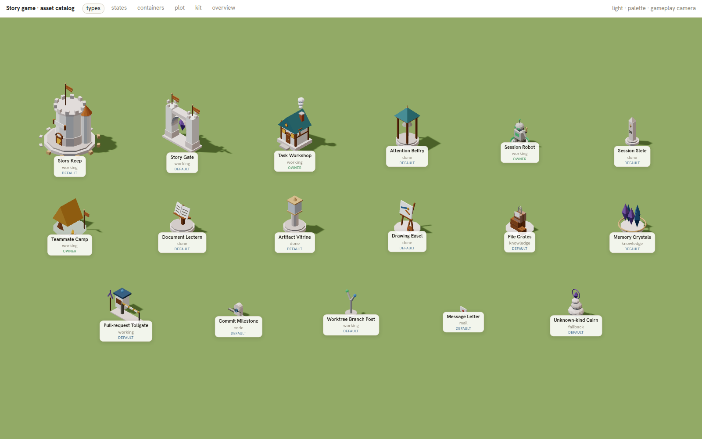 | 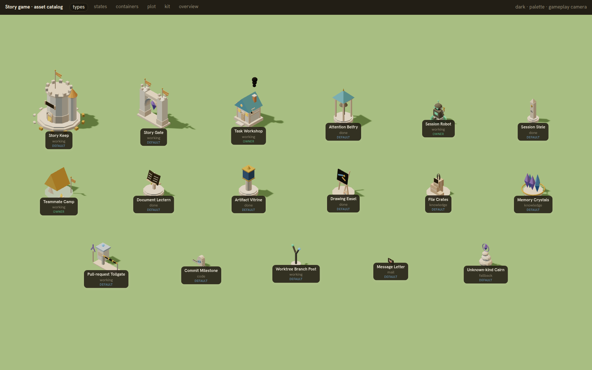 | 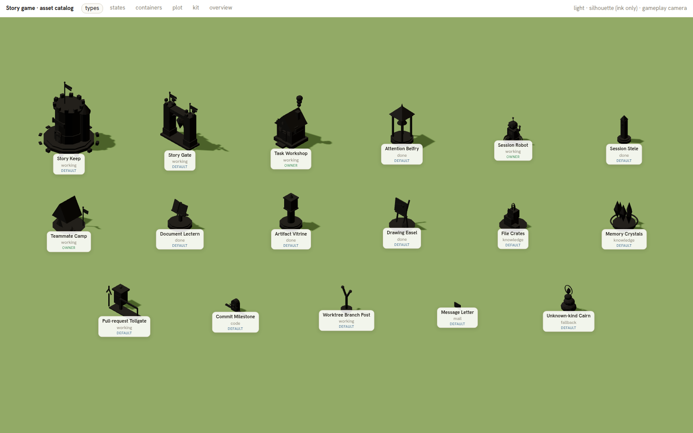 |
| States | 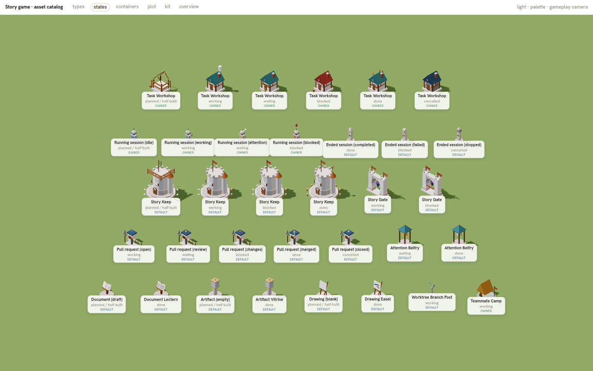 | 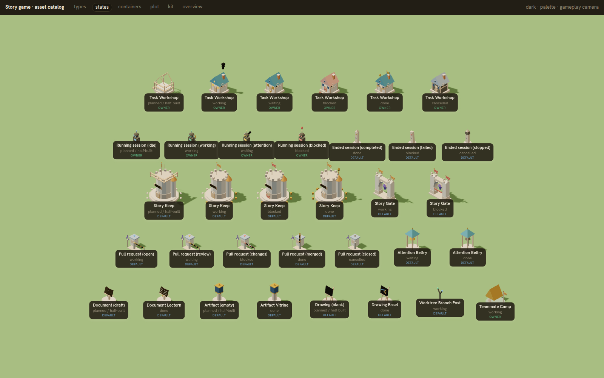 | 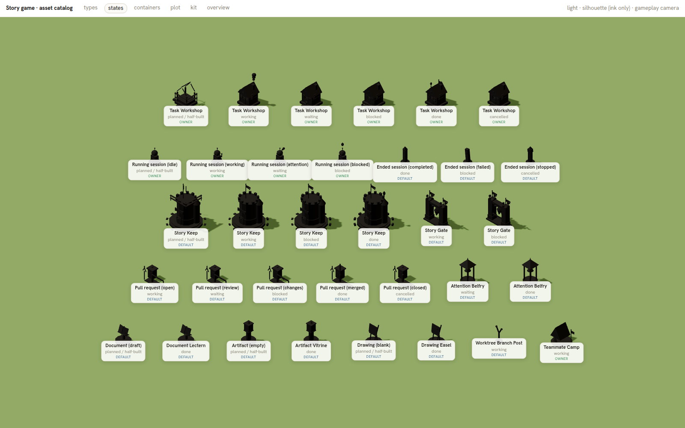 |
| Containers | 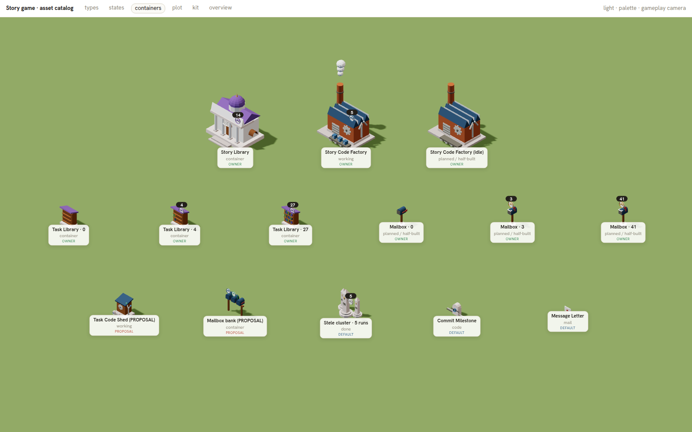 | 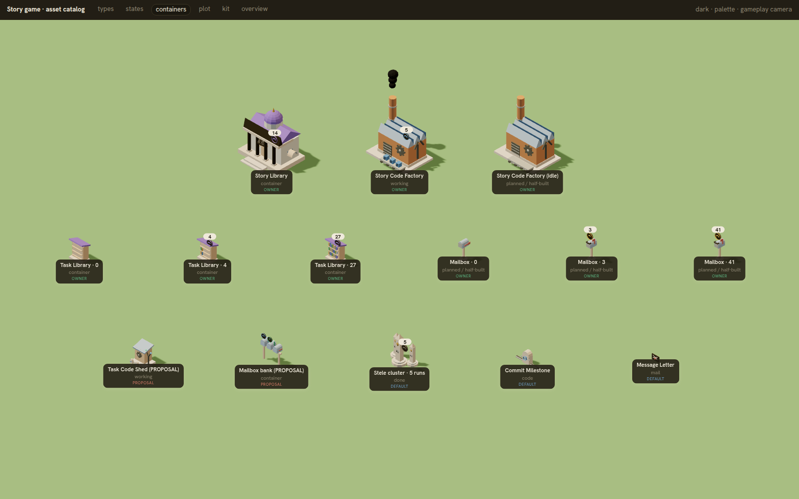 | |
| Task plot via sockets | 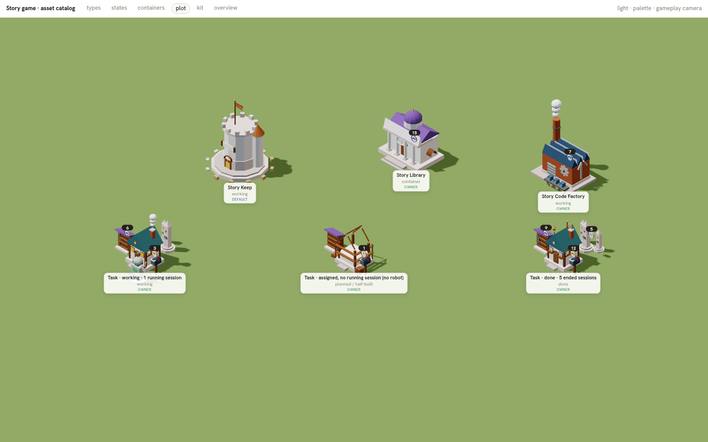 | 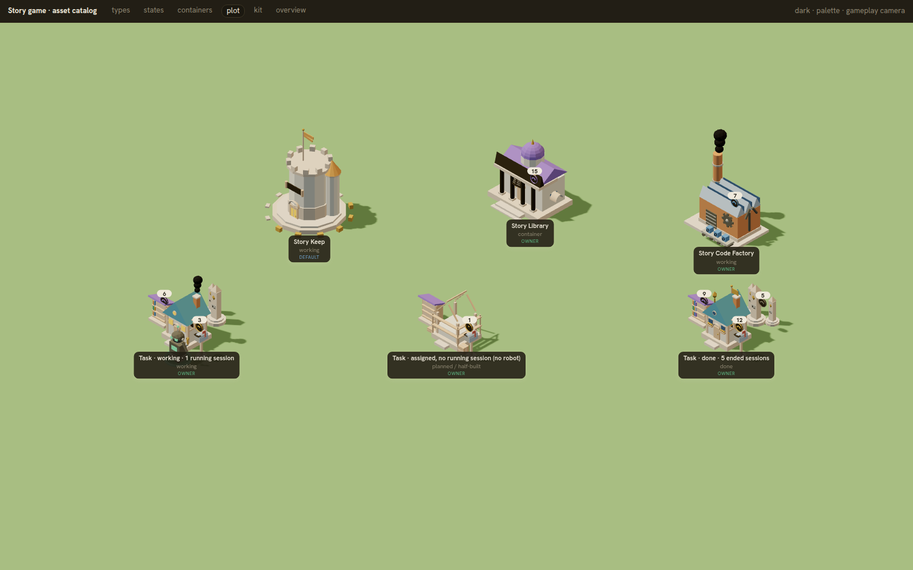 | sockets: 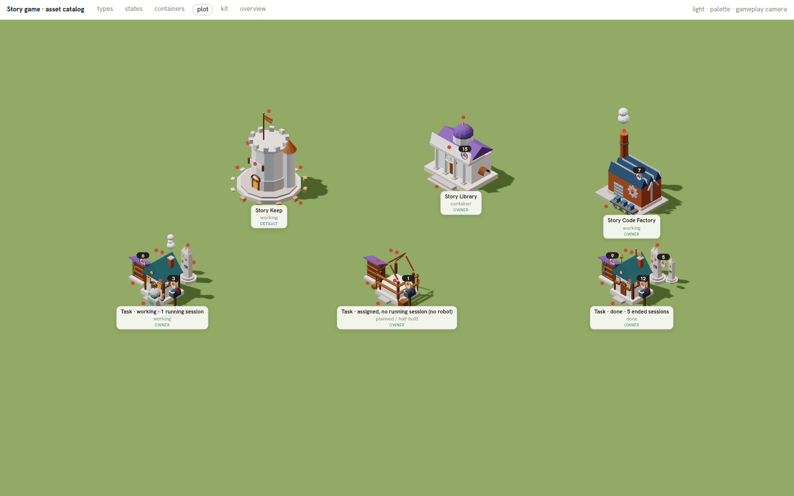 |
| Kit blocks | 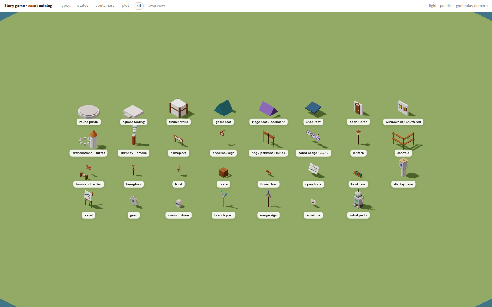 | | |
| Overview zoom | 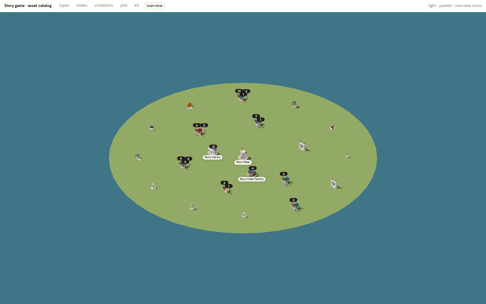 | 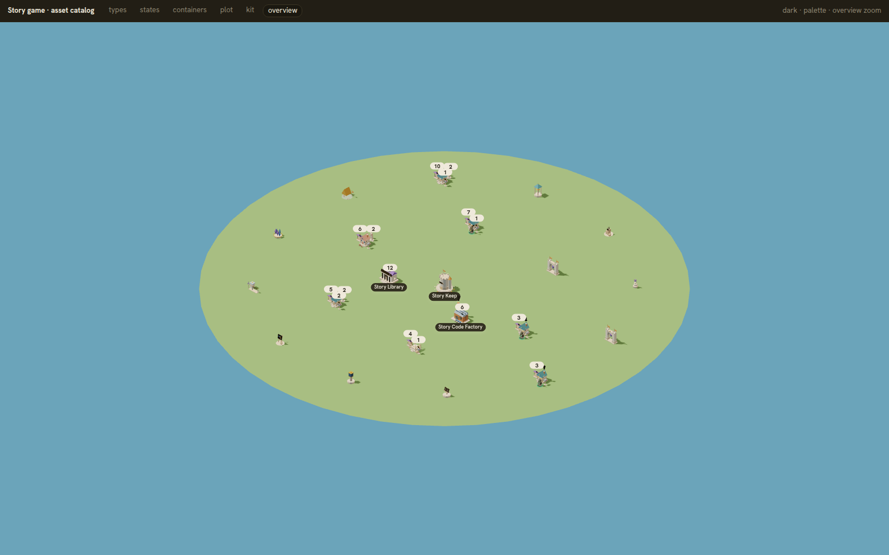 | 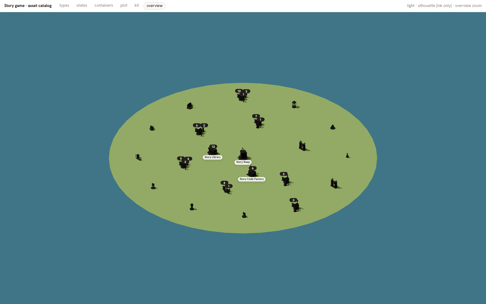 |

## Measurements (honest)

These come from headless Chromium on **SwiftShader** (software GL, `--single-process`, 1600×1000, 2048² shadow map),
so the fps figures measure this host's CPU rasteriser. **Hardware 60 fps has not been verified.** Draw calls are the
meaningful number: 19–23 per frame on every sheet (78 only with debug socket markers on). That holds whether the sheet
shows 17 assets or the 40-asset overview, because each solid is one instanced batch. Measured fps on this host was 0.9–4.4 (17.9k–62.7k triangles); with
SwiftShader shadows that is CPU-bound and says nothing about GPU frame time. Per-sheet values are in
[`images/story-assets-metrics.json`](images/story-assets-metrics.json).

## Reproduce

```sh
cd packages/tm8-ui && bun run dev --host 127.0.0.1 --port 4651 --strictPort &
export LD_LIBRARY_PATH=/home/tm8/.local/chromium-libs/usr/lib/x86_64-linux-gnu
export SPACIOUS_BROWSER=/home/tm8/.cache/ms-playwright/chromium-1243/chrome-linux64/chrome
node e2e/asset-catalog.mjs            # → /tmp/asset-catalog/*.png + metrics.json (CATALOG_DIR to change)
bunx vitest run src/story/game/assets # 15 tests: mapping, uniqueness, type-vs-state core invariance, metrics
```
