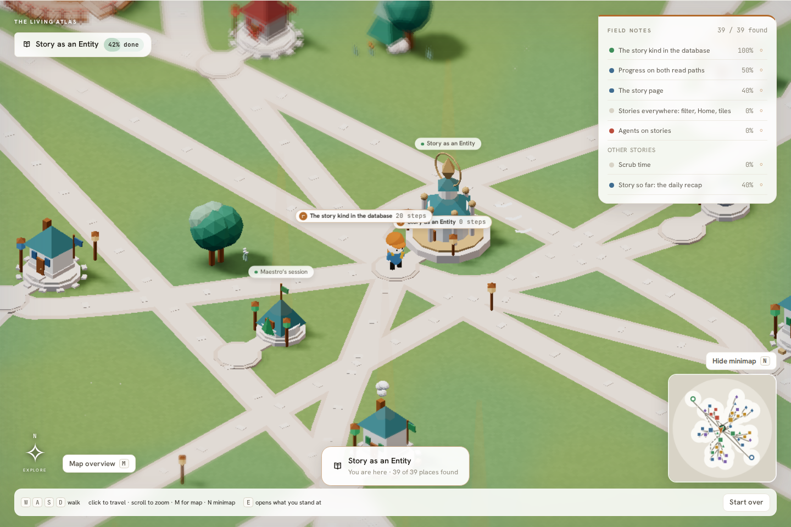
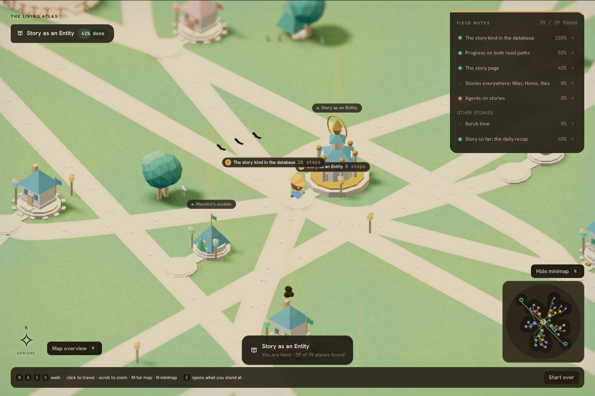
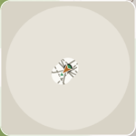
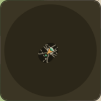
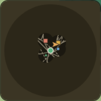
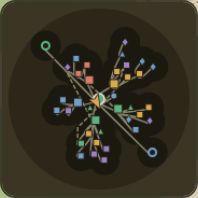

# Story game minimap

Open this evidence when reviewing the minimap PR or changing the minimap's projection, fog, redraw throttle, click-to-walk or HUD toggle. Task: `01a1090f-ea6e-7385-a1be-891788829f30` (W3 of plan doc `01a1090e-7ff7-7f6f-8e45-2249f6e4eaee`). Base: `origin/main` at `ad885eb0` (contains PR #1039 spacious layout, #1040 node counts, #1041 road labels).

## Behavior

- **Where:** bottom-right of the game HUD, 180 CSS px, above the hint bar (120 px and raised above the approach card in containers ≤ 700 px). Hidden during a session duel, like the field notes. Only mounted with WebGL; the flat list fallback has no walk to map.
- **Orientation:** turned 45° to match the fixed isometric camera, so W walks up the map and D walks right, as on screen. The framed radius is `mapExtent(world)`: the occupied land plus one reveal radius, capped at the island.
- **Fog:** the canvas is fog (`--pn-line-2`) with the island (`--pn-line`) under it. The land (`--pn-surface`), districts, and roads are drawn only inside clearings of radius 12 world units (`REVEAL_RADIUS`, the scene's value) around each revealed place and the player. Dots are drawn only for revealed places, so the map does not give away unexplored locations.
- **Dots:** shape-coded. Hub is a ringed circle. Building and library are squares, tent and camp triangles, signpost and crystal diamonds, stones circles. A **portal is the only hollow ring**. Dot colour is the place's tone, using the scenery's colour rule (`dotColor` mirrors `placeColor` without importing three.js).
- **Roads:** every routed road polyline. Cross-story roads are dashed.
- **Districts:** drawn as tinted annular sectors when the world carries `districts`. The minimap reads them defensively (angles under `startAngle|from|start|a0` and `endAngle|to|end|a1`, optional radii, status category). They are absent on main today, so nothing is drawn.
- **Player:** brand-coloured arrow at the saved position, pointing along the heading.
- **Click:** a click within 8 px of a revealed place walks to that place. A click on other revealed land walks to that point. Both go through `walkTo(control, …)`, the same order the scene obeys. Fog clicks do nothing. Afterwards the HUD leaves the overview and takes focus back, so WASD keeps working.
- **Toggle:** the `Hide minimap / Minimap` button (`aria-pressed`, `aria-controls` → the canvas) and the **N** key. N is not used by WASD, the arrows, E, Enter, Space, M or Escape, and the key is ignored during a duel. The state is component state, exposed as `data-minimap="shown|hidden"` on the game root. The canvas is `aria-hidden`: the field notes are the accessible route list.
- **Colours:** only `readPalette()` values (runtime `--pn-*` tokens). No hex literals.

## Redraw budget

The redraw is driven by React inputs; there is no animation loop. Each change schedules at most one paint per 100 ms (≤ 10 Hz). Changes inside that window share one paint. A paint is skipped when the world, the revealed set and the palette are the same objects, and the player's rounded position (0.1 units), heading (0.01 rad), size and DPR are also unchanged (`minimapSignature`). The backing store is `size × devicePixelRatio`, with DPR clamped to 1–2.

Unit and component tests cover these cases (`minimap.test.ts`, `Minimap.test.tsx`, `StoryGame.minimap.test.tsx`). Covered: a re-render with nothing changed does not paint; 20 position changes in one window give exactly one more paint; a fog click issues no order; a place click issues `{x, z, placeId, open: false}`; the toggle works with aria; the backing store scales with DPR.

## Captures (SwiftShader software rendering, 1440×960, DPR 1)

| | Light | Dark |
| --- | --- | --- |
| Full HUD, everything revealed |  |  |
| Fresh game (hub + player clearing) |  |  |
| After walking W then D |  |  |
| Everything revealed |  |  |

## Audit — `e2e/story-minimap-audit.mjs` (2026-10-04)

**All fps and timing numbers are SwiftShader software rendering on a shared, loaded host. They are not GPU evidence**, and the host load varies a lot between windows.

| | Light | Dark |
| --- | --- | --- |
| Paints on load | 2 | 2 |
| Paints while idle for 3 s | 0 | 0 |
| Paints while walking (W 2.5 s, D 2 s, settle) | 4 in 8.0 s (0.50 Hz) | 5 in 7.2 s (0.70 Hz) |
| One full paint, 39 places / 41 roads, 360² backing store (CPU 2D) | 0.16 ms | 0.20 ms |
| Click on the hub dot → player ends at | (0, 3.15): the hub doorstep | (0, 3.15) |
| Scene fps, minimap **shown**, three 5 s windows | 3.91 / 3.00 / 2.41 | 3.11 / 2.85 / 1.64 |
| Scene fps, minimap **hidden** (N), interleaved windows | 2.01 / 3.25 / 2.92 | 1.57 / 2.44 / 1.47 |
| Page errors | 0 | 0 |

The shown and hidden windows overlap within host noise, and the shown windows are not lower, so there is no measurable frame cost. The paint rate while walking follows the save, which updates about once a second. That is far below the 10 Hz cap.

Reproduce from `packages/tm8-ui` after `bun install --frozen-lockfile` and the root `bun run build`:

```sh
bun run dev --host 127.0.0.1 --port 4683 --strictPort &
export LD_LIBRARY_PATH=/home/tm8/.local/chromium-libs/usr/lib/x86_64-linux-gnu
export MINIMAP_BROWSER=$(ls -d /home/tm8/.cache/ms-playwright/chromium_headless_shell-1243/*/chrome-headless-shell)
MINIMAP_URL='http://127.0.0.1:4683/story-dev.html?full=1' MINIMAP_DIR=/tmp/story-minimap node e2e/story-minimap-audit.mjs
```

## Approximations and follow-ups

- **Position lags about 1 s.** The marker reads the per-story save, which `scene.tsx` writes about once a second. A live feed needs `scene.tsx` to publish the player's position and heading, for example on `GameControl` each frame. The minimap would then sample it at ≤ 10 Hz.
- **Heading is the direction of the last saved step**, because the scene does not expose its `heading` ref. `<Minimap heading>` accepts the real value once `scene.tsx` provides it.
- **Districts are drawn speculatively.** The reader accepts the plausible field names until W1 settles the `world.districts` shape. Pin the names once it lands.
- **Glyphs are placeholders** built from existing `PlaceShape`s. When the asset registry lands, it can replace `GLYPH_OF_SHAPE`.
