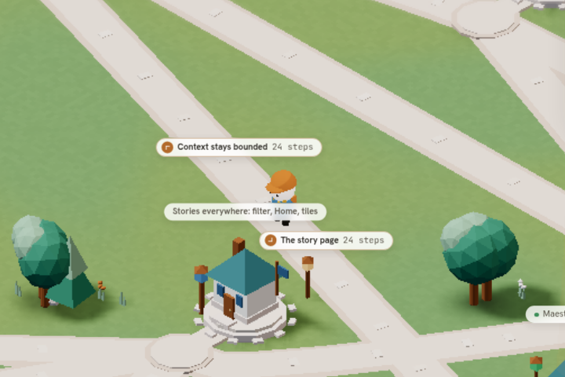
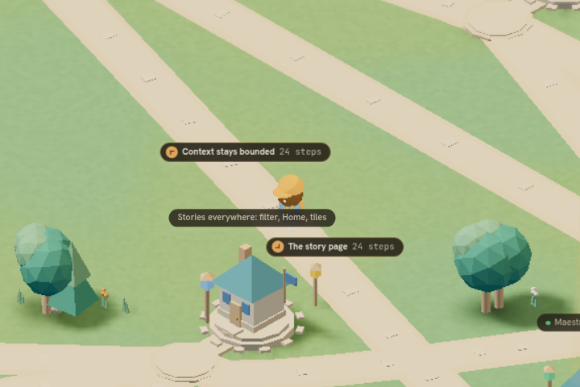
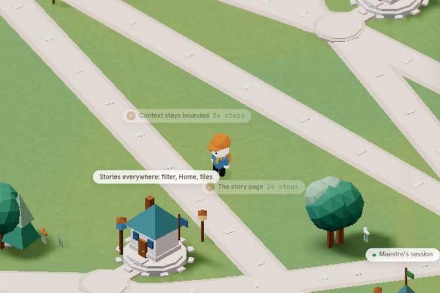
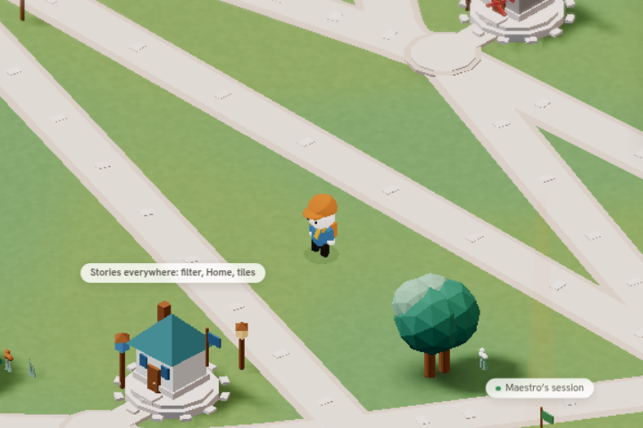
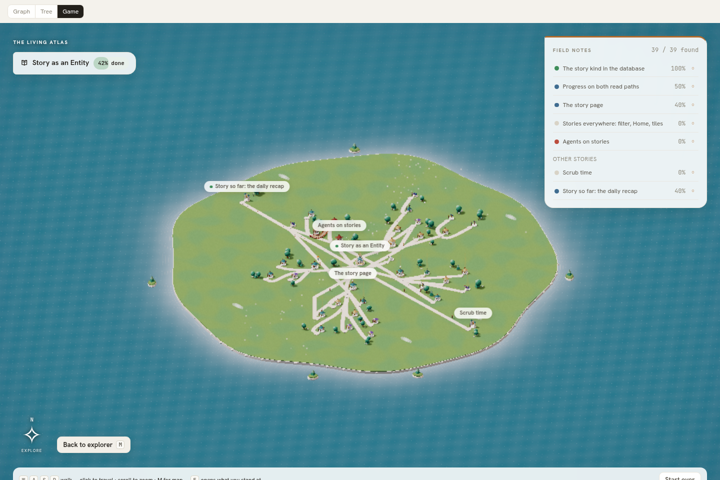

# Story game: road destination signs (W4)

Open this evidence when reviewing the road-labels PR or changing near-road signage in the story game. It records the behaviour, the reproducible capture and its software-renderer limits.

Task: `01a1090f-ec81-79e3-a24b-4367378a39cf`. Baseline: `6427de72fbac3eda37ad7f3abdd7e816c6c1faec` (PR #1039 merged).

## Behaviour

- `road-labels.ts` (pure): `nearestRoad(world, x, z)` scans every road polyline with `segmentDistance` and returns the road, segment index, perpendicular distance and foot position `t`. `roadLabels(world, x, z, { threshold })` returns one sign per road end while the player is within `ROAD_LABEL_THRESHOLD = ROAD_WIDTH + ROAD_SHOULDER + 0.6` (2.05 world units) of the centre line: destination place id, title and kind (all from the `World`, so from the `StoryPage`), the heading along the road towards that end, the remaining road length in steps (`STEP_LENGTH = 1` world unit) and an opacity of 1 on the road surface (`ROAD_WIDTH / 2`) falling linearly to 0 at the threshold. `writeRoadLabels` is the allocation-free form the frame loop uses.
- `scene-road-labels.tsx`: mounted once inside the canvas beside `<Labels />`. It builds a fixed pool of two `.sgm-roadsign` nodes in the existing `.sgm-labels` layer on mount and removes them on unmount. Each frame it reads the same `playerPos` ref `Labels` uses, places each sign 2.8 units ahead along its heading, and rotates a CSS chevron with `rotate(var(--sgm-dir))` to the projected screen direction. DOM writes happen only when a rounded value changes, so a still frame touches nothing.
- Hidden in map overview and during a duel. Under reduced motion there is no fade: a sign is fully opaque inside the threshold and hidden outside it.
- Styles: `story-game-roads.css`, every rule under `.cv2-root`, palette through `--pn-*` only, type through `--pn-fs-fine`.

## Capture

All frames are **SwiftShader software rendering** (chromium 1243, `--enable-unsafe-swiftshader`) on a shared host; they are visual evidence only, not GPU or frame-rate evidence. Fixture: `STORY_FIXTURE` in `story-dev.html?full=1`, every place revealed, the player saved at the midpoint of the road segment farthest from all other roads (`fx-r3|fx-m3|remembers`, (-12.77, 9.41)).

| Frame | Player | Signs in the DOM |
| --- | --- | --- |
|  | on the road | "Context stays bounded · 24 steps" (−133°), "The story page · 24 steps" (47°), opacity 1 |
|  | on the road, dark theme | same two signs |
|  | 1.6 units off the centre line | same two signs, opacity 0.32 (model: (2.05 − 1.6) / (2.05 − 0.625)) |
|  | 3.2 units off the centre line | none shown |
|  | map overview (downscaled) | both pooled nodes `display: none` |

Zero page errors across all five frames.

Reproduce (dev server on a free port; headless shell needs the host's extra libraries):

```
cd packages/tm8-ui && bun run dev --host 127.0.0.1 --port 4673 --strictPort &
export LD_LIBRARY_PATH=/home/tm8/.local/chromium-libs/usr/lib/x86_64-linux-gnu
ROADS_BROWSER=/home/tm8/.cache/ms-playwright/chromium-1243/chrome-linux64/chrome node e2e/story-road-labels-audit.mjs
```

The script writes PNGs and `report.json` to `ROADS_DIR` (default `/tmp/story-road-labels`). All captures share one page: under `--single-process` SwiftShader a second page did not reliably get a WebGL context.

## Approximate or open

- A "step" is one world unit; there is no step unit elsewhere in the game, so the count is a scale, not a measured stride.
- Signs name a destination even if the player has not revealed it yet. Roads are always drawn, and naming where a road leads is what a signpost is for; switch to the `revealed` set if exploration should hide names.
- At a shared doorstep apron several roads meet; the nearest one wins, so signs can change road as the player crosses the apron.
- Signs may overlap place labels near crowded junctions; there is no collision pass between the two layers.
