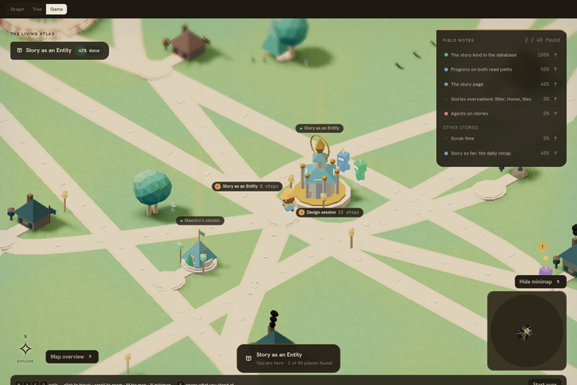
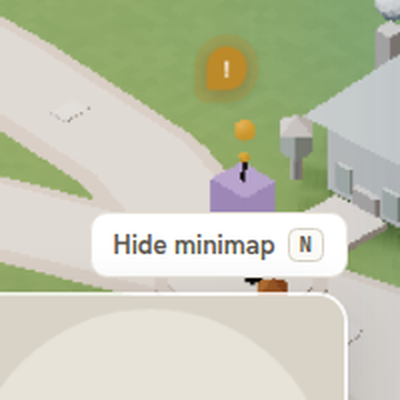
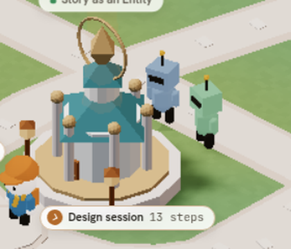
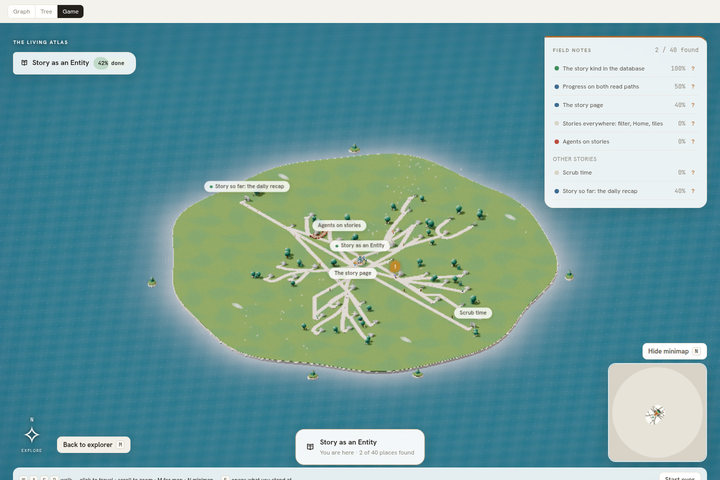
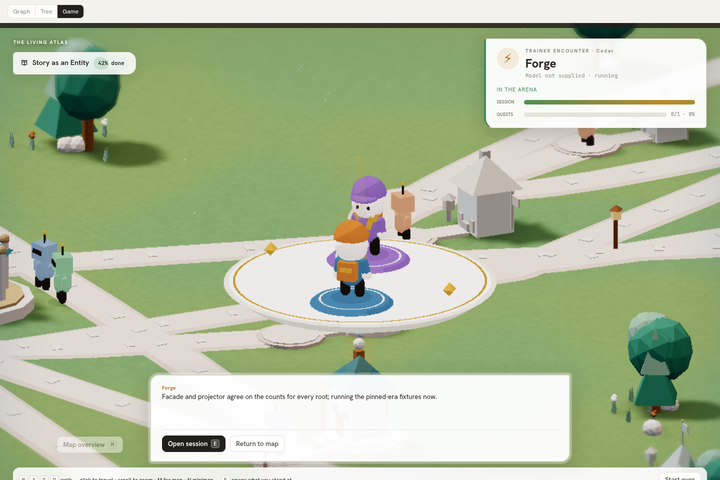
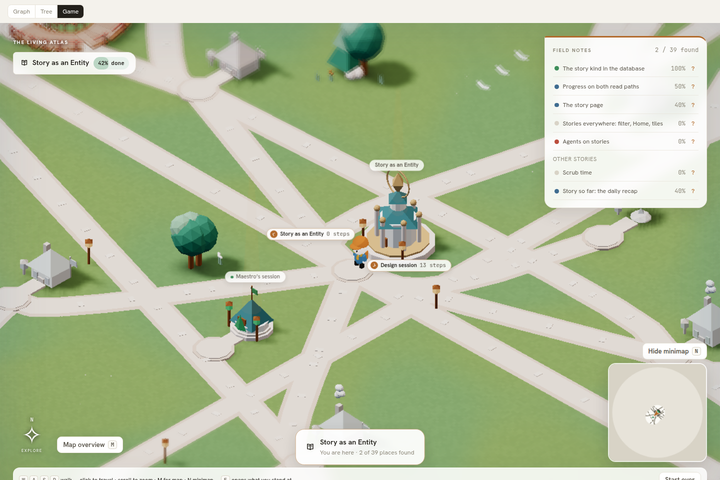

# Story game: one robot per live session, with an attention indicator (W2)

Open this evidence when reviewing the robots PR, changing where a session's robot stands, or replacing the robot look from the asset lane. It records the placement rules, which of them are provisional, the reproducible SwiftShader capture and its limits.

Task: `01a1090f-e81d-7a84-887d-cca85f6782c0`. Baseline: `6427de72fbac3eda37ad7f3abdd7e816c6c1faec` (PR #1039 merged), rebased onto `e5639242` (PR #1040 node counts, PR #1041 road labels, PR #1043 asset kit, PR #1044 minimap).

## Behaviour

- `robots.ts` (pure, **the swappable seam**): `robotsFor(view, world, now)` returns exactly one `Robot` per `page.sessions` entry with `live === true`; finished sessions get none. `robotStand(session, world, now, options)` chooses the stand:
  - one task in the world: its doorstep, reason `task`;
  - several tasks: the task named by the latest `page.activity` entry or `page.recentMessages` message whose actor is the session or its team member, reason `recent-task` (**PROVISIONAL**: the page carries no current-task field, so this is a recency heuristic, not evidence of what the session is doing now);
  - several tasks and no such signal: the lowest task id, reason `stable` (**PROVISIONAL**, chosen so a robot never jumps between snapshots; `taskIds` order is never used);
  - no task in the world: an arc north of the hub, spaced by index, reason `depot` (**PROVISIONAL**: the page says nothing about where a taskless session belongs).
  - Two robots at the same doorstep stand one unit apart. Every robot faces its place (depot robots face the hub).
- `robotAttention(view, stand, world, nodes)`: false unless `view.state.pendingAttentionCount > 0` and the robot has a place. When the place's node carries `counts.pendingAttention` (PR #1040) that number decides. When `counts` is absent (unknown, never zero: the running server may not send it yet) the **PROVISIONAL** rule applies: true if the place is adjacent in the world graph to a node whose kind maps to the tasks view and is not the task kind itself (`ATTENTION_KIND` from `model.ts`, no literal).
- `scene-robots.tsx`: nine `InstancedMesh`es for the whole population, one per body part (shade, legs, torso, arms, head, visor, antenna, tip, attention orb); the part table `ROBOT_PARTS` is the look seam the asset lane replaces. Instance colour tints each robot by a hash of its session id (`robotHue`, FNV-1a plus a murmur3 avalanche so sibling ids spread across the four palette hues `info / merged / run / brand`, softened toward `card`). Idle bob and sway update the instance matrices at most 30 times a second; under reduced motion the matrices are written once and stay still. The orb is scaled to zero unless the robot has attention. A DOM pip (`!`) in the existing `.sgm-labels` layer tracks each attention robot; it pulses through CSS unless reduced motion, and hides during a duel like the place labels. Clicking any instanced part walks the player to the robot's place with `onPlaceClick(placeId, false)`; a depot robot has no place and no handler is attached.
- Styles: `story-game-robots.css`, every rule under `.cv2-root`, palette through `--pn-*` only.
- No attention API calls; the indicator only reads the page.

## Capture

All frames are **SwiftShader software rendering** (chromium 1243, `--enable-unsafe-swiftshader --single-process`) on a shared host at 1440×960. They are visual and draw-count evidence only, **not GPU or frame-rate evidence**. Fixture: `e2e/story-robots-fixture.ts` on top of `STORY_FIXTURE` in `story-dev.html?full=1`, every place revealed. `live3` keeps the fixture's three live sessions; `live7-attention` adds four live sessions (every third taskless) and one attention node about the first live session's task, pending attention count 1.

| Frame | Scenario | What it shows |
| --- | --- | --- |
|  | `live7-attention`, light | depot pair north of the hub; a doorstep robot with its orb and `!` pip at the right edge |
|  | `live7-attention-dark` | same scene, dark palette |
|  | `live7-attention`, 2× crop | orb above the robot, pip above the orb |
|  | `live7-attention`, crop | two taskless sessions on the depot arc, distinct hues, facing the hub |
|  | `live7-attention`, map overview | pip stays projected in the overview |
|  | `live7-attention`, after clicking the `fx-s2` robot | the player walked to the robot's doorstep; the place's trainer encounter opened; pips hidden during the duel |
|  | `live0` | no live sessions, nothing mounted |

| Scenario | Live sessions | Robots | Instanced meshes in scene | Draw calls (min–max) | Triangles | Pips | fps (SwiftShader) |
| --- | --- | --- | --- | --- | --- | --- | --- |
| `live0` | 0 | 0 | 9 | 59–59 | 81,096 | 0 | 2.3 |
| `live3` | 3 | 3 | 18 | 68–68 | 83,040 | 0 | 2.4 |
| `live7-attention` | 7 | 7 | 18 | 68–68 | 86,312 | 1 | 3.1 |
| `live7-attention-dark` | 7 | 7 | 18 | 68–68 | 86,312 | 1 | 5.5 |
| `live7-attention-reduced` | 7 | 7 | 18 | 68–68 | 86,312 | 1 (static) | 2.9 |

- Draw-call delta against PR #1039's 12-place overview (59 draw calls): **+9, constant**, the nine part meshes, whether 3 or 7 robots are alive; 0 robots mount nothing and stay at 59. Triangles grow by about 1,000 per robot.
- Every click scenario walked the player to within 0 units of the robot's stand and opened the place's encounter card (`.sgm-duel__opponent`; the approach card is replaced by the duel plate at a place with encounters).
- The fps column is the SwiftShader software renderer on a loaded host and varies run to run (0.9 to 6.4 across runs; the table is the run on `e5639242`); it establishes nothing about hardware frame rate.
- Page errors during all five scenarios: none.

## Reproduce

```sh
cd packages/tm8-ui
bun run dev --host 127.0.0.1 --port 4677 --strictPort
LD_LIBRARY_PATH=<chromium libs> ROBOTS_BROWSER=<chromium 1243 binary> ROBOTS_DIR=/tmp/story-robots \
  node e2e/story-robots-audit.mjs            # ROBOTS_ONLY=<scenario> for one scenario
```

Unit tests: `bun run test -- src/story/game/robots.test.ts` (robotStand single, multi, recency, stable, depot; robotsFor on the fixture and on synthetic 0/1/7 live sessions; completed sessions excluded; attention on/off/per-node; hue spread).

## Gaps the page does not fill

- No current-task field on a session: `recent-task` and `stable` are heuristics until the contract carries one.
- No home for a taskless session: the depot arc is a placeholder.
- `counts.pendingAttention` is optional on the server today: the adjacency rule stands in until every node carries it.
