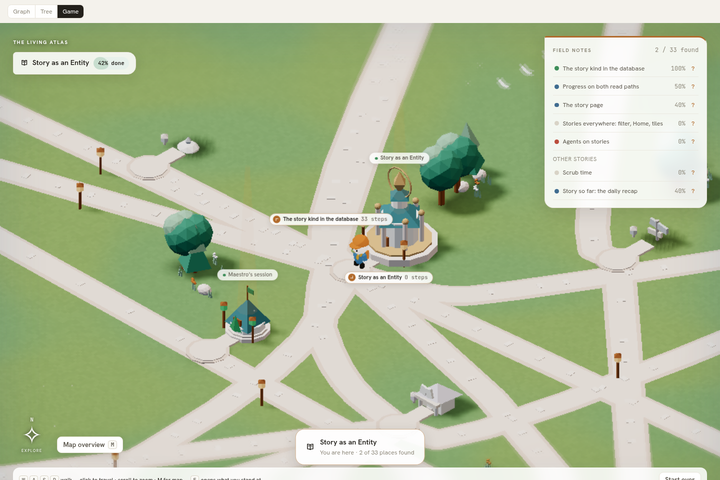
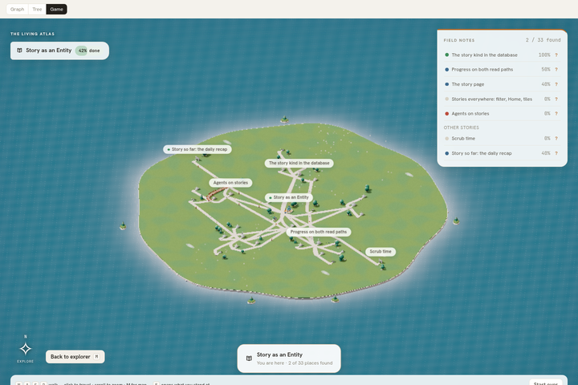
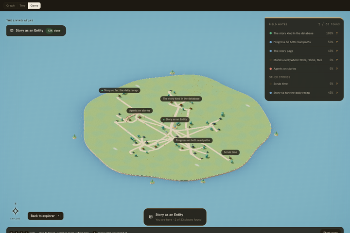
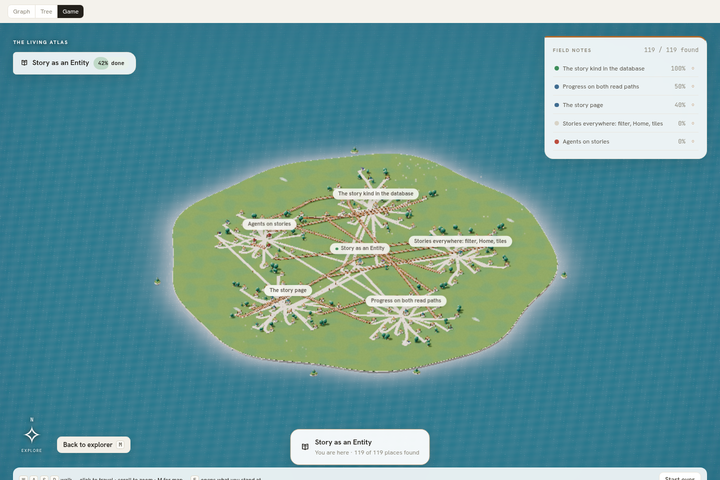

# Story map W1 — world model: Library / Code Factory, task attachments, parent sites, status districts (evidence)

Task 01a1090f-e5ec-720d-a265-ff95fe83f5cc, branch `feat/story-map-w1-world`, rebased onto `main`
ad885eb0 (PRs 1039, 1040, 1041 merged). Pure data/layout change in `src/story/game/world.ts` and the new
`src/story/game/world-groups.ts`; the scene reads the same `World` shape with new optional fields.

## What the world now carries

- **Aggregation.** Every node the graph shows in the `made` view (doc, drawing, artifact, file) is a member of
  ONE `${storyId}:library` landmark (shape `library`); every `code` node (pull_request, commit) is a member of ONE
  `${storyId}:code` landmark (shape `factory`, a placeholder that wears the signpost until the asset lane registers
  its look). Members are not places. Edges that reached a member now reach its landmark, deduplicated by
  `from|to|type`. A landmark exists only when it has a member. `Place.members: WorldMember[]`.
- **Attachments** on every task place: `attachments.library = { count, memberIds }` (made-family edges to made
  nodes), `attachments.mailbox = { count, approx }` (recentMessages anchored on the task; `approx: true` when the
  page window is full at 50; exact and `approx: false` when the node carries `counts.messages`), `hasWorker`
  (node live, or a live session lists the task), `pendingAttention` (from `counts`, else null). Non-task places
  carry `attachments: null`.
- **Sites.** `parentId` from `parent` edges. Children stand on their parent's site: `siteLayout` (pure, in
  `world-groups.ts`) rings them around the parent, radius growing with child count, MIN_DISTANCE kept, the side
  facing the parent's own anchor left open for the road. A whole site is placed as one unit (`siteRadius`).
- **Districts.** Tasks get `district` from status (`to_do`, `in_progress`, `blocked`, `done`; cancelled counts as
  done). `layoutWorld` gives each district an angular sector from the hub, ordered to_do → in_progress → blocked →
  done from the top, width proportional to the land it holds, exposed as `World.districts: { id, from, to }[]`.
  Time is still distance inside a sector. Roads route in a corridor first and are verified against every obstacle.

## Captures (SwiftShader software rendering — not GPU evidence)

Dev server `vite --host 127.0.0.1 --port 5177`, page `story-dev.html?full=1` (`&theme=dark` for dark),
Playwright chromium-headless-shell `--no-sandbox --single-process --no-zygote --enable-unsafe-swiftshader
--ignore-gpu-blocklist`, 1440×960, script `packages/tm8-ui/e2e/story-w1-world-audit.mjs`. Reproduce:

```
LD_LIBRARY_PATH=/home/tm8/.local/chromium-libs/usr/lib/x86_64-linux-gnu \
W1_BROWSER=$HOME/.cache/ms-playwright/chromium-1243/chrome-linux64/chrome \
node e2e/story-w1-world-audit.mjs            # W1_RUNS=fixture-light,fixture-dark,spacious-125-light
```

| Capture | What to look at |
| --- | --- |
|  | Fixture, ground level, light. Hub centre; the Code Factory placeholder (signpost) and Library are hub-anchored on the commons. |
|  | Fixture overview, light. Five roots, each with its children ringed on its own site; roots sit in status sectors (done at the left/top, to_do at the top-right, in_progress right, blocked bottom-left). |
|  | Same layout on the dark ground (`?theme=dark`). |
|  | `spaciousFixture(125)`: 104 of 109 tasks on five root sites, each site a fan of rings, parent→child roads short, cross-site dependency roads routed around the sites. |

## Numbers (same runs; `report.json` in `/tmp/story-w1` when reproduced)

| Run | nodes | places | roads | min gap | buildWorld cold / warm (ms) | landmarks | standalone made/code | tasks sited | SwiftShader fps (overview) |
| --- | --- | --- | --- | --- | --- | --- | --- | --- | --- |
| fixture light | 37 | 33 | 40 | 6.00 | 29 / 8–31 | library 5 members, factory 3 | 0 | 14 of 19 | 2.8 (software) |
| fixture dark | 37 | 33 | 40 | 6.00 | — | same | 0 | 14 of 19 | 3.7 (software) |
| spacious 125 | 125 | 119 | 138 | 6.00 | 135 / 78–109 | same | 0 | 104 of 109 | 0.9 (software) |

Districts on the fixture (radians from the top, clockwise on screen): to_do [−1.571, −0.314],
in_progress [−0.314, 2.199], blocked [2.199, 3.456], done [3.456, 4.712]. Fixture attachments: 6 shelf edges
across tasks, 2 mailbox messages, 3 tasks with a worker, no approximate mailbox (the fixture window is 6 < 50).

The fps figures are SwiftShader (ANGLE Vulkan, Subzero) on a shared host and say nothing about GPU frame rate;
they are here only to show the scene renders every place without errors (`errors: []` in every run).

## Verification (2026-10-04)

```
bun run typecheck:ui                                                 ok
packages/tm8-ui: bun run test -- src/story src/hex-ban.test.ts src/panels/no-branching.test.ts \
   src/attention-api-ban.test.ts src/panels/css-comments-do-not-eat-rules.test.ts
                                                                     21 files, 266 tests passed
   world.test.ts (23): aggregation, no empty landmark, attachments, approx/counts, sites, nested sites,
   districts, status-change stability, 125 places < 600 ms (vitest: ~120–230 ms warm, ≤ 690 ms file total
   including JIT), generic layoutWorld sites/districts, encounters
   world-groups.test.ts (14): siteLayout clearance 1…125 children, determinism, open side, districtOf, sectors
   src/story/game ×3 consecutive runs: 57/57 (the duel Escape race is flushed with act())
npx vite build                                                        ok (1m 9s)
```

## Seams for later lanes

`siteLayout` (ring/grid policy), `districtOf` / `DISTRICT_ORDER` (status → district table), `LANDMARK_OF_VIEW`
(which graph views fold into which landmark), `routeNear` (corridor width). The `factory` PlaceShape is the hook
the asset registry replaces.
