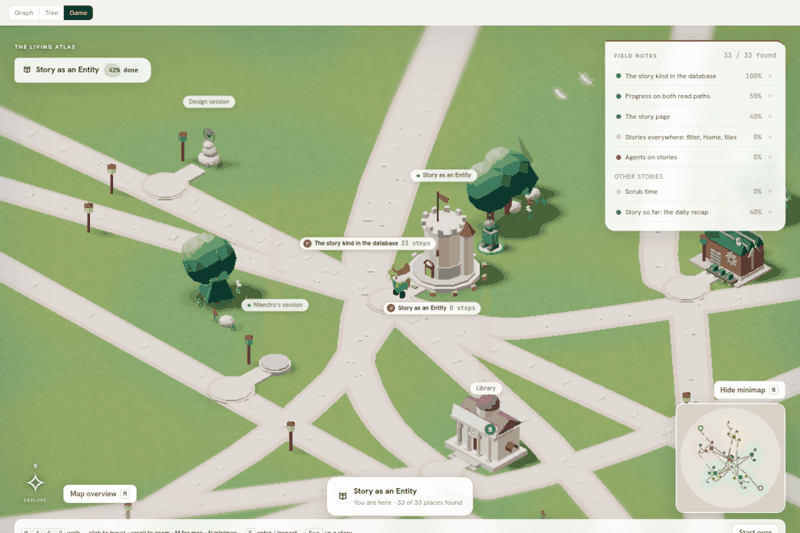
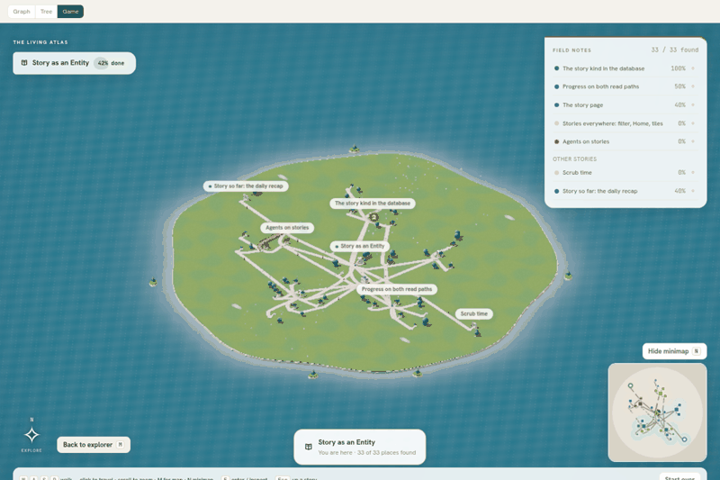
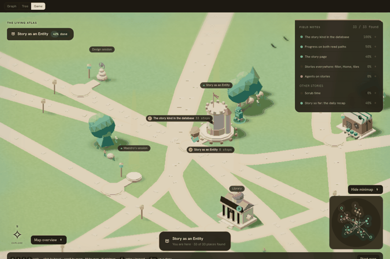
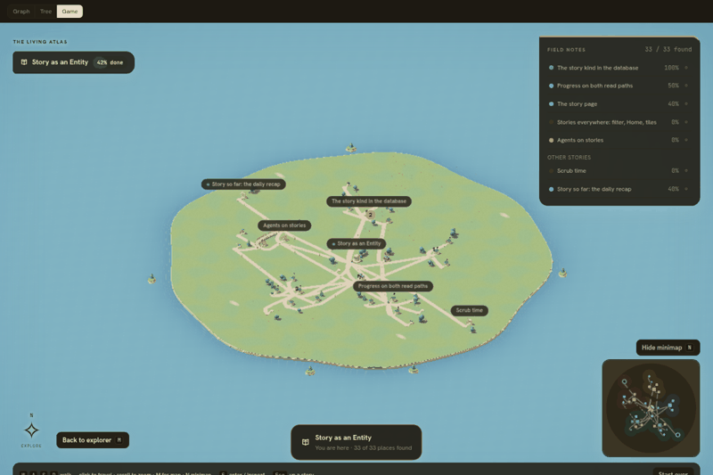
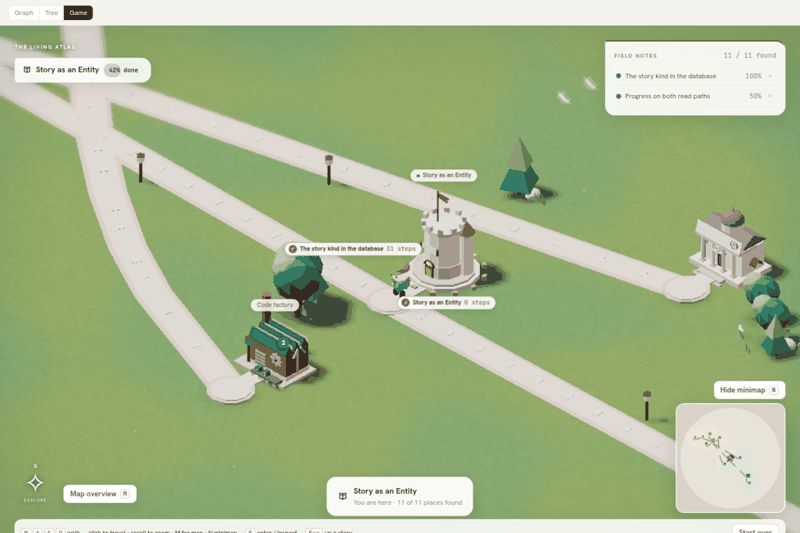
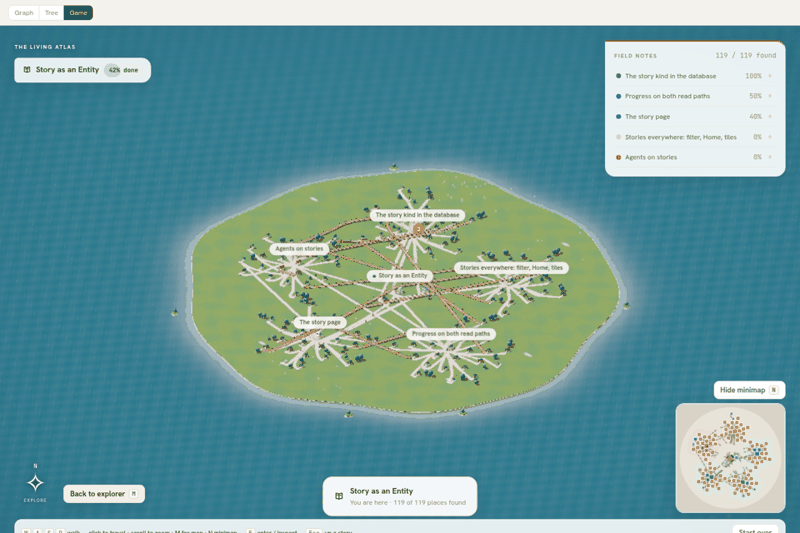

# Story game W7 — asset-kit integration

Open this evidence when reviewing the W7 PR or changing how a laid-out `Place` becomes a kit asset (`place-asset.ts`), the DOM count badges (`badges.tsx`), or the kit robots in `scene-robots.tsx`. It records what the scene now draws per place, the coverage limit of the registry, the owner decisions still pending, and the draw-call / triangle cost measured against `story-spacious-map.md`.

Task: `01a1090f-f31a-7d07-b58f-3f9651441de9`. PR: <https://github.com/subhangR/tm8/pull/1049>. Base: `origin/main` after PR 1043 (asset kit), 1044 (minimap), 1045 (W1 world), 1046 (W2 robots), 1047 and 1042, plus the asset lane's PR 1050 (`story-assets-budget`, `2d584de3`: low-poly kit details and `chat` listed as unresolved) merged into this branch until it lands on main. Branch: `feat/story-map-w7-assets-integration`.

## Behaviour

**Place → asset.** `place-asset.ts` is the single translation from W1's `Place` to the registry's subjects: the role comes from the layout (hub, portal, the two landmark ids `${storyId}:library` / `${storyId}:code`), the type from `assetTypeOf({kind, live, role})`, and the state from `assetStateOf` fed with the place's tone, pending attention, `hasWorker` and `live`. `makeScenery` then calls `buildAsset(type, palette, {state, count, progress, scale, x, z, placeId})` for every place; the old per-shape switch is gone (the `factory` fall-through to the signpost placeholder included). Roads, lanterns, scatter, coast and the island are unchanged. A task's Library annex and Mailbox are built at the workshop's own sockets, only when the page carries a non-zero count. Progress rings stay on roots (ring ≤ 1) only; the story keep draws its own.

**Type / state separation preserved.** No place-level code names a state cue; every state goes through `stateFor(type, state)` so a type that lacks a state falls back the way the registry says. Landmarks have no status of their own and stand `working` while any member is live, else `done`.

**Half-built variant: OFF.** `HALF_BUILT_ENABLED = false` in `place-asset.ts`. A task or story the registry calls `planned` draws its built form in the `working` state, the switch the asset lane documented. The owner decision (plan doc 01a1090e, "half-built vs to-do district") is still open; flip the constant once it lands.

**Sessions.** One robot per RUNNING session, still drawn by `scene-robots.tsx`; a live session's plot carries only the kit's round plinth so the robot has a pad to stand on and is not drawn twice. A session that is not live draws the registry's `session-stele` (count 1). Session clusters / stele retention are not implemented: the catalog's stele placement is a prototype, not product policy.

**Robots.** `scene-robots.tsx` now builds its parts from `buildAsset('session-robot', palette, {state: pose})` for the four registry poses (`planned`, `working`, `waiting`, `blocked`), bucketed per kit solid through the same instanced path (one `InstancedMesh` per solid, capacity = the largest pose). The pose is derived, not stored: pending attention → `waiting`; standing on a blocked place → `blocked`; no place → `planned`; else `working`. Recency and the fallback stand are untouched; hue tinting still applies only to the body metal, never to the ground ring. The attention pip stays a DOM node at the kit's badge anchor.

**Count badges.** `badges.tsx` renders DOM pills in the scene's `.sgm-labels` layer at `assetMetrics(type).badgeAnchor` (the annex / mailbox anchors for a task's attachments, offset by the socket). Members on the Library and Code factory, Library and Mailbox counts on tasks (`≈` when `mailbox.approx`), and pending attention at the place's own anchor. Hidden beyond `LABEL_RADIUS` (14) on the ground; the overview keeps the same "roots only" rule as the name labels. Nodes are pooled by badge id and reused across frames. Styles live in `story-game-badges.css`, scoped under `.cv2-root`, palette via `--pn-*` only.

**Integration fixes.** (i) `minimap.ts` `readDistricts` now reads the sector `id` W1 emits (`to_do`, `in_progress`, …) so districts no longer all take the same ink; test extended. (ii) `StoryGame.tsx` no longer offers Enter / Inspect / Open for an aggregate place (`members.length > 0`) and the E key does not call `open()` with a landmark id that is not an entity; drill test added. The place still counts as visited.

**W3's optional request, done.** `scene.tsx` publishes the live player `x / z / heading` on `control.player` every frame (`PlayerPose` in `control.ts`) so the minimap can sample it instead of waiting on the 1 s save. `REVEAL_RADIUS` is now exported from `control.ts` and re-exported by `scene.tsx` and `minimap.ts`; `minimap.ts` no longer mirrors the literal 12.

## Coverage limit — what still draws as the cairn

The registry's `UNRESOLVED_KINDS` (eight kinds) have no asset yet and render the `unknown-cairn`: **member, skill, spell, form, project, collection, channel, loop**. The scene cannot change that; `place-asset.ts` only forwards the registry's answer.

A ninth, the fixture's `chat` kind, was in neither `ASSET_OF_KIND` nor `UNRESOLVED_KINDS` when this lane started; the asset lane's PR 1050 lists it as unresolved, so it still draws the cairn but is now declared. The scenery test accepts the cairn only when the kind is absent from `ASSET_OF_KIND`, so mapping it later flips the test to the right expectation.

## Matched evidence

All captures: Playwright chromium-headless-shell on this host's **SwiftShader software renderer** (`--no-sandbox --single-process --no-zygote --enable-unsafe-swiftshader --ignore-gpu-blocklist`). The fps numbers below are software rasterisation on a shared CPU; they say nothing about GPU performance. Page: `story-dev.html?full=1` (`&theme=dark` for dark), fixture `STORY_FIXTURE` (33 places), script `packages/tm8-ui/e2e/story-w7-assets-audit.mjs`.

| Scenario | Ground | Overview |
| --- | --- | --- |
| Fixture, light |  |  |
| Fixture, dark |  |  |
| 7 live sessions, 1 with pending attention, dark |  | (same layout; pip visible on both) |

Audit output (identical in both themes, zero page errors):

| Scenario | Places | Types | Cairn kinds | Badges built | Badges visible (ground / overview) | Robots | Instanced meshes | Draw calls (max) | Triangles (max) | fps (SwiftShader) |
| --- | --- | --- | --- | --- | --- | --- | --- | --- | --- | --- |
| fixture light | 33 | keep 1, workshop 19, robot 3, stele 1, library 1, code factory 1, gate 2, memory 3, belfry 1, cairn 1 | chat 1 | library 5, mailbox 1, members 2 | 1 (`members 5`) / 4 | 3 | 19 | 89 | 83,462 | 5.2 |
| fixture dark | 33 | same | chat 1 | same | 1 / 4 | 3 | 19 | 89 | 83,462 | 4.8 |
| robots7 attention light | 34 | + belfry 1 | chat 1 | same | 1 / 4, pip 1 / 1 | 7 | 19 | 89 | 90,390 | 4.3 |
| robots7 attention dark | 34 | same | chat 1 | same | 1 / 4, pip 1 / 1 | 7 | 19 | 89 | 90,390 | 4.6 |

Before PR 1050's low-poly kit details the same scenarios measured 92,550 / 99,478 triangles at the same 89 calls; the captures above are from that run and are visually identical at map scale.

Notes: the ground view hides every badge beyond 14 units, so from the hub only the Library's member count is in range; the overview shows the root tasks' Library / Mailbox counts and hides children, exactly like the name labels. The fixture carries no `pendingAttention` counts and no `approx` mailbox, so neither badge form appears in the captures; both are covered by `place-asset.test.ts` and `badges.test.ts`. The 19 instanced meshes are the 12 kit solids plus the scatter / road batches that were already there; the batch count is constant in the place count.

## Cost against the spacious baseline

Same script and fixtures as `story-spacious-map.md` (`e2e/story-spacious-audit.mjs`, `SPACIOUS_PHASE=after`, matched 12 / 50 / 125 fixtures, buffer 1007×671, SwiftShader). Baseline column is that doc's final measurement.

| Fixture | Places laid out | Draw calls, baseline → now | Triangles, baseline → now | Layout build | fps (SwiftShader) |
| --- | --- | --- | --- | --- | --- |
| 12 | 11 | 59 → 63 (+6.8%) | 30,836 → 34,086 (+10.5%) | 14.5 ms | 6.9 |
| 50 | 44 | 77 → 87 (+13.0%) | 103,224 → 108,406 (+5.0%) | 15.7 ms | 4.3 |
| 125 | 119 | 77 → 87 (+13.0%) | 206,904 → 244,970 (+18.4%) | 143.9 ms | 2.6 |

**Draw calls and triangles are both within the +25% budget at every size** (the kit's 12 solids are 12 instanced batches; empty batches create no mesh). This is the measurement with PR 1050 merged in. Before it, the same run measured 38,774 / 125,990 / 305,754 triangles (+25.7% / +22.1% / **+47.8%**) at the same draw calls. Where those triangles came from, measured in vitest on the 125 fixture after the scene-side trims: the scatter, roads, lanterns and coast are unchanged from the baseline (~145k); the places cost ~165k, of which 109 task workshops are ~144k at ~1,319 triangles each (41 parts — 24 boxes, 5 cylinders, 8 orbs, prism, arch, gem, cone). The eight orbs alone are 640 of those triangles (the kit's orb is an icosahedron of 80 triangles, the same solid the pre-kit scene used). The scene-side trims already applied: the Mailbox and Library annex are built only for non-zero counts, the progress ring only on roots, and the place lantern is the road lantern (68 triangles) rather than the kit's.

That overshoot was the workshop's own part count, asset-lane geometry under `assets/**` and not this lane's to change. Reported to the registry owner (session 01a10908-4153); their PR 1050 moved the tiny round details (door knob, finial, blooms, badge pips) from the 80-triangle orb to the 8-triangle gem and the badge rim from the torus to a cylinder, with no new solid and no new batch. Re-measured here with that branch merged in: 125 places lands at +18.4%.

Captures from that run:  

## Verification

- `bun run typecheck:ui`: passed.
- `bun run test -- src/story src/hex-ban.test.ts src/panels/no-branching.test.ts src/attention-api-ban.test.ts src/panels/css-comments-do-not-eat-rules.test.ts`: 354 tests in 31 files passed. New: `place-asset.test.ts` (every place of the fixture and of the 125-place stress world maps to an `ASSET_SPECS` type with a valid state, cairn only for kinds absent from `ASSET_OF_KIND`; roles; state subject; half-built off; badge anchors, `≈`, ids, zero-count suppression), `badges.test.ts` (pool create / reuse / drop, visibility rule), `scene-robots.test.ts` (poses = registry states, buckets cover the kit solids, tint on metal never on the ring, pose derivation), `scenery.test.ts` (every part geometry is a kit solid, every place has parts, live session plot is smaller than its stele, attachments add parts), `minimap.test.ts` (sector `id` colours), `StoryGame.drill.test.tsx` (aggregate place offers no action).
- `npx vite build` in `packages/tm8-ui`: passed; existing chunk-size advisory remains.
- Guards: hex ban, no-branching (no kind literals: the roles come from `LANDMARK_OF_VIEW` and the registry), attention-api ban, css-comments all green.

## Reproduce

```sh
cd packages/tm8-ui && bun run dev --host 127.0.0.1 --port 4699 --strictPort   # load story-dev.html?full=1 once first: the dev server re-optimises three/R3F and reloads
export LD_LIBRARY_PATH=/home/tm8/.local/chromium-libs/usr/lib/x86_64-linux-gnu
export W7_BROWSER=/home/tm8/.cache/ms-playwright/chromium-1243/chrome-linux64/chrome
W7_URL='http://127.0.0.1:4699/story-dev.html?full=1' node e2e/story-w7-assets-audit.mjs        # → /tmp/story-w7
SPACIOUS_BROWSER=$W7_BROWSER SPACIOUS_URL='http://127.0.0.1:4699/story-dev.html?full=1' SPACIOUS_PHASE=after node e2e/story-spacious-audit.mjs   # → /tmp/story-spacious
```

## Open points

- The triangle budget depends on PR 1050 landing: without it the 125 fixture is at +47.8%; with it, +18.4%. This branch carries 1050 merged in until then.
- Half-built variant OFF until the owner decides; completed-session steles / clusters not shown until the owner confirms.
- `chat` kind is declared unresolved (PR 1050) but still has no asset.
- The catalog's Library wording, stele placement / retention, Code Shed and mailbox categories are not treated as product decisions anywhere in this lane.
