# Implementation Plan: CodeBrain — a top-level view in `tm8_ui_2.0`

Task: `01a056f3-f6e2-7cf4-bc3c-9825dcbbd7eb`
Phase: PLAN (`/plan`) · CodeBrain 2 · `01a0566f-3f4e-77a6-a31f-f443e5750a42`
Spec: `SPEC.md` at the repo root, DEFINE, final at `9470eb57`
Branch: `tm8/01a0574e`, rebased onto `9470eb57` so SPEC.md and this plan travel
together — BUILD needs both, and a tree with only one is missing half its
instructions
Written: 2026-08-31 · **revised the same day** — see §8

**Task list target: the tm8 graph, not `tasks/todo.md`.** Eight `task` entities
as children of `01a056f3`, wired with `depends_on` edges. The Task List section
below is an ordered index of their ids, not a duplicate checklist. This follows
`planning-and-task-breakdown` §"Task List Target" — the project has a tracker,
so the tracker gets the tasks.

---

## 0. What PLAN re-verified, and what it found

SPEC.md said "do not re-derive, but confirm before editing". Every structural
claim this plan's slicing rests on was re-read in **this** worktree at
`41c824b4` before the fast-forward. All of DEFINE's claims held. Three facts
below are the ones that actually shape the breakdown.

| Claim | Evidence | Consequence for slicing |
|---|---|---|
| `landingOfRoute` is a switch over `NavView` with **no default arm** | `src/domain/nav-targets.ts:215-323` | adding the union member without its case is a **compile error** |
| `pathOf` (codec build) is a switch over `NavView` with **no default arm** | `src/routes/codec.ts:433-489` | same — the build case cannot be deferred |
| `navViewOfName` **does** have `default: return null` | `src/domain/nav-targets.ts:159-178` | this one case *could* be deferred; AC2 says it must not be |
| `navigateToRouteView` collapses the two nulls | `src/views/GateApp.tsx:544-551` | the chord cannot work until this is split — confirmed verbatim |
| `destinationOf` has the same collapse; `toBe(9)` guard | `src/keyboard/guaranteed-destinations.test.ts:30-39`, `:52` | both amendments are deliberate, not incidental |
| `g r` is free — `h t s d m p c i ,` are taken | `src/keyboard/contract.ts:212-222` | the chord key is available |
| Board v2's route-only navigation is `navStore.getState().navigate(...)` | `src/views/GateApp.tsx:1630-1636` | the two-nulls fix has a precedent to copy, not invent |
| `newSession` / `boardV2` return `{ target: null, openEntity: null }` | `src/domain/nav-targets.ts:239-256` | CodeBrain's landing is the third of these |
| No `codebrain` identifier in the package | `grep -rni codebrain packages/tm8_ui_2.0/src` → no hits | greenfield; nothing to migrate |
| No `node_modules` in this worktree | `ls node_modules` → ENOENT; `readlink -f packages/tm8_ui_2.0/node_modules/@tm8/contract` → empty, exit 1 | Task 1 exists, and it is first |
| `tm8_ui_2.0` resolves `@tm8/contract` through the **built** `dist/*.d.ts`, and `dist/` is gitignored | `tools/ci/check.sh:102-104`; `.gitignore:2`; `git ls-files packages/contract/dist` → 0 files | `typecheck:core` must run before `typecheck:tm8-ui-2.0` in **every** task, or the red is false (found by BUILD at Checkpoint A) |
| `vite.config.ts` sets no `css` key | `grep -n css packages/tm8_ui_2.0/vite.config.ts` → no hits | default `css: false`; CSS is asserted as source, never claimed as covered |

### The one finding PLAN adds that DEFINE did not have

**`ALL_ROUTE_VIEWS` is a hand-written array, not a compiler-enforced record.**

`src/domain/nav-targets.test.ts:31-54` declares `const ALL_ROUTE_VIEWS:
NavView[] = [...]`. It is a plain literal. It already omits `craft`, `help` and
`boardV2`, and its own docblock (`:41-44`) says of an earlier omission that "a
hand-written exhaustiveness list that omits a member silently stops guarding
it, which is the one failure mode this list has."

So: adding `codebrain` to `NavView` will **not** break this test, and nothing
will tell BUILD that CodeBrain has quietly fallen outside the exhaustiveness
guard. The compiler forces `codec.ts` and `nav-targets.ts`; it does not force
this list. It is therefore an explicit acceptance criterion on Task 2 rather
than something left to notice.

---

## 1. Architecture decisions

**D1 — The route module is atomic, and the compiler decides that, not taste.**
`types.ts` + `codec.ts` parse + `codec.ts` build + `landingOfRoute` land in one
task because the package does not typecheck in any state between them. Splitting
them would produce a red tree at every intermediate commit, which violates
"every task leaves the system working" more loudly than a 5-file task does.

**D2 — The screen is split at *no run* vs *a run*, not at the layer.**
**Revised 2026-08-31 after DEFINE's review of this plan.** The first cut split
it as *shell + explainer* (Task 4) then *the rail* (Task 5). That was wrong, and
DEFINE was right to catch it: SPEC §7.5 requires the empty state to render **the
six phases, from the graph, all queued** — deliberately, because that is what
makes AC3 observable before any run exists. An explainer-only empty state does
not satisfy AC4, so Task 5 would have had to rewrite Task 4's empty-state test.
The rail would have been built twice.

The boundary that holds is the *state of the world*, not the layer:

- **Task 4 — the no-run case, complete.** Mount, explainer, the six queued
  phases, the run pick list, the how-to-start line. A whole working screen.
- **Task 5 — the run case.** The same rows telling the truth about a selected
  run: derived states, elapsed, the detail pane.

Both are vertical and each leaves something whole. The alternative — "all the
components, then wire them" — would put the first visible moment at the end,
which is exactly the failure this phase exists to prevent.

**D3 — `codebrain-model` is parallel to the route because it shares no file and
no import.** SPEC §3 asserts this; PLAN confirms it is true of the *file sets*
too — Task 2 touches `routes/` and `domain/`, Task 3 touches only `codebrain/`.
That disjointness is what makes the parallelism real rather than nominal.

**D4 — Tasks 4 and 7 are serialized because they edit the same file.**
Both touch `views/GateApp.tsx` — Task 4 the render switch (`:1939`), Task 7 the
chord dispatch (`:544-551`). They are the only two tasks that do, and running
them concurrently would buy a conflict for no wall-clock. `4 → 7` is a
dependency of the file system, and it is stated so it is a decision.

**D5 — Task 1 is a task, not a preamble.** A precondition whose failure is a
stop needs an owner and a receipt. It also carries the *baseline* run: without a
green before the first change, no later red can be attributed.

---

## 2. Task list — index into the graph

| # | tm8 id | Title | Files | Size | Depends on |
|---|---|---|---|---|---|
| 1 | `01a0575a-68e3-7ba2-9b42-fe6139368189` | Install dependencies in the BUILD worktree, and take the baseline | 0 | XS | — |
| 2 | `01a0575a-706b-7413-b11d-5beab4862be0` | `codebrain-route` — the route member, its codec, its landing | 5 | M | 1 |
| 3 | `01a0575a-7888-7969-bc70-923ffbca1e0a` | `codebrain-model` — six phases, their states, what a run is | 2 | S | 1 |
| 4 | `01a0575a-7ffb-7216-adca-02ccd3a88661` | `CodeBrainScreen` — mounted, addressable, the **complete** empty state | 5 | M | 2, 3 |
| 5 | `01a0575a-872c-7009-b70a-744800859c40` | The selected run — derived states, elapsed, detail pane | 3 | M | 4 |
| 6 | `01a0575a-8ea1-7617-b343-7730a51f9202` | The cross-vendor mark — detail pane, non-colour channel, aria | 3 | S | 5 |
| 7 | `01a0575a-96ae-7968-841c-f339bf00b365` | The `g r` chord, and the two-nulls fix it needs first | 3 | S | 4 |
| 8 | `01a0575a-9e38-750b-a615-550b5271a833` | Screenshot, PR, and the closing receipt | 0 | S | 5, 6, 7 |

All eight are children of `01a056f3`, and the ten `depends_on` edges above are
in the graph — the `Depends on` column is a rendering of the edges, not a
parallel record of them. No task touches more than five files, and none is
larger than M.

### Files, per task — the collision check

| Task | Files |
|---|---|
| 2 | `routes/types.ts`, `routes/codec.ts`, `routes/codec.test.ts`, `domain/nav-targets.ts`, `domain/nav-targets.test.ts` |
| 3 | `codebrain/codebrain-model.ts`, `codebrain/codebrain-model.test.ts` |
| 4 | `codebrain/CodeBrainScreen.tsx`, `codebrain/codebrain.css`, `codebrain/index.ts`, `codebrain/codebrain-screen.test.tsx`, `views/GateApp.tsx` |
| 5 | `codebrain/CodeBrainScreen.tsx` (may extract a `PhaseRail.tsx`), `codebrain/codebrain.css`, `codebrain/codebrain-screen.test.tsx` |
| 6 | `codebrain/CodeBrainScreen.tsx`, `codebrain/codebrain.css`, `codebrain/codebrain-screen.test.tsx` |
| 7 | `keyboard/contract.ts`, `keyboard/guaranteed-destinations.test.ts`, `views/GateApp.tsx` |

`views/GateApp.tsx` appears exactly twice — Tasks 4 and 7 — and they are
serialized. That is the whole of the collision surface.

---

## 3. The dependency graph

```mermaid
graph LR
  T1["<b>1 · Install deps + baseline</b><br/>XS · no source files<br/><i>readlink resolves inside the tree</i>"]

  T2["<b>2 · codebrain-route</b><br/>M · types + codec + landing<br/><i>atomic: no default arm</i>"]
  T3["<b>3 · codebrain-model</b><br/>S · pure, no React<br/><i>phases · states · isRun</i>"]

  T4["<b>4 · CodeBrainScreen</b><br/>M · mount + empty state<br/><i>first visible moment</i>"]

  T5["<b>5 · The phase rail</b><br/>M · six rows, state/model/tool"]
  T6["<b>6 · Cross-vendor mark</b><br/>S · from agentTool, not a name list"]
  T7["<b>7 · g r chord + two-nulls fix</b><br/>S · keyboard/ + GateApp dispatch"]

  T8["<b>8 · Screenshot · PR · receipt</b><br/>S · AC8, AC9"]

  CA(["◆ Checkpoint A — baseline green"])
  CB(["◆ Checkpoint B — route round-trips, model resolves"])
  CC(["◆ Checkpoint C — screen opens, empty state is real"])
  CD(["◆ Checkpoint D — full slice green"])

  T1 --> CA
  CA --> T2
  CA --> T3
  T2 --> CB
  T3 --> CB
  CB --> T4
  T4 --> CC
  CC --> T5
  CC --> T7
  T5 --> T6
  T6 --> CD
  T7 --> CD
  CD --> T8

  classDef par fill:#e2f0ed,stroke:#0d6155,stroke-width:3px,color:#0d6155;
  classDef seq fill:#f8ece0,stroke:#9c5511,stroke-width:1px,color:#9c5511;
  classDef gate fill:#fff,stroke:#555,stroke-width:1px,color:#333,stroke-dasharray:4 3;

  class T2,T3,T5,T7 par;
  class T1,T4,T6,T8 seq;
  class CA,CB,CC,CD gate;
```

**Teal, heavy border = parallel-safe.** Two windows, and they are real because
the file sets are disjoint, not because the work merely feels independent:

| Window | Tasks | Why they cannot collide |
|---|---|---|
| after Checkpoint A | **2 ∥ 3** | 2 touches `routes/` + `domain/`; 3 touches only `codebrain/`. 3 imports nothing from `routes/`; 2 reads no graph. |
| after Checkpoint C | **5 ∥ 7** | 5 touches only `codebrain/`; 7 touches `keyboard/` + `views/GateApp.tsx`. |

Everything else is forced. `6` follows `5` for a **file** reason rather than a
logical one — the rows it decorates exist from Task 4 onward, but 5 and 6 edit
the same three files in `codebrain/`; same shape as D4, stated so it reads as a
decision. `7` follows `4` for D4's file reason as much as for the screen's. `8`
follows all three because a screenshot of two-thirds of a screen is not evidence
of a screen.

**Two agents is the useful width.** A third has nothing to do at any point in
this graph, and fanning out further would be motion rather than progress.

**Execution note from the gate (2026-08-31).** On this 4-core node the two
windows are to be run **sequentially** unless the box is quiet, to avoid the
spawn-wedge seen earlier under load. That changes nothing this plan specifies:
the windows are a claim about **disjoint file sets**, not about wall-clock. The
constraint that actually matters is the `4 → 7` serialization on
`views/GateApp.tsx`, and it holds either way. Running a parallel-safe pair
sequentially is always sound; running a colliding pair concurrently is not.

---

## 4. Checkpoints

### Checkpoint A — after Task 1. **Nothing has changed yet.**
- [ ] `readlink -f packages/tm8_ui_2.0/node_modules/@tm8/contract` prints a path
      **inside this worktree** and exits 0
- [ ] `bun run typecheck:core` green **first** — see the build-order note below
- [ ] `bun run typecheck:tm8-ui-2.0` green
- [ ] `bun x vitest run src/routes src/domain src/keyboard` green
- [ ] every one of the above echoed with `git rev-parse HEAD` in the **same**
      command

This is the line every later red is measured against. A typecheck run from a
sibling tree is a typecheck of another tree, and a first green that arrives
*after* the first edit cannot tell you which of the two it belongs to.

**THE BUILD ORDER IS LOAD-BEARING — added 2026-08-31 from BUILD's Checkpoint A,
and it applies to every task in this plan, not just Task 1.**
`bun run typecheck:tm8-ui-2.0` **alone is a false red on a fresh worktree.**
`packages/tm8_ui_2.0` resolves `@tm8/contract` through the **built**
`dist/*.d.ts`; `dist/` is gitignored (`.gitignore:2`, and `git ls-files
packages/contract/dist` returns 0 files), so a fresh tree has no dist and the
run reports **558 errors, 299 of them `Cannot find module '@tm8/contract'`** —
errors for fields that exist in source. `tools/ci/check.sh:102-104` says it in
as many words: *"The order is also load-bearing, not cosmetic."*

Always `bun run typecheck:core` (which is `tsc -b packages/contract …`) **then**
`bun run typecheck:tm8-ui-2.0`. Also `bunx` is not on PATH in these shells —
use `bun x vitest`.

Measured by BUILD at Checkpoint A: 929 packages installed; `typecheck:core`
green; `typecheck:tm8-ui-2.0` then 0 errors; `bun x vitest run src/routes
src/domain src/keyboard` green — 11 files, 325 tests.

### Checkpoint B — after Tasks 2 and 3
- [ ] typecheck green; `src/routes`, `src/domain`, `src/codebrain` green
- [ ] `#/s/{s}/codebrain` and `#/s/{s}/codebrain/{taskId}` both round-trip
- [ ] `landingOfRoute({view:'codebrain',runId:null})` returns a `Landing`, and a
      test says `target` is `null` while the `Landing` itself is not
- [ ] `codebrain` is present in `ALL_ROUTE_VIEWS`
- [ ] **human review**: the route shape as it actually landed, against the
      gate's approval of Option A

### Checkpoint C — after Task 4. **First human-visible moment.**
- [ ] the dev server serves `#/s/{s}/codebrain` and it is the CodeBrain screen,
      not the fallback
- [ ] **six real phases are in the empty state**, read from the graph, in
      position order, all `queued` — see the note below
- [ ] the empty state reads as a real screen: a person who has never heard of
      CodeBrain learns what it is and how to start one
- [ ] a `runId` naming nothing shows the empty state plus a not-found line
- [ ] **the codex row carries its vendor mark** — see the note below
- [ ] **screenshot taken here**, Chrome, `--js-flags=--jitless` — not deferred
      to Task 8

**This checkpoint is not "is the panel non-blank".** DEFINE's caution on the
first draft of this plan, and it is the right one: SPEC §7.5 requires the six
phases in the empty state, so a C that passes on an explainer with no rail has
passed the wrong test — and Task 5 would then be building the rail a second
time. Count the rows.

If the empty state is a blank panel, or has fewer than six rows for a reason
other than the graph genuinely holding fewer members (SPEC A7), AC4 has already
failed and Tasks 5–7 would be landing on top of a failure.

**Why the vendor mark is checked at C rather than at D.** SPEC §7.4 derives the
mark from `agentTool` on the **phase** — a property of the phase, not of the
run; §7.4 never mentions a run. Task 4 renders six phase rows and one of them is
the codex phase, so the mark belongs on them from the start. And §7.5 item 1's
explainer says in prose *"six phases, each a different model, one cross-vendor
review"* — so a rail without the mark would have the screen **asserting the
cross-vendor split in words while not showing it**, at the exact checkpoint a
human reviews it. DEFINE raised this; it is the same defect as the 4/5 re-cut,
one level down — build once, decorate twice.

### Checkpoint D — after Tasks 5, 6, 7
- [ ] typecheck green; full vitest green for every touched file
- [ ] CSS asserted as **source text**; the closing message does not claim the
      suite covered it
- [ ] `g r` lands on CodeBrain in the running app
- [ ] the six phases render from the graph, and `grep -rn "'DEFINE'\|\"DEFINE\"" src/codebrain` finds
      nothing — a hardcoded name fails AC3
- [ ] all nine acceptance criteria on `01a056f3` reviewed one by one

---

## 5. Risks and mitigations

| Risk | Impact | Mitigation |
|---|---|---|
| The worktree has no `node_modules` and installing may need a human | **High** — nothing can be verified at all | Task 1 is first and its failure is a **stop**, not a workaround. Never substitute a sibling tree's green. §7 asks who owns this. |
| `ALL_ROUTE_VIEWS` is not compiler-enforced | Medium — CodeBrain silently unguarded, forever | An explicit acceptance criterion on Task 2, with the file's own docblock quoted as the reason |
| Tasks 4 and 7 both edit `GateApp.tsx` | Medium — conflict if fanned out | Serialized `4 → 7`; they are the only two, and the parallel window is 5 ∥ 7 instead |
| Vitest is `css: false` | Medium — a green run cannot have seen a CSS change | Task 5 asserts CSS as source text and greps for the reduced-motion rule; §11's "Never" list forbids the claim |
| The run predicate over-includes (A2) | Low | Visible and correctable. Under-inclusion would hide a real run, which is worse. Open question, not a blocker. |
| The two-nulls fix touches shared navigation | Medium — it changes behaviour for `newSession` and `boardV2` too | That is the *point* — their chords do not exist yet, so nothing regresses, but Task 7 must say so and the `guaranteed-destinations` amendment is the guard |
| AC8 needs a dev server and real data | Medium | **Task `01a056f3` is itself a run** — CodeBrain 1 and CodeBrain 2 are its assignees, so §6.2's first disjunct classifies it. The screenshot can show the screen rendering its own task, which is stronger evidence than a fixture. |
| Wrong screen after Task 2 and before Task 4 | Low | `#/codebrain` resolves but nothing is mounted, so the render switch falls through. Checkpoint B does not claim a working screen, and Task 4 is the very next thing. |

---

## 6. Boundaries this plan inherits and will not relax

From SPEC §11 and §12, restated because a plan that drops them invites a BUILD
that widens. **Out of scope, and a diff containing any of these has left the
slice:** the setup wizard, the approval gate, chat, the live stage viewports,
the cross-browser matrix, the four specialists (positions 7–10), the BUILD
parallel-lane table, CodeBrain on the phone, and any rail seat, menu group or
`MenuViewRef`.

**Never**, per SPEC §11: hardcode the six phase names/models/tools/ids; invent a
`run` kind; read the roster from `data.launch.teammates`; stub a handler
(`no-op-handler-ban.test.ts`); copy the prototype's markup or hex; claim a green
Vitest run covered CSS; say "waiting on you" is targeted at the viewer.

---

## 7. Open questions — none blocks BUILD except the first

1. **Who installs dependencies, and does BUILD get a tree where `@tm8/contract`
   resolves locally?** SPEC §9.1 asked it and it is still unanswered. This is
   the only item that stops work. PLAN's recommendation: BUILD attempts
   `bun install` in the worktree as Task 1, and if it cannot, raises it on the
   anchor rather than typechecking a sibling tree.
2. **A5** — the per-phase command (`/spec`, `/plan`, …) and skills list are on
   no read this slice makes. Not rendered, no placeholder. Answer before the
   phase detail grows.
3. **A2** — should a run be marked explicitly (an axis, a label, a parent
   collection) rather than inferred? An explicit mark would end the
   over-inclusion.
4. **A3** — `badges.attention` carries no actor, so "waiting on you" is not
   viewer-targeted. Flagged for the approval-gate phase, which is the one that
   will need per-viewer truth.

Carried forward from DEFINE unchanged; PLAN adds no new open question, only the
`ALL_ROUTE_VIEWS` finding in §0, which is answered rather than asked.

---

---

## 8. Revision log

**2026-08-31, after DEFINE's review and the gate's approval.** The dependency
graph is unchanged — same eight tasks, same ten edges, same two windows, all
approved as they stand. What changed is what sits *inside* Tasks 4 and 5, plus
two hardenings.

| Change | Why |
|---|---|
| **Task 4 absorbs the six-phase rail; Task 5 becomes the selected-run path** | DEFINE's caution, and it was correct. SPEC §7.5 requires the empty state to render the six phases queued; an explainer-only empty state does not meet AC4, so Task 5 would have rewritten Task 4's test and built the rail twice. See D2. |
| **Checkpoint C now counts rows** | Follows from the above. "Non-blank panel" was the wrong test. |
| **Task 2 gains a do-not-"fix"-it criterion** | The `ALL_ROUTE_VIEWS` assertion at `nav-targets.test.ts:64-68` is `expect(landingOfRoute(view)).not.toBeNull()` — the **Landing**, not its `target`. That is why `newSession` passes with `target: null`. A BUILD agent who assumes it *should* assert `.target` would "correct" it and destroy the exact distinction Task 7 exists to preserve. |
| **Task 2 gains the both-forms criterion** | Per corrected SPEC §5.5: add `runId: null` **and** `runId: ENTITY`. The two forms take different codec paths, and only the pair covers §5.2. |
| **Task 8 must say what the screenshot does *not* show** | Rendering `01a056f3` exercises done / running / queued, but not `waiting` (no attention pending at capture time) and not `failed`. A three-state capture is not proof of five, and the closing message must not let a reader infer it is. |
| **Branch rebased `adc75255` → `9470eb57`** | DEFINE corrected §5.5 after PLAN found that `ALL_ROUTE_VIEWS` does not guard a new member. Without the rebase, BUILD would have read a spec and a task that disagree about whether the suite guards CodeBrain — and SPEC.md is the document its Boundaries tell it to obey. |

The `ALL_ROUTE_VIEWS` finding travelled the whole way: PLAN found it, DEFINE
verified it independently rather than taking it on trust, it became a spec
correction at `9470eb57` and a `Boundaries > Never` entry, and it is now a
stated criterion on Task 2. That is the pipeline working.

### Second revision, same day — after BUILD's Checkpoint A

The graph is *still* unchanged. Two more corrections to task contents:

| Change | Why |
|---|---|
| **Every task's typecheck verification is now `typecheck:core` then `typecheck:tm8-ui-2.0`; `bunx` → `bun x`** | BUILD found it at Checkpoint A and I verified it: `dist/` is gitignored, a fresh tree has no dist, and `typecheck:tm8-ui-2.0` alone reports 558 errors that are not real. **Every** task in this plan carried the single-command form, so every one of them would have produced a false red. `check.sh:102-104` documents the order. |
| **The vendor mark on the *row* moves into Task 4; Task 6 keeps the detail pane, the non-colour channel, aria, and the not-a-name-list test** | DEFINE, and it is the 4/5 defect one level down. §7.4 derives the mark from `agentTool` on the **phase**, and Task 4 now renders the phases. Without it, Checkpoint C shows a screen whose explainer claims "one cross-vendor review" beside a rail that does not show one. `6 → 5` is unaffected — still a file collision, not logic. |

Both were caught by a phase downstream of the one that made the error, which is
the arrangement working as intended rather than a sign that it is not.

---

*Written by CodeBrain 2 · PLAN. The dependency graph in §3 is the plan; the
table in §2 is an index to it. BUILD is entitled to refuse a task whose
acceptance criteria this document does not carry.*
